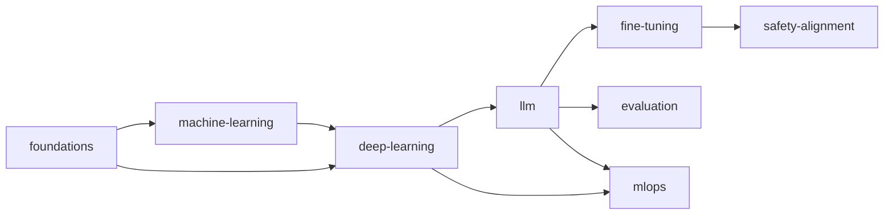

# AI 학습 가이드라인 — competency 정의 / 산출물 / 검증

**[[ai|↑ ai hub]]**

---

## 1. 목적

본 문서는 vault 의 `20-areas/ai/` 하위 노트들이 어떤 학습 단계 / 산출물 / 검증 기준을 충족해야 하는지를 정의하는 **참조 가이드라인** 이다.

본 문서가 정의하는 것:
- AI 영역의 8 도메인 분류 와 의존 관계
- 각 도메인 별 competency level (foundational / operational / architectural) 정의
- 각 level 의 학습 항목 / 산출물 / 검증 기준
- vault 노트 종류 별 작성 표준 (concepts / mental-models / practice / pitfalls)

본 문서가 정의하지 않는 것:
- 개별 모델 / 프레임워크의 syntax (PyTorch / TensorFlow / scikit-learn 각각의 사용법)
- 개인 학습 일정 / 시간 배분
- 자격증 시험 절차

---

## 2. 범위

| 구분 | 포함 |
| --- | --- |
| 대상 | vault 의 `20-areas/ai/` 하위 모든 노트 |
| 인접 영역 | 운영 측 [[../ai-agent/ai-agent]] (LLM 에이전트 운영) — 별도 도메인 |
| 외부 표준 매핑 | Coursera ML Specialization / DeepLearning.ai / fast.ai / Stanford CS231n / CS224n |
| 제외 | 회사 / 프로젝트 한정 운영 절차 (`10-projects/<project>/` 에 둠) |

---

## 3. 용어

| 용어 | 정의 |
| --- | --- |
| **도메인 (domain)** | AI 영역의 독립 책임 단위. 본 vault 의 8 개. |
| **competency** | 한 도메인에 대해 정의된 측정 가능한 능력. |
| **level** | competency 의 깊이 단계. `foundational` / `operational` / `architectural` 3 단계. |
| **산출물 (artifact)** | level 충족을 증명하는 구체적 결과물 (vault 노트 / Jupyter notebook / 학습된 모델 checkpoint / 평가 결과). |
| **검증 기준 (criteria)** | 산출물이 level 을 충족했는지 판단하는 객관적 조건. |

---

## 4. 도메인 분류

본 영역은 다음 8 도메인으로 분류된다. 도메인 정의는 vault 의 디렉토리 (`20-areas/ai/<domain>/`) 와 1:1 매핑된다.

### 4.1 Foundation (3)

| 도메인 | 디렉토리 | 책임 범위 |
| --- | --- | --- |
| foundations | `foundations/` | 수학 (linear algebra / calculus / probability) + Python ML stack (NumPy / Pandas / Matplotlib / PyTorch) |
| machine-learning | `machine-learning/` | 전통 ML — supervised / unsupervised / loss / gradient descent / 평가 |
| deep-learning | `deep-learning/` | NN / perceptron / backprop / CNN / RNN / optimizer / normalization |

### 4.2 LLM Stack (3)

| 도메인 | 디렉토리 | 책임 범위 |
| --- | --- | --- |
| llm | `llm/` | Transformer / attention / pretraining / scaling law |
| fine-tuning | `fine-tuning/` | SFT / LoRA / RLHF / DPO |
| evaluation | `evaluation/` | benchmark / hand-curated / LLM-as-judge / RAGAS |

### 4.3 Operations (2)

| 도메인 | 디렉토리 | 책임 범위 |
| --- | --- | --- |
| mlops | `mlops/` | 데이터 pipeline / 학습 cluster / 모델 serving / 모니터링 |
| safety-alignment | `safety-alignment/` | RLHF / constitutional / red-team / 평가 |

→ 운영 측 (LLM 에이전트 시스템 운영 — agent runtime / RAG / tool calling) 은 별도 영역 [[../ai-agent/ai-agent]].

---

## 5. 도메인 의존 그래프

각 도메인 학습 시 선행 도메인 충족 가정.

선행 도메인의 `foundational` competency 미충족 시 본 도메인 학습 권장하지 않음.

---

## 6. Competency level 정의

도메인별 competency 는 다음 3 단계로 정의한다.

### 6.1 Foundational

도메인의 핵심 개념 / 용어 / 기본 코드에 대한 정의를 진술할 수 있고, 표준 데이터셋 / 표준 task 에서 동작하는 최소 구현을 만들 수 있다.

### 6.2 Operational

도메인의 실제 적용에 필요한 데이터 준비 / 학습 / 평가 / 디버깅 절차를 수립할 수 있고, 흔한 실패 모드의 1차 원인 분석을 단독으로 수행할 수 있다.

### 6.3 Architectural

도메인의 적용 여부 / 대안 / 트레이드오프를 비교 정의할 수 있고, 데이터 규모 / 비용 / 정확도 / latency 제약 안에서 모델 / 학습 / serving 의 선택 근거를 문서화할 수 있다.

→ 각 level 은 다음 산출물과 검증 기준으로 충족 여부를 판단한다.

---

## 7. 도메인 × level 산출물 매트릭스

각 셀의 산출물이 vault / 실험 환경에 존재하고 검증 기준을 만족할 때 해당 level 충족으로 간주한다.

### 7.1 foundations

| level | 산출물 | 검증 기준 |
| --- | --- | --- |
| foundational | [[foundations/data-analysis]], [[foundations/data-visualization]] + 1 NumPy / Pandas notebook | 행렬 / 벡터 / broadcasting / DataFrame groupby 진술 + 데이터 셋 1 개 분석 |
| operational | (작성 예정) `linear-algebra-basics.md`, `calculus-for-ml.md`, `probability-basics.md`, `pytorch-basics.md` | 편미분 / chain rule / gradient 진술 + PyTorch tensor + autograd 사용 |
| architectural | (작성 예정) `karpathy-micrograd.md` | backprop 을 40 줄로 직접 구현 + 차원 / 메모리 / 수치 안정성 분석 |

### 7.2 machine-learning

| level | 산출물 | 검증 기준 |
| --- | --- | --- |
| foundational | [[machine-learning/concepts]] + 1 회 선형 회귀 + logistic regression notebook | 4 학습 종류 / loss / gradient / overfitting 진술 |
| operational | [[machine-learning/loss-and-gradient-descent]], [[machine-learning/training-and-evaluation]] | train/val/test split + cross-validation + leakage 방지 + metric (accuracy / F1 / AUC / RMSE) 선택 |
| architectural | (작성 예정) `bias-variance.md`, `tree-models.md`, `regularization-deep.md`, `class-imbalance.md` | 모델 / regularization / 손실 / sampling 선택의 trade-off 비교 |

### 7.3 deep-learning

| level | 산출물 | 검증 기준 |
| --- | --- | --- |
| foundational | [[deep-learning/concepts]] + MLP MNIST 분류 notebook | perceptron / MLP / activation / loss / forward pass 진술 |
| operational | [[deep-learning/backpropagation]], [[deep-learning/training-loop-pytorch]] | PyTorch DataLoader + train loop + checkpoint + 학습 곡선 plot + overfit 진단 |
| architectural | (작성 예정) `optimizers-sgd-adam.md`, `normalization.md`, `cnn-basics.md`, `rnn-lstm-gru.md`, `embeddings.md` | optimizer / normalization / architecture 선택 근거 + transfer learning |

### 7.4 llm

| level | 산출물 | 검증 기준 |
| --- | --- | --- |
| foundational | (작성 예정) `transformer-basics.md`, `attention.md`, `tokenization.md` | self-attention / multi-head / positional encoding / tokenization 진술 |
| operational | (작성 예정) `pretraining-overview.md`, `scaling-laws.md`, `decoding.md` | next-token prediction + Chinchilla 법칙 + sampling (temperature / top-p / top-k) |
| architectural | (작성 예정) `architecture-variants.md` (encoder/decoder/encoder-decoder), `mixture-of-experts.md` | 아키텍처 선택 근거 + 비용 / latency / 정확도 trade-off |

### 7.5 fine-tuning · evaluation · mlops · safety-alignment

| 도메인 | foundational | operational | architectural |
| --- | --- | --- | --- |
| fine-tuning | SFT 정의 + 1 회 SFT 실험 | LoRA / QLoRA / 데이터셋 큐레이션 | RLHF / DPO / PPO 선택 |
| evaluation | benchmark 종류 + 평가 metric | hand-curated set + LLM-as-judge | RAGAS / human eval / calibration |
| mlops | 데이터 pipeline 정의 | 학습 cluster + serving (vLLM / TGI) | A/B test + 모니터링 + 비용 최적화 |
| safety-alignment | RLHF / 약점 정의 | red-team / 프롬프트 주입 방어 | constitutional / 평가 자동화 |

---

## 8. 학습 진행 절차

본 가이드라인은 시간 일정을 정의하지 않는다. 다만 다음 절차를 권장한다.

1. **도메인 선정** — §5 의존 그래프에서 선행 도메인이 충족된 도메인만 선택.
2. **노트 정독** — 선택한 도메인의 hub → concepts → mental-models / deep → pitfalls 순.
3. **실습 수행** — 표준 데이터셋 / 표준 task 로 직접 코드 작성. notebook 보존.
4. **산출물 작성** — §7 의 해당 level 산출물 작성 또는 갱신.
5. **검증** — §7 의 검증 기준 자체 검토.

---

## 9. 노트 종류 표준

vault 의 도메인 디렉토리는 다음 5 종 노트로 구성된다. 도메인마다 모든 종류가 필수는 아니나, `hub` / `concepts` 2 종은 모든 도메인에 존재해야 한다.

| 종류 | 파일명 패턴 | 역할 | 필수 |
| --- | --- | --- | --- |
| hub | `<domain>.md` | 도메인 진입점 + 하위 노트 인덱스 + 학습 순서 | ✓ |
| concepts | `concepts.md` | 핵심 용어 / 정의 / 기본 알고리즘 | ✓ |
| mental-models | `<topic>-mental-models.md` | 도메인 모델의 설계 원리 / 트레이드오프 | architectural level |
| practice / 실용 | `<topic>.md` (training-loop / data-analysis 등) | 실제 코드 + notebook 형태의 가이드 | operational level |
| pitfalls | `pitfalls.md` | 흔한 실패 모드 + 1차 디버깅 | 권장 |

---

## 10. 외부 표준 매핑

vault 의 도메인 / level 은 다음 외부 표준과 다음과 같이 매핑된다.

| 외부 표준 | 매핑되는 도메인 | 매핑되는 level |
| --- | --- | --- |
| Coursera ML Specialization (Andrew Ng) | foundations + machine-learning | foundational + operational |
| DeepLearning.ai Deep Learning Specialization | deep-learning | foundational + operational |
| fast.ai Practical Deep Learning | deep-learning + mlops | operational |
| Stanford CS231n (Vision) | deep-learning (CNN) | operational + architectural |
| Stanford CS224n (NLP) | deep-learning (RNN / Transformer) + llm | operational + architectural |
| Stanford CS229 (ML Theory) | machine-learning | architectural |
| Hugging Face NLP Course | llm + fine-tuning | foundational + operational |
| Andrej Karpathy "Zero to Hero" | foundations + deep-learning + llm | foundational + operational |
| DeepLearning.ai MLOps | mlops | operational + architectural |

외부 표준은 vault 의 노트를 대체하지 않는다. vault 가 정의하는 산출물 / 검증 기준은 외부 표준의 시험 / 인증 범위와 무관하게 본 문서 §7 을 기준으로 한다.

---

## 11. 본 가이드라인의 유지보수

| 트리거 | 갱신 항목 |
| --- | --- |
| 새 도메인 추가 | §4 분류 + §5 의존 그래프 + §7 매트릭스 |
| 새 노트 종류 신설 | §9 표 |
| 산출물 / 검증 기준 변경 | §7 해당 셀 + frontmatter `updated_at` |
| 외부 표준 개정 | §10 표 |

본 문서를 갱신할 때는 frontmatter `updated_at` 을 ISO-8601 로 기록한다.

---

## 12. 관련

- [[ai|↑ ai hub]]
- [[foundations/foundations]]
- [[machine-learning/machine-learning]]
- [[deep-learning/deep-learning]]
- [[llm/llm]]
- [[../ai-agent/ai-agent|↗ ai-agent (운영)]]
- [[../computer-science/computer-science|↗ CS]]
- [[../devops/devops-senior-curriculum|↗ devops 학습 가이드라인 (동일 패턴)]]
