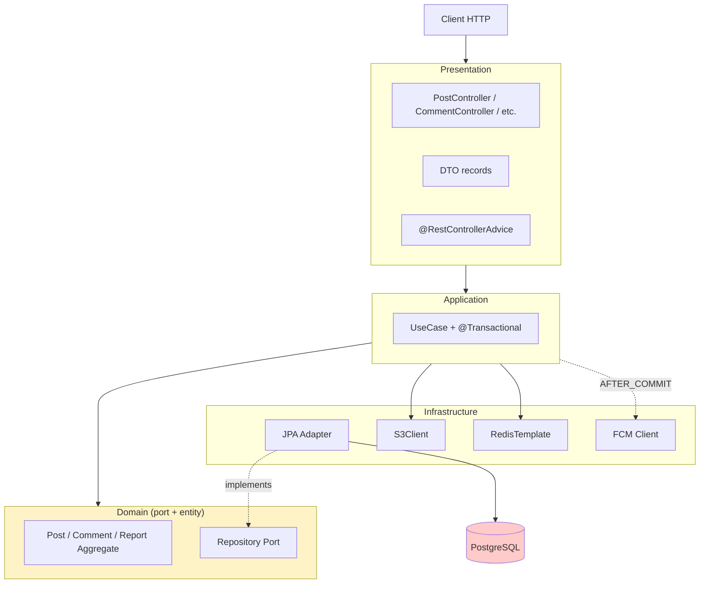

# board §7 — 아키텍처 / 의존성

| 문서 버전 | 작성일 | 작성자 | 주요 변경 사항 |
| --- | --- | --- | --- |
| v1.0.0 | 2026-05-15 | engineering-agent/tech-lead | 최초 |

**[[board|↑ board hub]]**  ·  ← [[domain-model/domain-model]]  ·  → [[security/security]]

> Hexagonal / Port-Adapter. signup 과 동일 패턴.

---

## 1. 계층 책임

| 계층 | 패키지 | 책임 |
| --- | --- | --- |
| Presentation | `presentation/api/v1/board/` | HTTP / DTO / Bean Validation |
| Application | `application/board/` | UseCase / @Transactional / 흐름 조정 |
| Domain | `domain/board/` | Aggregate / VO / Event / Port |
| Infra Persistence | `infrastructure/persistence/jpa/board/` | JPA Entity / Adapter |
| Infra External | `infrastructure/external/s3/` | S3 / FCM / 외부 호출 |
| Config | `config/` | SecurityConfig / CORS |

**의존성 방향**: 바깥 → 안쪽 (Hexagonal).

---

## 2. 의존성 흐름



자세히: [[../signup/architecture|↗ signup architecture]] — 동일 패턴.

---

## 3. 패키지 구조

```
com.example.shop
├── domain/
│   └── board/
│       ├── Post.java              (Aggregate Root)
│       ├── Comment.java
│       ├── Report.java
│       ├── value/
│       │   ├── PostId / CommentId / BoardId / ReportId.java
│       │   └── TargetId.java       (sealed)
│       ├── status/
│       │   ├── PostStatus.java
│       │   ├── CommentStatus.java
│       │   └── ReportStatus.java
│       ├── events/
│       │   └── (16 DomainEvent records)
│       └── (Port interfaces)
│
├── application/
│   └── board/
│       ├── PostService.java        (@Service @Transactional)
│       ├── CommentService.java
│       ├── ReportService.java
│       ├── LikeService.java
│       ├── SearchService.java
│       └── (Cmd records)
│
├── infrastructure/
│   ├── persistence/jpa/board/
│   │   ├── PostJpaEntity.java
│   │   ├── CommentJpaEntity.java
│   │   ├── PostJpaRepository.java   (Spring Data)
│   │   └── JpaPostRepositoryAdapter.java (implements PostRepository)
│   ├── external/
│   │   ├── s3/AwsS3Client.java
│   │   ├── notification/FcmClient.java
│   │   └── search/ElasticsearchIndexer.java
│   └── messaging/
│       └── BoardNotificationListener.java (@TransactionalEventListener)
│
├── presentation/
│   └── api/v1/board/
│       ├── PostController.java
│       ├── CommentController.java
│       ├── LikeController.java
│       ├── ReportController.java
│       └── (DTO records — Request/Response)
│
└── config/
    └── BoardSecurityConfig.java
```

---

## 4. 외부 의존성

| External | 사용처 | Port |
| --- | --- | --- |
| **S3** | 첨부 파일 | `AttachmentStorage` |
| **CloudFront** | CDN | (URL builder) |
| **Redis** | counter / cache / block list | (RedisTemplate 직접) |
| **FCM / APNs** | push 알림 | `PushNotifier` |
| **Elasticsearch** (옵션) | 검색 | `PostSearcher` |

→ 각 외부 의존성에 도메인 layer 의 port 만.

---

## 5. 관련

- [[board|↑ hub]]
- [[../signup/architecture|↗ signup architecture]] — 패턴
- [[domain-model/repository-ports]]
- [[security/security]] — 다음
