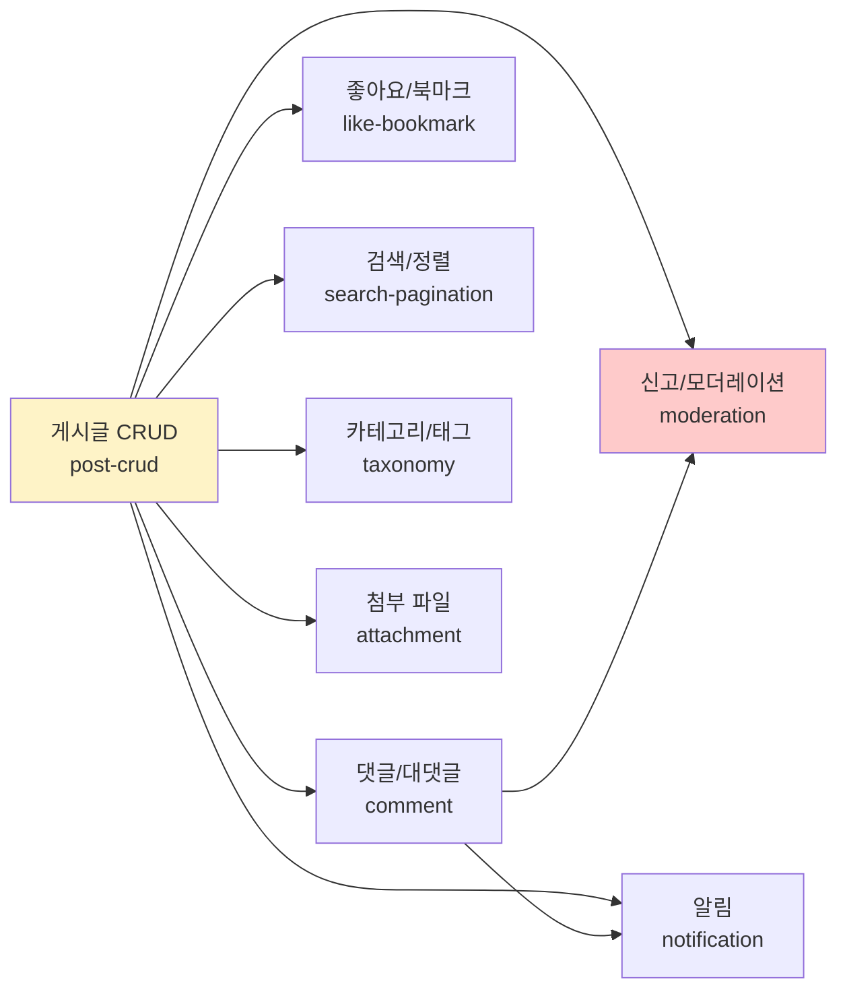
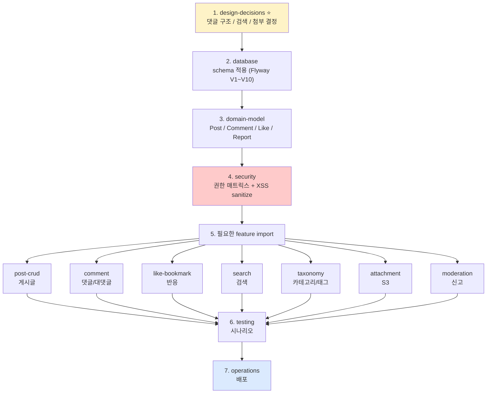
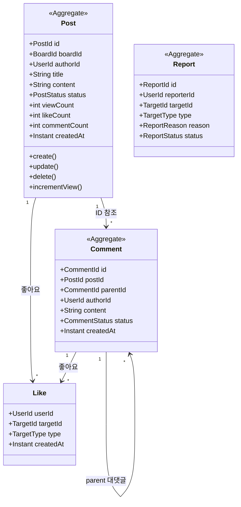
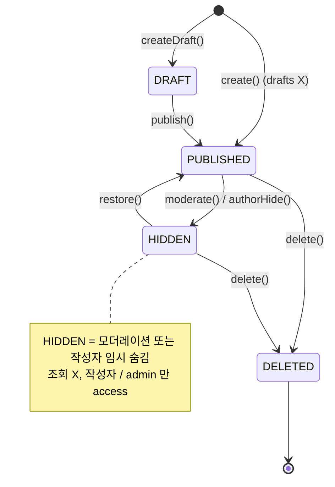

# 게시판 (커뮤니티) — Hub

| 문서 버전 | 작성일 | 작성자 | 주요 변경 사항 |
| --- | --- | --- | --- |
| v1.0.0 | 2026-05-15 | engineering-agent/tech-lead | 최초 — 커뮤니티 게시판 (당근 / 무신사 매거진 스타일) — signup 과 동일 구조 |

**[[../api-design|↑ api-design hub]]**

> 📐 **ORM**: §implementation 들의 영속 코드는 JPA Adapter sketch. 3 모드 정책: [[../api-design#0.5 ORM 정책]].
> 공통 패턴: [[../../common/response-envelope]] · [[../../common/security-config]]
> 인증: [[../signup/signup|signup 가입 + 로그인]] 의존 — board endpoint 들은 인증된 user 가 전제.

---

## 1. 무엇이 이 폴더의 범위인가

**커뮤니티 게시판** (당근 동네 / 무신사 매거진 / 디시 갤러리 스타일) 의 production-grade 구현.



**범위 안**:
- 게시판 (board) 다중 종류 — 자유 / Q&A / 공지 등
- 게시글 CRUD + soft delete + 작성자 검증
- 댓글 / 대댓글 (2-level)
- 좋아요 / 북마크 (per user)
- 카테고리 / 태그
- 검색 (DB FTS / Elasticsearch 옵션)
- 첨부 파일 (S3 presigned)
- 신고 / 모더레이션 (자동 + 수동)
- 차단 사용자 (block list)
- 익명 / 닉네임 옵션
- 인기 글 / 정렬 (최신 / 인기 / hot)
- 좋아요 / 댓글 알림 (선택 — `../../notification` 의존)

**범위 밖** (별도 recipe):
- 실시간 채팅 — `../chat-realtime`
- 피드 타임라인 (follow 기반) — `../feed-timeline`
- 추천 (개인화) — `../recommendation`
- 결제 (광고 / 후원) — `../payment-pg`

---

## 2. 어떤 순서로 봐야 하나

> "**위에서부터 차례대로**" 읽으면 설계 → DB/도메인 → 보안 → 구현 → 운영 순서. 개발 단계 그대로 따라갈 수 있음.

### Phase 1 — 설계 / 의사결정

| 순 | 노트 | 무엇을 결정 |
| --- | --- | --- |
| 1 | [[overview]] | 전체 흐름 / 어떤 endpoint 필요한지 |
| 2 | [[prerequisites]] | 전제 (인증 / DB / S3) |
| 3 | [[requirements]] | 완료 조건 (Acceptance Criteria) |
| 4 | [[design-decisions/design-decisions]] ⭐ | **권장 도구 가이드** — 댓글 구조 / 검색 / 첨부 / 정렬 / 알림 |

### Phase 2 — 기반 (DB & 도메인)

| 순 | 노트 | 무엇 |
| --- | --- | --- |
| 5 | [[database/database]] | DB schema (posts / comments / likes / bookmarks / reports / attachments / categories / tags) |
| 6 | [[enums/enums]] | 상태 enum (PostStatus / CommentStatus / ReportStatus 등) |
| 7 | [[domain-model/domain-model]] | 도메인 모델 (Post / Comment / Like / Report Aggregate + VO) |
| 8 | [[architecture]] | 계층 / Port·Adapter |
| 9 | [[security/security]] | 권한 매트릭스 / XSS / 차단 / 모더레이션 |

### Phase 3 — 기능별 구현

| 순 | 노트 | 무엇 |
| --- | --- | --- |
| 10 | [[implementation/implementation]] | implementation hub (구현 순서) |
| 11 | [[implementation/post-crud-impl]] | 게시글 CRUD |
| 12 | [[implementation/comment-impl]] | 댓글 / 대댓글 |
| 13 | [[implementation/like-bookmark-impl]] | 좋아요 / 북마크 |
| 14 | [[implementation/search-pagination-impl]] | 검색 / 정렬 / 페이지네이션 |
| 15 | [[implementation/taxonomy-impl]] | 카테고리 / 태그 |
| 16 | [[implementation/attachment-impl]] | 첨부 파일 (S3 presigned) |
| 17 | [[implementation/moderation-impl]] | 신고 / 모더레이션 / 차단 |
| 18 | [[implementation/notification-impl]] | 좋아요 / 댓글 알림 |

### Phase 4 — 운영 품질

| 순 | 노트 | 무엇 |
| --- | --- | --- |
| 19 | [[transactions]] | 트랜잭션 / 동시성 / counter 처리 |
| 20 | [[testing/testing]] | 테스트 시나리오 + Unit + Integration |
| 21 | [[operations/operations]] | 배포 / 모니터링 / 알림 / 롤백 |

### Phase 5 — Reference

| 순 | 노트 | 무엇 |
| --- | --- | --- |
| 22 | [[implementation-order]] | 단계별 PR 분할 to-do |
| 23 | [[pitfalls/pitfalls]] | 흔한 함정 (코드 리뷰 체크리스트) |

---

## 3. "바로 사용" 흐름

가장 일반적인 한국 커뮤니티 게시판 시나리오:



→ 모든 feature 가 같은 도메인 모델 + 같은 응답 envelope.

---

## 4. 한 페이지 cheat sheet

### 4.1 전체 endpoint

```
# 게시글
GET    /api/v1/boards/{boardId}/posts                    (목록 — pagination)
POST   /api/v1/boards/{boardId}/posts                    (생성)
GET    /api/v1/posts/{postId}                            (상세)
PATCH  /api/v1/posts/{postId}                            (수정 — 작성자만)
DELETE /api/v1/posts/{postId}                            (soft delete)

# 댓글
GET    /api/v1/posts/{postId}/comments                   (목록)
POST   /api/v1/posts/{postId}/comments                   (생성)
POST   /api/v1/posts/{postId}/comments/{commentId}/reply (대댓글)
PATCH  /api/v1/comments/{commentId}                      (수정)
DELETE /api/v1/comments/{commentId}                      (soft delete)

# 좋아요 / 북마크
POST   /api/v1/posts/{postId}/like                       (좋아요 toggle)
DELETE /api/v1/posts/{postId}/like
POST   /api/v1/posts/{postId}/bookmark                   (북마크 toggle)
DELETE /api/v1/posts/{postId}/bookmark
POST   /api/v1/comments/{commentId}/like

# 검색 / 정렬
GET    /api/v1/posts/search?q=...&sort=hot               (검색 + 정렬)
GET    /api/v1/boards/{boardId}/posts?sort=hot&period=7d (인기 글)

# 카테고리 / 태그
GET    /api/v1/categories
GET    /api/v1/tags/popular
GET    /api/v1/posts?tag={tag}

# 첨부
POST   /api/v1/posts/attachments/presigned               (S3 presigned URL)

# 신고 / 차단
POST   /api/v1/posts/{postId}/report
POST   /api/v1/comments/{commentId}/report
POST   /api/v1/users/{userId}/block

# 내 활동
GET    /api/v1/me/posts                                  (내가 쓴 글)
GET    /api/v1/me/comments
GET    /api/v1/me/bookmarks
GET    /api/v1/me/blocks
```

### 4.2 도메인 객체



### 4.3 status 머신



### 4.4 권장 도구 (자세히는 [[design-decisions/design-decisions]])

| 영역 | 권장 |
| --- | --- |
| 댓글 구조 | **2-level** (대댓글까지) — 무한 depth X |
| 좋아요 counter | DB 컬럼 + **Redis HINCRBY** (eventual consistency) |
| 조회수 | **Redis counter** + 1 hour batch UPDATE |
| 검색 | DB ILIKE (소규모) / **PostgreSQL FTS** (중) / **Elasticsearch** (대) |
| 정렬 (hot) | likes × 1.0 + comments × 2.0 + views × 0.01 의 시간 감쇠 (Reddit 식) |
| 첨부 | **S3 presigned URL** + CloudFront CDN |
| 신고 모더레이션 | 5회 신고 = 자동 HIDDEN + admin review |
| 페이지네이션 | **cursor-based** (무한 스크롤) + offset (admin) |
| 알림 | outbox + FCM/APNs ([[../../notification]] 의존) |
| 차단 사용자 | block list 테이블 + 조회 시 filter |

---

## 5. 관련

- [[../signup/signup]] — 인증 / 권한 (board 의 user 식별)
- [[../rate-limiting]] — 글/댓글 작성 rate limit
- [[../file-upload-s3]] — 첨부 파일 S3 presigned
- [[../elasticsearch-integration]] — 검색 (선택)
- [[../feed-timeline]] — follow 기반 피드 (별도)
- [[../chat-realtime]] — DM (별도)
- [[../../../../security/security|↗ security hub]]
- [[../api-design|↑ api-design hub]]
