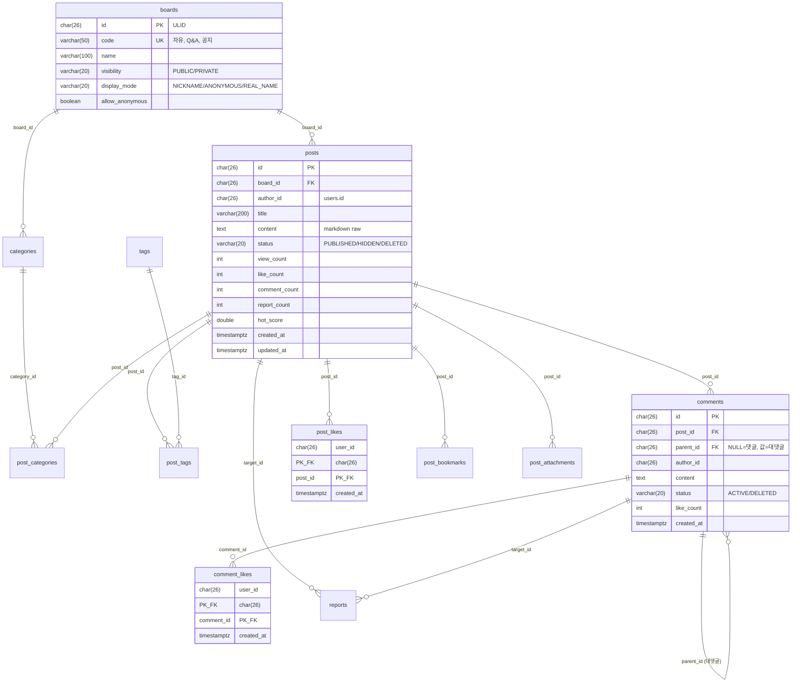
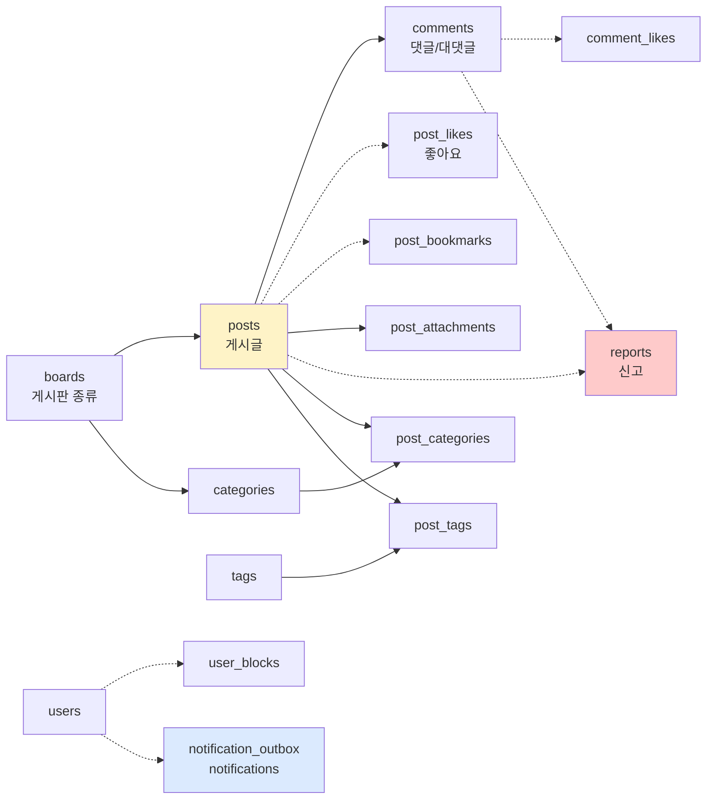

# board §5 — DB 스키마 (Hub)

| 문서 버전 | 작성일 | 작성자 | 주요 변경 사항 |
| --- | --- | --- | --- |
| v1.0.0 | 2026-05-15 | engineering-agent/tech-lead | 최초 — 11 테이블 + 횡단 정책 |

**[[../board|↑ board hub]]**  ·  ← [[../design-decisions/design-decisions]]  ·  → [[../domain-model/domain-model]]

> board 도메인의 모든 table / 인덱스 / 제약 / 정합성 정책.

---

## 1. 이 폴더의 노트

### 1.1 Table 별

| 노트 | Table | 목적 |
| --- | --- | --- |
| [[boards-table]] | `boards` | 게시판 종류 (자유 / Q&A / 공지) |
| [[posts-table]] | `posts` | 게시글 본체 |
| [[comments-table]] | `comments` | 댓글 / 대댓글 (2-level) |
| [[likes-tables]] | `post_likes` / `comment_likes` | 좋아요 (per user) |
| [[bookmarks-table]] | `post_bookmarks` | 북마크 |
| [[categories-tags-tables]] | `categories` / `post_categories` / `tags` / `post_tags` | 분류 / 태그 |
| [[attachments-table]] | `post_attachments` | S3 file key 매핑 |
| [[reports-table]] | `reports` | 신고 |
| [[user-blocks-table]] | `user_blocks` | 차단 사용자 |
| [[notification-tables]] | `notification_outbox` / `notifications` / `user_notification_preferences` | 알림 |

### 1.2 정책 / 횡단

| 노트 | 무엇 |
| --- | --- |
| [[../../signup/database/id-strategy\|↗ id-strategy]] | ULID 결정 (signup 의 정책 그대로) |
| [[../../signup/database/migrations\|↗ migrations]] | Flyway 운영 정책 (signup 의 정책 그대로) |
| [[../../signup/database/encryption-at-rest\|↗ encryption-at-rest]] | 암호화 정책 |

→ board 의 ID / migration / encryption 은 signup 의 정책 그대로. cross-link 만.

---

## 2. 전체 ERD



### 2.1 관계 요약



---

## 3. 공통 컨벤션

### 3.1 ID — ULID `CHAR(26)`

signup 의 [[../../signup/database/id-strategy|↗ id-strategy]] 정책 그대로.

### 3.2 시간 — `TIMESTAMPTZ` (UTC)

### 3.3 enum — `VARCHAR + CHECK` + JPA `@Enumerated(EnumType.STRING)`

### 3.4 soft delete vs hard delete

| Table | 정책 |
| --- | --- |
| `posts` | soft (status=DELETED, content 마스킹) |
| `comments` | soft (대댓글 보존 위해) |
| `post_likes` / `bookmarks` | hard delete (toggle 흐름) |
| `reports` | soft (audit) |
| `user_blocks` | hard delete (unblock 흐름) |
| `notification_outbox` | 30일 cleanup |

### 3.5 Indexing 원칙

- PK 자동 인덱스.
- UNIQUE (lookup) — `boards.code`, `(provider, external_id)`.
- FK 명시 인덱스 (PG 자동 X).
- Partial index — `WHERE status = 'PUBLISHED'`.
- Composite (정렬 + filter) — `(board_id, hot_score DESC, id DESC)`.

자세히: [[posts-table#3 인덱스]].

---

## 4. 트랜잭션 / 정합성

### 4.1 한 트랜잭션 안의 INSERT

게시글 작성 흐름:
```sql
BEGIN;
  INSERT INTO posts (...);
  INSERT INTO post_categories (...);     -- N 카테고리
  INSERT INTO post_tags (...);            -- N 태그
  INSERT INTO post_attachments (...);     -- N 첨부
COMMIT;
-- AFTER_COMMIT
  INSERT INTO notification_outbox (...); -- follower 알림
```

### 4.2 Race condition

| 시나리오 | 1차 방어 | 진실의 원천 |
| --- | --- | --- |
| 같은 user 의 중복 좋아요 | application existsBy | `post_likes` PK (user_id, post_id) |
| 같은 신고 중복 | application | `reports` UNIQUE (reporter_id, target_id) |
| 같은 닉네임 가입 | application | `users.nickname` UNIQUE |
| comment_count race | application | `comment_count` 가 actual count 와 1h grace |

---

## 5. 검색 패턴 — 자주 쓰이는 query

| 쿼리 | 빈도 | 인덱스 |
| --- | --- | --- |
| `posts WHERE board_id = ? ORDER BY hot_score DESC` | 메인 화면 | `(board_id, hot_score DESC, id DESC) WHERE PUBLISHED` |
| `posts WHERE id = ?` | 상세 조회 | PK |
| `comments WHERE post_id = ?` | 댓글 list | `(post_id, parent_id, created_at)` |
| `post_likes WHERE user_id = ? AND post_id = ?` | 좋아요 여부 | PK |
| `posts WHERE author_id = ?` | /me/posts | `(author_id, created_at DESC) WHERE PUBLISHED` |
| `tags WHERE name LIKE ?` | 인기 태그 | trigram (pg_trgm) |
| `posts WHERE content_tsv @@ ?` | 검색 (FTS) | GIN |

---

## 6. 마이그레이션 (Flyway)

```
src/main/resources/db/migration/
├── V1__create_boards.sql
├── V2__create_categories.sql
├── V3__create_tags.sql
├── V4__create_posts.sql
├── V5__create_post_categories.sql
├── V6__create_post_tags.sql
├── V7__create_post_attachments.sql
├── V8__create_comments.sql
├── V9__create_post_likes.sql
├── V10__create_comment_likes.sql
├── V11__create_post_bookmarks.sql
├── V12__create_reports.sql
├── V13__create_user_blocks.sql
├── V14__create_notification_outbox.sql
├── V15__create_notifications.sql
└── V16__create_user_notification_preferences.sql
```

자세히: [[../../signup/database/migrations|↗ migrations]].

---

## 7. 관련

- [[../board|↑ board hub]]
- [[../domain-model/domain-model|↗ 도메인 모델]]
- [[../../signup/database/database|↗ signup database]] — 참고 패턴
