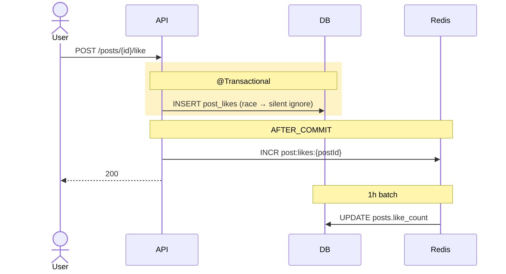

# post_likes / comment_likes 테이블

| 문서 버전 | 작성일 | 작성자 | 주요 변경 사항 |
| --- | --- | --- | --- |
| v1.0.0 | 2026-05-15 | engineering-agent/tech-lead | 최초 |

**[[database|↑ database hub]]**

> 좋아요 (post / comment) — per user 한 번만. counter 는 별도 (Redis + batch).

---

## 1. Schema

```sql
-- V9__create_post_likes.sql
CREATE TABLE post_likes (
    user_id    CHAR(26) NOT NULL,            -- users.id
    post_id    CHAR(26) NOT NULL REFERENCES posts(id) ON DELETE CASCADE,
    created_at TIMESTAMPTZ NOT NULL DEFAULT now(),
    PRIMARY KEY (user_id, post_id)
);

CREATE INDEX ix_post_likes_post_created ON post_likes (post_id, created_at DESC);
CREATE INDEX ix_post_likes_user_created ON post_likes (user_id, created_at DESC);

-- V10__create_comment_likes.sql
CREATE TABLE comment_likes (
    user_id    CHAR(26) NOT NULL,
    comment_id CHAR(26) NOT NULL REFERENCES comments(id) ON DELETE CASCADE,
    created_at TIMESTAMPTZ NOT NULL DEFAULT now(),
    PRIMARY KEY (user_id, comment_id)
);

CREATE INDEX ix_comment_likes_comment_created ON comment_likes (comment_id, created_at DESC);
CREATE INDEX ix_comment_likes_user_created ON comment_likes (user_id, created_at DESC);
```

---

## 2. 컬럼 "왜"

### 2.1 PK (user_id, target_id)

**왜**
- 같은 user 가 같은 target 두 번 좋아요 차단 (DB UNIQUE).
- 사용자가 좋아요 했는지 O(1) lookup.

**race condition**
- 동시 2 요청 → DB UNIQUE 위반 → application 이 `DataIntegrityViolationException` catch → silent idempotent.

### 2.2 ON DELETE CASCADE (post / comment)

- post / comment hard delete 시 좋아요도 같이.
- soft delete 는 ON DELETE 발동 X (status 만 변경).

### 2.3 created_at 인덱스

- "이 post 의 최근 좋아요 user" 표시 옵션.
- "내가 좋아요한 글" (`/me/liked-posts`).

### 2.4 왜 별도 테이블 (post_likes vs comment_likes)

- 단일 `likes` 테이블 + `target_type` 컬럼도 가능.
- 단 — target_type 별 query 가 항상 분기.
- 별도 테이블 = 명확 + 인덱스 / FK 단순.

**대안: 통합 likes**
```sql
CREATE TABLE likes (
    user_id     CHAR(26),
    target_id   CHAR(26),
    target_type VARCHAR(20),       -- POST / COMMENT
    PRIMARY KEY (user_id, target_id, target_type)
);
```

→ 사용자가 좋아요한 모든 것 한 번에 조회 시 유리. 단 — FK 명시 X (target_id 가 다중 테이블).

**본 vault**: 별도 테이블 (단순성).

---

## 3. counter 와의 관계



자세히: [[../design-decisions/like-counter]].

---

## 4. 함정

### 함정 1 — Composite PK 없이 (자체 ID)
같은 user 좋아요 race → 2 row INSERT.
→ PK (user_id, target_id).

### 함정 2 — ON DELETE CASCADE 없음
post hard delete 시 좋아요 좀비 row.
→ CASCADE.

### 함정 3 — soft delete 시 좋아요 정리 X
DELETED post 의 좋아요 그대로 보임.
→ 조회 시 join + status filter.

### 함정 4 — counter 가 actual count 와 영구 mismatch
race / batch fail 시.
→ daily 보정 batch (`UPDATE posts SET like_count = (SELECT count(*) FROM post_likes WHERE post_id = posts.id)`).

### 함정 5 — DataIntegrityViolationException 안 catch
중복 좋아요 시 500 응답.
→ catch + silent.

---

## 5. 관련

- [[database|↑ hub]]
- [[../design-decisions/like-counter]] — Redis + batch
- [[bookmarks-table]] — 같은 패턴
- [[posts-table]] · [[comments-table]] — like_count 컬럼
