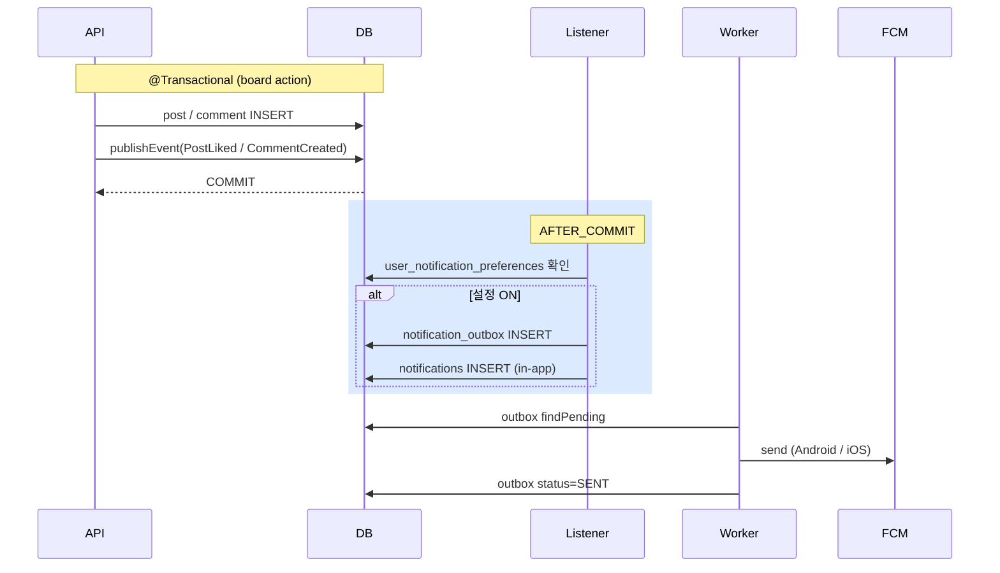

# notification 테이블 3종 — outbox / in-app / preferences

| 문서 버전 | 작성일 | 작성자 | 주요 변경 사항 |
| --- | --- | --- | --- |
| v1.0.0 | 2026-05-15 | engineering-agent/tech-lead | 최초 |

**[[database|↑ database hub]]**

> 알림 = outbox (worker 발송) + in-app (사용자 화면) + preferences (사용자 설정).

---

## 1. Schema

### 1.1 notification_outbox (worker 큐)

```sql
-- V14__create_notification_outbox.sql
CREATE TABLE notification_outbox (
    id              CHAR(26) PRIMARY KEY,
    user_id         CHAR(26) NOT NULL,                 -- 받는 user
    type            VARCHAR(30) NOT NULL,
    title           VARCHAR(200) NOT NULL,
    body            VARCHAR(1000) NOT NULL,
    deeplink        VARCHAR(500),
    metadata        JSONB,
    status          VARCHAR(20) NOT NULL DEFAULT 'PENDING',
    attempts        INTEGER NOT NULL DEFAULT 0,
    max_attempts    INTEGER NOT NULL DEFAULT 5,
    last_error      TEXT,
    next_attempt_at TIMESTAMPTZ NOT NULL DEFAULT now(),
    sent_at         TIMESTAMPTZ,
    failed_at       TIMESTAMPTZ,
    created_at      TIMESTAMPTZ NOT NULL DEFAULT now(),

    CONSTRAINT chk_notif_outbox_status
        CHECK (status IN ('PENDING', 'PROCESSING', 'SENT', 'FAILED', 'DEAD_LETTER'))
);

CREATE INDEX ix_notif_outbox_pending
    ON notification_outbox (next_attempt_at, status)
    WHERE status IN ('PENDING', 'PROCESSING');
```

→ signup 의 [[../../signup/database/email-outbox-table|↗ email_outbox]] 와 같은 패턴.

### 1.2 notifications (in-app)

```sql
-- V15__create_notifications.sql
CREATE TABLE notifications (
    id          CHAR(26) PRIMARY KEY,
    user_id     CHAR(26) NOT NULL,
    type        VARCHAR(30) NOT NULL,
    title       VARCHAR(200) NOT NULL,
    body        VARCHAR(1000),
    deeplink    VARCHAR(500),
    metadata    JSONB,
    read_at     TIMESTAMPTZ,
    created_at  TIMESTAMPTZ NOT NULL DEFAULT now()
);

CREATE INDEX ix_notifications_user_read
    ON notifications (user_id, read_at, created_at DESC);

CREATE INDEX ix_notifications_user_created
    ON notifications (user_id, created_at DESC);
```

### 1.3 user_notification_preferences

```sql
-- V16__create_user_notification_preferences.sql
CREATE TABLE user_notification_preferences (
    user_id   CHAR(26) PRIMARY KEY,
    settings  JSONB NOT NULL DEFAULT '{}',           -- { "LIKE_RECEIVED": false, "COMMENT_RECEIVED": true }
    updated_at TIMESTAMPTZ NOT NULL DEFAULT now()
);
```

---

## 2. 흐름 — outbox + in-app + push



자세히: [[../design-decisions/notification-policy]].

---

## 3. 컬럼 "왜"

### 3.1 outbox vs in-app 분리

**왜 별도 테이블**
- **outbox**: worker 처리용 (push 발송 후 cleanup).
- **in-app**: 사용자 화면 목록 (영구 보존).

**같은 이벤트 → 2 row INSERT** (outbox + in-app).

### 3.2 `metadata JSONB`

- 알림 type 별 동적 데이터.
- 예: `{ "postId": "...", "likeCount": 12 }` (집계 알림).

### 3.3 `read_at` (BOOLEAN 아님)

- 언제 읽었는지 audit.
- 통계 (알림 노출 vs 읽음 rate).

### 3.4 `user_notification_preferences.settings JSONB`

- 알림 type 별 ON/OFF — 동적 키.
- VARCHAR 컬럼 N개 분리 보다 유연.

---

## 4. 조회 — 알림 목록

```sql
-- 사용자의 알림 (안 읽은 것 우선)
SELECT * FROM notifications
WHERE user_id = ?
ORDER BY read_at NULLS FIRST, created_at DESC
LIMIT 20;

-- 안 읽은 수
SELECT COUNT(*) FROM notifications
WHERE user_id = ? AND read_at IS NULL;
```

→ `ix_notifications_user_read` 인덱스 활용.

---

## 5. Cleanup

```sql
-- 30일 지난 outbox SENT 삭제
DELETE FROM notification_outbox
WHERE status = 'SENT' AND sent_at < now() - INTERVAL '30 days';

-- 90일 지난 in-app notifications 삭제 (사용자 별 1000개 max)
DELETE FROM notifications
WHERE created_at < now() - INTERVAL '90 days';
```

---

## 6. 함정

### 함정 1 — outbox + in-app 같은 테이블
worker cleanup 시 사용자 in-app 도 삭제됨.
→ 별도 테이블.

### 함정 2 — preferences 가 row N개 (key 별)
설정 변경 시 다중 UPDATE.
→ JSONB 단일 컬럼.

### 함정 3 — 사용자 설정 무시
"OFF 했는데 받음" — 신뢰 ↓.
→ outbox INSERT 전 검증.

### 함정 4 — `read_at` BOOLEAN
"언제 읽었는지" X.
→ TIMESTAMPTZ.

### 함정 5 — Cleanup 없음
notifications row 영구 누적.
→ 90일 cleanup + 사용자별 1000 max.

### 함정 6 — Self-notification
자기 글에 자기 좋아요 → 알림.
→ author = recipient skip.

### 함정 7 — 트랜잭션 안에서 outbox INSERT 만 (in-app X)
사용자가 push 만 받고 화면에 알림 없음.
→ 둘 다 같은 listener 에서.

---

## 7. 관련

- [[database|↑ hub]]
- [[../design-decisions/notification-policy]]
- [[../../signup/database/email-outbox-table|↗ email_outbox]] — 비슷한 패턴
- [[../implementation/notification-impl]] (todo)
