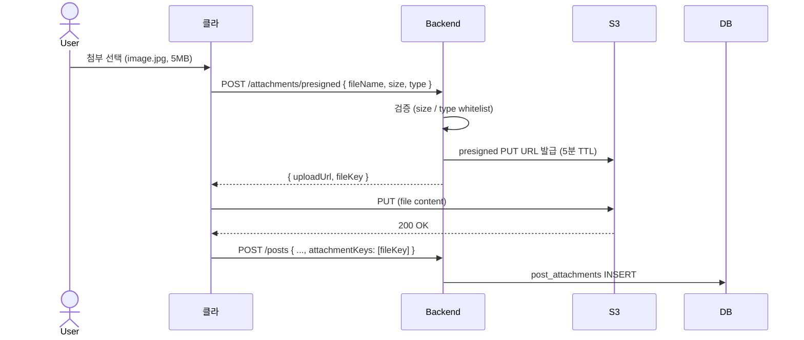

# 첨부 파일 — S3 presigned URL + CloudFront

| 문서 버전 | 작성일 | 작성자 | 주요 변경 사항 |
| --- | --- | --- | --- |
| v1.0.0 | 2026-05-15 | engineering-agent/tech-lead | 최초 |

**[[design-decisions|↑ design-decisions hub]]**

> "첨부 파일 어떻게 저장 / 서빙하나" — backend 경유는 비용 / latency 부담. presigned 가 표준.

---

## 1. 본 vault 결정

- **저장**: S3 (또는 R2 / NCP Object Storage).
- **업로드**: presigned URL — 클라가 직접 S3 PUT (backend 우회).
- **서빙**: CloudFront CDN.
- **DB**: `post_attachments` 테이블 (file key 매핑).

---

## 2. 옵션 비교

### 2.1 Backend 경유 (절대 X)

```
[클라] → backend → S3
```

**왜 안 됨**
- backend 가 file content 전체 받음 → 메모리 / 네트워크 부담.
- 50MB 동영상 100 user 동시 = backend 5GB 트래픽.
- 비용 ↑ + scale 어려움.

---

### 2.2 S3 Presigned URL (본 vault)

```
[클라] → backend (metadata 만)
[클라] → S3 (file content 직접)
```



**왜 적합**
- backend 부담 0 — 메타데이터 만.
- 직접 업로드 = latency ↓.
- S3 의 multipart upload (대용량) 지원.
- 비용 ↓.

**보안**
- presigned URL 5분 TTL — 만료 후 사용 X.
- 검증: size / type / user 권한 (backend).

---

## 3. 구현 — Presigned URL 발급

```java
@RestController
@RequestMapping("/api/v1/attachments")
@RequiredArgsConstructor
public class AttachmentController {

    private final AttachmentService service;

    @PostMapping("/presigned")
    public PresignedResponse presigned(
        @Valid @RequestBody PresignedRequest req,
        @AuthenticationPrincipal AuthUser user
    ) {
        return service.createPresignedUrl(user.id(), req);
    }
}

@Service
public class AttachmentService {

    private final S3Presigner presigner;

    private static final Set<String> ALLOWED_TYPES = Set.of(
        "image/jpeg", "image/png", "image/webp", "image/gif",
        "video/mp4", "video/webm",
        "application/pdf"
    );
    private static final long MAX_SIZE = 50 * 1024 * 1024;  // 50MB

    public PresignedResponse createPresignedUrl(UserId userId, PresignedRequest req) {
        // 1. 검증
        if (!ALLOWED_TYPES.contains(req.contentType()))
            throw new BusinessException(ResponseCode.INVALID_INPUT_FORMAT,
                "unsupported type");
        if (req.size() > MAX_SIZE)
            throw new BusinessException(ResponseCode.INVALID_INPUT_FORMAT,
                "file too large (max 50MB)");

        // 2. file key 생성 — { userId }/{ yearMonth }/{ ulid }-{ name }
        var key = userId.value() + "/" +
                  YearMonth.now() + "/" +
                  UlidCreator.getMonotonicUlid() + "-" +
                  sanitize(req.fileName());

        // 3. presigned URL
        var putRequest = PutObjectRequest.builder()
            .bucket(bucket)
            .key(key)
            .contentType(req.contentType())
            .contentLength(req.size())
            .build();

        var presigned = presigner.presignPutObject(b -> b
            .signatureDuration(Duration.ofMinutes(5))
            .putObjectRequest(putRequest));

        return new PresignedResponse(
            presigned.url().toString(),
            key,
            Instant.now().plus(Duration.ofMinutes(5))
        );
    }
}
```

### 3.1 왜 file key 가 `{userId}/{yearMonth}/{ulid}-{name}`

- userId — 소유자 분리.
- yearMonth — S3 partition / archive.
- ulid — 고유성.
- name — 디버깅 (S3 console 에서 식별).

### 3.2 왜 5분 TTL

- 너무 짧음 (1분) → 클라가 큰 file 업로드 중 만료.
- 너무 김 (1시간) → 도난 시 영구 사용.
- 5분 = 50MB 도 충분 + 보안.

### 3.3 왜 type / size 검증

- 검증 없으면 .exe / .zip 업로드 → 다른 user 가 다운로드 시 위험.
- 50MB 보다 큰 file → 비용 / DB 부담.

---

## 4. Post 작성 시 첨부 매핑

```java
@Transactional
public Post createPost(PostCreateCmd cmd) {
    var post = Post.create(...);
    posts.save(post);

    for (var attachmentKey : cmd.attachmentKeys()) {
        // S3 에 실제 존재하는지 검증
        if (!s3.exists(attachmentKey))
            throw new BusinessException(ResponseCode.NOT_FOUND,
                "attachment not uploaded");
        attachments.save(new PostAttachment(post.id(), attachmentKey));
    }
    return post;
}
```

### 4.1 왜 S3 exists 검증

- 클라가 fake key 보낼 수 있음.
- S3 HEAD request — 빠름 (수십 ms).

### 4.2 미연결 첨부 — orphan cleanup

```sql
-- 매일 batch: 1일 전 presigned 발급 후 post 와 연결 안 된 S3 object 삭제
DELETE FROM presigned_pending
WHERE created_at < now() - INTERVAL '1 day';

-- + S3 lifecycle: 30일 후 archive / 90일 후 삭제 (uploaded but unused)
```

---

## 5. CDN 서빙

```
[클라] → CloudFront → S3 (원본)
```

**왜 CloudFront**
- 한국 user 의 latency ↓ (edge 서울).
- S3 의 GET 비용 ↓ (CDN 의 큰 cache hit).
- 대량 트래픽 시 S3 throttling 회피.

**구현**
- S3 bucket = private (직접 access X).
- CloudFront 의 OAC (Origin Access Control) 만 S3 read 권한.
- CloudFront URL: `https://cdn.example.com/{key}`.

### 5.1 서명 URL (private 콘텐츠)

```java
var signedUrl = cloudFrontUrlSigner.signUrlCannedPolicy(
    "https://cdn.example.com/" + key,
    Date.from(Instant.now().plus(Duration.ofHours(1)))
);
```

- 인증된 user 에게만 1시간 valid URL.
- public 콘텐츠 (게시판 글 첨부) 는 일반 URL.

---

## 6. DB 스키마

```sql
CREATE TABLE post_attachments (
    id          CHAR(26) PRIMARY KEY,
    post_id     CHAR(26) NOT NULL REFERENCES posts(id) ON DELETE CASCADE,
    file_key    VARCHAR(500) NOT NULL UNIQUE,
    file_name   VARCHAR(255) NOT NULL,
    content_type VARCHAR(100) NOT NULL,
    size_bytes  BIGINT NOT NULL,
    created_at  TIMESTAMPTZ NOT NULL DEFAULT now()
);

CREATE INDEX ix_post_attachments_post ON post_attachments (post_id);
```

---

## 7. 함정 모음

### 함정 1 — Backend 경유 업로드
메모리 / 네트워크 부담 폭증.
→ S3 presigned.

### 함정 2 — Presigned 검증 없음 (type/size)
악성 파일 / 큰 파일 무제한.
→ size 50MB max + type whitelist.

### 함정 3 — Presigned TTL 영구
도난 시 무한 사용.
→ 5분.

### 함정 4 — Post 작성 시 S3 exists 검증 X
클라가 fake key 보냄.
→ HEAD request 검증.

### 함정 5 — orphan cleanup 없음
업로드만 하고 post 안 만든 file 무한 누적.
→ S3 lifecycle 또는 daily cleanup.

### 함정 6 — Post 삭제 시 S3 file 안 삭제
storage 비용 누적.
→ post delete trigger 또는 background cleanup.

### 함정 7 — Public S3 bucket
누구나 접근 가능.
→ private + CloudFront OAC.

### 함정 8 — File name 사용자 입력 그대로
`../../etc/passwd` 같은 path traversal.
→ sanitize + ulid prefix.

### 함정 9 — Content-Type 검증을 클라 trust
악의적 클라가 .exe 를 image/jpeg 로 위장.
→ 서버에서 magic bytes 검증 (옵션 — 부담 시 type whitelist 만).

### 함정 10 — CloudFront cache control 무한
파일 수정 시 옛 cache 영구.
→ ulid prefix 로 file key 변경 시 새 URL.

---

## 8. 다른 컨텍스트

### 8.1 동영상 critical (TikTok 식)

```yaml
storage: s3 + mediaconvert (transcoding)
streaming: cloudfront + signed cookies
upload: multipart presigned
```

### 8.2 작은 SaaS (S3 안 씀)

```yaml
storage: local fs + nginx serve
limitation: 단일 server scale 한계
```

### 8.3 한국 / 비용 critical

```yaml
storage: ncp object storage / cloudflare r2
cdn: ncp / cloudflare
```

---

## 9. 관련

- [[design-decisions|↑ hub]]
- [[../../file-upload-s3]] — file upload recipe 본거지
- [[../implementation/attachment-impl]]
- [[../security/transport-security]] — CORS
- 외부 — AWS S3 Presigned URL Docs
