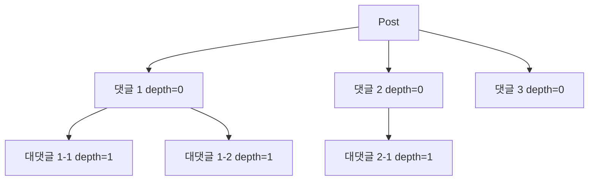

# 댓글 구조 — flat vs 2-level vs 무한 depth

| 문서 버전 | 작성일 | 작성자 | 주요 변경 사항 |
| --- | --- | --- | --- |
| v1.0.0 | 2026-05-15 | engineering-agent/tech-lead | 최초 |

**[[design-decisions|↑ design-decisions hub]]**

> "댓글의 depth 를 어디까지" — flat / 2-level / 무한. 잘못 선택하면 **UX 망함 또는 쿼리 폭증**.

---

## 1. 본 vault 결정

**2-level** (댓글 + 대댓글 까지). 대대댓글 시도 시 부모 comment 의 reply 로 평탄화.

- depth=0: 댓글 (parent_id=NULL)
- depth=1: 대댓글 (parent_id={comment_id})
- depth=2+: 허용 X (부모 reply 로)

---

## 2. 옵션 비교 — 4구조

### 2.1 Flat (depth 0, 대댓글 X)

**왜 적합**
- 가장 단순 — 1차원 list.
- 쿼리 단순 (ORDER BY createdAt).
- UX 단순.

**왜 안 됨 (커뮤니티)**
- "이 댓글에 답하기" 흐름 표현 어려움 → 멘션 (@nickname) 으로 우회.
- 토론 구조 X.

**언제 적합**
- Q&A 형 (질문 → 답변만, 추가 토론 적음).
- 매거진 (관리자 글 + user 댓글, 댓글끼리 토론 X).

---

### 2.2 2-level (본 vault — 댓글 + 대댓글)

**왜 적합**
- 댓글 + 답변 흐름 OK (대부분 케이스).
- UX 명확 (들여쓰기 1단계).
- 쿼리 단순 (parent_id 만).
- DB 부담 ↓.

**왜 안 됨**
- 깊은 토론 (5-level+) 표현 X.
- 단 — UX 측면에서 깊은 댓글은 가독성 ↓ 으로 오히려 unhelpful.

**대안**
- 2-level 강제 + 더 깊은 답변 시 부모 comment 의 reply 로 평탄화 + @멘션.

**트레이드오프**
- 깊은 토론 X vs UX 명확.
- 한국 커뮤니티 (당근 / 무신사 / 디시) 다수 = 2-level.

---

### 2.3 무한 depth (Reddit / Hacker News)

**왜 적합**
- 깊은 토론 자연 (정치 / 기술 토론 site).
- 사용자가 "thread" 형식 익숙.

**왜 안 됨 (일반 커뮤니티)**
- UX 가독성 ↓ (모바일은 들여쓰기 표시 어려움).
- 쿼리 복잡 (recursive CTE 또는 path encoding).
- 댓글 cache / 페이지네이션 어려움.
- 한국 모바일 user 친숙 X.

**구현 방법**
- adjacency list (parent_id) — recursive CTE.
- materialized path (path 컬럼) — `1/3/7`.
- nested set — 복잡.

**언제 적합**
- 영문 / 기술 토론 site (Reddit / HN 클론).

---

## 3. DB 스키마 — 2-level

```sql
CREATE TABLE comments (
    id         CHAR(26) PRIMARY KEY,
    post_id    CHAR(26) NOT NULL REFERENCES posts(id),
    parent_id  CHAR(26) REFERENCES comments(id),    -- NULL = 댓글 (depth 0), 값 = 대댓글
    author_id  CHAR(26) NOT NULL,
    content    TEXT NOT NULL,
    status     VARCHAR(20) NOT NULL DEFAULT 'ACTIVE',
    created_at TIMESTAMPTZ NOT NULL DEFAULT now(),

    CONSTRAINT chk_no_grandchild
        CHECK (parent_id IS NULL OR
               (SELECT parent_id FROM comments c2 WHERE c2.id = comments.parent_id) IS NULL)
);

CREATE INDEX ix_comments_post_parent ON comments (post_id, parent_id, created_at);
CREATE INDEX ix_comments_post_active ON comments (post_id, created_at)
    WHERE status = 'ACTIVE';
```

### 3.1 왜 CHECK 제약 (대대댓글 차단)

- application 의 검증만 의존 시 — 직접 SQL INSERT 우회 가능.
- DB 가 마지막 방어선.

### 3.2 application 단 평탄화

```java
public Comment createReply(CommentId parentId, CommentCreateCmd cmd) {
    var parent = comments.findById(parentId).orElseThrow();
    if (parent.parentId() != null) {
        // 부모가 대댓글 → 부모의 부모 (조부모) 의 reply 로 평탄화
        parentId = parent.parentId();
    }
    return Comment.create(cmd.postId(), parentId, cmd.authorId(), cmd.content());
}
```

→ 사용자가 "대대댓글" 시도해도 자동 1-level 위로.

---

## 4. 댓글 tree 조회



### 4.1 쿼리

```sql
-- 댓글 + 대댓글 한 번에
SELECT * FROM comments
WHERE post_id = ? AND status = 'ACTIVE'
ORDER BY COALESCE(parent_id, id), created_at;
```

```java
// application 단 tree 구성
Map<CommentId, List<Comment>> byParent = comments.stream()
    .filter(c -> c.parentId() != null)
    .collect(Collectors.groupingBy(Comment::parentId));

return comments.stream()
    .filter(c -> c.parentId() == null)
    .map(c -> new CommentTree(c, byParent.getOrDefault(c.id(), List.of())))
    .toList();
```

### 4.2 왜 한 query 로

- N+1 회피 — 댓글마다 자식 조회 X.
- post 의 모든 comment + reply 한 번에.

---

## 5. 페이지네이션

### 5.1 댓글 (depth 0)

```sql
SELECT * FROM comments
WHERE post_id = ? AND parent_id IS NULL AND status = 'ACTIVE'
ORDER BY created_at
LIMIT 20 OFFSET ?
```

→ 부모 댓글 page. 자식은 page 당 별도 fetch.

### 5.2 대댓글 (depth 1)

- 부모 댓글의 자식 — 전체 fetch (보통 적음).
- 만약 자식 1000+ 면 — 별도 endpoint (`GET /comments/{id}/replies?cursor=...`).

---

## 6. 삭제 정책

```mermaid
flowchart LR
    A[부모 댓글 삭제 시도] --> B{자식 (대댓글) 있나?}
    B -->|있음| C[soft delete<br/>content='[삭제된 댓글]'<br/>row 유지]
    B -->|없음| D[soft delete<br/>또는 hard delete 옵션]

    style C fill:#fef3c7
```

### 6.1 왜 부모 댓글의 자식이 있으면 soft delete

- hard delete 시 자식 (대댓글) 의 `parent_id` 가 dangling.
- "삭제된 댓글" placeholder 로 자식 보존.

### 6.2 안 하면 무슨 문제

- 자식 대댓글이 부모 없는 고아 → 표시 어려움.

---

## 7. 함정 모음

### 함정 1 — 무한 depth 허용
UX 가독성 ↓ (모바일) + 쿼리 복잡.
→ 2-level 강제.

### 함정 2 — 대대댓글 시도 무시 (에러)
사용자가 답글 못 씀 → UX 망함.
→ 자동 평탄화 (부모 reply 로).

### 함정 3 — N+1 query (댓글마다 자식)
1 post 의 50 댓글 = 51 query.
→ 한 query + tree 구성.

### 함정 4 — 부모 hard delete
자식 고아.
→ 자식 있으면 soft delete.

### 함정 5 — depth CHECK 없음
직접 SQL 우회로 대대댓글 가능.
→ DB CHECK 또는 INSERT trigger.

### 함정 6 — 댓글 sort 가 created_at DESC
대댓글이 부모와 떨어짐.
→ ORDER BY COALESCE(parent_id, id), created_at ASC.

### 함정 7 — comment_count 자동 갱신 누락
post.comment_count 가 실제와 mismatch.
→ INSERT/DELETE trigger 또는 application UPDATE.

### 함정 8 — XSS sanitize 누락
댓글 content 의 `<script>` → 다른 user 영향.
→ rendering 시 sanitize.

---

## 8. 관련

- [[design-decisions|↑ hub]]
- [[content-format]] — 댓글도 markdown
- [[../implementation/comment-impl]]
- [[../database/database]] — comments 테이블
