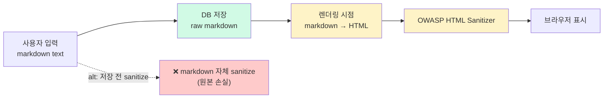

# 글 content 형식 — Markdown vs HTML vs JSON

| 문서 버전 | 작성일 | 작성자 | 주요 변경 사항 |
| --- | --- | --- | --- |
| v1.0.0 | 2026-05-15 | engineering-agent/tech-lead | 최초 |

**[[design-decisions|↑ design-decisions hub]]**

> "글 content 를 어떤 형식으로 저장하나" — Markdown / HTML / JSON. 잘못 선택하면 **XSS 무방비 또는 에디터 호환 X**.

---

## 1. 본 vault 결정

**Markdown** (sanitize 후 저장) + 렌더링 시 HTML 변환.

- 저장: 사용자 입력 그대로 (markdown text).
- 렌더링: `commonmark-java` → HTML + OWASP HTML Sanitizer.
- 에디터: TipTap / Toast UI Editor (markdown 호환).

---

## 2. 옵션 비교 — 4구조

### 2.1 Markdown (본 vault 선택)

**왜 적합**
- 사용자 친숙 (GitHub / Notion / 디스코드 — 익숙).
- 저장 size 작음 (HTML 보다 ↓).
- 형식 단순 → 검색 / 인덱싱 / preview 추출 쉬움.
- 에디터 다양 (TipTap / TUI / Toast).

**안 하면 무슨 문제**
- HTML 직접 저장 시 — XSS 가드 부담 (모든 HTML element / attribute 검증).
- Plain text 만 — 굵게 / 링크 / 이미지 등 기본 표현 X.

**대안과 왜 안 됨**
- HTML — XSS 가드 복잡 + 사용자가 raw HTML 입력 시 의도치 않은 스타일.
- JSON (Slate / TipTap / ProseMirror) — 구조 강력하지만 다른 도구로 변환 어려움 + 검색 부담.

**트레이드오프**
- markdown 의 일부 표현 한계 (복잡한 layout / 표 / 색상 X) — 대부분 OK.
- 렌더링 시점에 sanitize 필요.

---

### 2.2 HTML (직접 저장)

**왜 적합한 케이스**
- 에디터가 HTML output (CKEditor / Quill default).
- 복잡한 layout / 인라인 스타일 필요.

**왜 안 됨 (커뮤니티 게시판)**
- XSS 가드 부담 ↑↑ — 모든 attribute (onclick / style url 등) 검증.
- 저장 size ↑ (markdown 의 2-3배).
- 검색 / preview 추출 시 HTML 파싱 필요.

**대안**
- HTML + 강한 sanitize (OWASP Java HTML Sanitizer) — 가능하지만 markdown 이 단순.

**트레이드오프**
- 자유도 vs 보안 부담.

---

### 2.3 JSON 구조 (Slate / TipTap / ProseMirror)

**왜 적합한 케이스**
- Notion / Medium 같은 강한 에디터.
- 다양한 block type (heading / quote / code / embed / table).
- 협업 (Yjs / Automerge) 지원.

**왜 안 됨 (일반 게시판)**
- 검색 — JSON 안의 text 추출 비용.
- 다른 도구 (모바일 native) 로 마이그레이션 어려움.
- 구조 복잡 → 디버깅 / SQL query 어려움.

**언제 적합**
- 협업 에디터 (Notion 같은) 가 핵심.
- 일반 게시판은 과잉.

---

## 3. Markdown 처리 흐름



### 3.1 왜 저장은 raw, 렌더링 시점 sanitize

- 사용자가 입력한 원본 보존 (재편집 / migration 용).
- 렌더링 정책 변경 시 (sanitize rule 강화) — 옛 글도 자동 적용.
- 검색 / preview 추출 시 markdown 의 단순 형식 활용.

### 3.2 안 하면 무슨 문제

- 저장 시 sanitize → 원본 손실. 재편집 시 잘림.
- 렌더링 안 sanitize → XSS 폭탄.

---

## 4. 구현 — commonmark-java + OWASP HTML Sanitizer

```kotlin
implementation("org.commonmark:commonmark:0.22.0")
implementation("com.googlecode.owasp-java-html-sanitizer:owasp-java-html-sanitizer:20240325.1")
```

```java
@Component
public class MarkdownRenderer {

    private final Parser parser = Parser.builder().build();
    private final HtmlRenderer renderer = HtmlRenderer.builder().build();

    private static final PolicyFactory POLICY = new HtmlPolicyBuilder()
        .allowElements("p", "br", "b", "i", "em", "strong", "a", "code", "pre",
                       "blockquote", "ul", "ol", "li", "h1", "h2", "h3", "img")
        .allowAttributes("href").onElements("a")
        .allowAttributes("src", "alt").onElements("img")
        .allowUrlProtocols("https")        // http X (insecure)
        .requireRelNofollowOnLinks()        // SEO 보호
        .toFactory();

    public String render(String markdown) {
        var node = parser.parse(markdown);
        var rawHtml = renderer.render(node);
        return POLICY.sanitize(rawHtml);
    }
}
```

### 4.1 왜 whitelist (blacklist 가 아님)

- whitelist = "이것만 허용" — 새 element / attribute 자동 차단.
- blacklist = "이것 제외" — 새 위협 (HTML5 새 element) 무방비.

### 4.2 왜 `https://` 만

- `javascript:` / `data:` URL 차단 — XSS.
- `http://` 차단 — mixed content 경고.

### 4.3 왜 `rel="nofollow"` 강제

- SEO — 사용자 글의 외부 link 가 우리 PageRank 영향 X.
- Spam link 가 SEO 무력화.

---

## 5. 검색 / preview 추출

```java
public String extractPreview(String markdown, int maxLength) {
    // markdown 의 첫 문단 + image / link 마크 제거
    return markdown.lines()
        .filter(line -> !line.startsWith("#") && !line.isBlank())
        .findFirst()
        .map(line -> line.replaceAll("\\[(.*?)\\]\\(.*?\\)", "$1")  // [text](url) → text
                          .replaceAll("!\\[.*?\\]\\(.*?\\)", "")     //  → ""
                          .replaceAll("[*_`]", ""))                  // markdown markers
        .map(s -> s.length() > maxLength ? s.substring(0, maxLength) + "..." : s)
        .orElse("");
}
```

**왜 markdown text 그대로 검색 가능**
- ILIKE / FTS 가 markdown text 그대로 처리 (markup 무관).
- HTML 저장 시 — `<p>실제 내용</p>` 의 tag 까지 검색 → 노이즈.

---

## 6. 에디터 선택

| 에디터 | output | 추천 |
| --- | --- | --- |
| **TipTap** | Markdown export 지원 | ✅ React / Vue 호환 |
| **Toast UI Editor** | Markdown native | ✅ 한국 친화 |
| **Quill** | HTML | △ (markdown 변환 필요) |
| **CKEditor 5** | HTML | △ |
| **Slate.js** | JSON | 협업 시만 |

본 vault 권장: **Toast UI Editor** (markdown native + 한국어 친화) 또는 **TipTap** (React 환경).

---

## 7. 함정 모음

### 함정 1 — HTML 직접 저장
XSS 가드 부담 ↑ + size ↑.
→ markdown.

### 함정 2 — 저장 시 sanitize
원본 손실 → 재편집 / migration 어려움.
→ 저장 raw, 렌더링 시 sanitize.

### 함정 3 — Blacklist sanitize
새 element / attribute 무방비.
→ whitelist.

### 함정 4 — `javascript:` URL 허용
XSS.
→ https / mailto 만.

### 함정 5 — `rel="nofollow"` 누락
사용자 글의 spam link 가 SEO 망침.
→ 강제.

### 함정 6 — Preview 추출 시 markdown markup 그대로
"`# 제목` 의 글" 같은 노이즈.
→ markup 제거 후 추출.

### 함정 7 — 검색 시 HTML 파싱
비효율 + 노이즈.
→ markdown raw 검색.

### 함정 8 — 사용자별 다른 에디터 (markdown + HTML 혼합)
저장 형식 일관성 X.
→ 한 형식 강제.

### 함정 9 — 이미지 URL 검증 X
사용자가 외부 site 의 이미지 link → 외부 server 부담 + 차단 가능.
→ S3 / CDN 의 own URL 만 허용.

### 함정 10 — 렌더링 결과 cache 없음
매 조회마다 markdown → HTML 변환 → CPU 부담.
→ Redis cache 또는 DB 의 rendered_html 컬럼.

---

## 8. 다른 컨텍스트

### 8.1 협업 에디터 필요 (Notion / Confluence 같은)

```yaml
content-format: json (TipTap / Slate)
collaboration: yjs / automerge
storage: jsonb
```

### 8.2 관리자 only (블로그 / 매거진)

```yaml
content-format: html (CKEditor)
sanitize: minimal (작성자 = 관리자)
```

### 8.3 익명 / abuse 위험 큼

```yaml
content-format: markdown
sanitize: strict
image-upload: 본인 인증된 user 만
```

---

## 9. 관련

- [[design-decisions|↑ hub]]
- [[../security/sensitive-data-handling]] — XSS 가드
- [[../implementation/post-crud-impl]] — render 적용
- [[attachment-storage]] — 이미지 첨부 정책
- 외부 — commonmark spec, OWASP Java HTML Sanitizer docs
