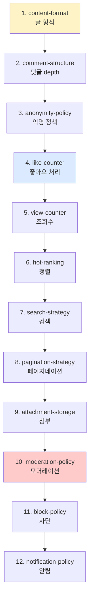

# board §4 — 설계 의사결정 (Hub)

| 문서 버전 | 작성일 | 작성자 | 주요 변경 사항 |
| --- | --- | --- | --- |
| v1.0.0 | 2026-05-15 | engineering-agent/tech-lead | 최초 — 12 결정 |

**[[../board|↑ board hub]]**  ·  ← [[../requirements]]  ·  → [[../database/database]]

> ⭐ **이 폴더의 핵심 결정 가이드.** 커뮤니티 게시판의 12 결정 — 각자 자기 노트.

---

## 1. 12 개 결정의 인덱스

### 1.1 콘텐츠 / 모델

| 노트 | 결정 | 본 vault 기본 |
| --- | --- | --- |
| [[content-format]] | 글 content 형식 | Markdown + sanitize |
| [[comment-structure]] | 댓글 depth | 2-level (대댓글까지) |
| [[anonymity-policy]] | 익명 / 닉네임 | board 별 정책 (default: 닉네임 필수) |

### 1.2 동작 / 카운터

| 노트 | 결정 | 본 vault 기본 |
| --- | --- | --- |
| [[like-counter]] | 좋아요 counter 처리 | Redis HINCRBY + 1시간 batch sync |
| [[view-counter]] | 조회수 counter | Redis + 1시간 batch + bot filter |
| [[hot-ranking]] | 인기 글 정렬 algorithm | Reddit 식 (시간 감쇠 + log(likes)) |

### 1.3 검색 / 페이지네이션

| 노트 | 결정 | 본 vault 기본 |
| --- | --- | --- |
| [[search-strategy]] | 검색 도구 선택 | DB ILIKE → PostgreSQL FTS → Elasticsearch |
| [[pagination-strategy]] | 페이지네이션 방식 | cursor-based (무한 스크롤) |

### 1.4 첨부 / 모더레이션

| 노트 | 결정 | 본 vault 기본 |
| --- | --- | --- |
| [[attachment-storage]] | 첨부 파일 storage | S3 presigned URL + CloudFront |
| [[moderation-policy]] | 신고 / 모더레이션 정책 | 5회 자동 hide + admin review |
| [[block-policy]] | 차단 사용자 정책 | block list + 조회 시 filter |

### 1.5 알림

| 노트 | 결정 | 본 vault 기본 |
| --- | --- | --- |
| [[notification-policy]] | 좋아요 / 댓글 알림 | outbox + FCM/APNs (사용자 OFF 가능) |

---

## 2. 결정의 순서

---

## 3. 본 vault 의 표준 가정

| 항목 | 가정 |
| --- | --- |
| 서비스 종류 | 한국 B2C 커뮤니티 게시판 |
| 트래픽 | MAU 10만 ~ 1000만 |
| 인프라 | AWS 서울 + RDS PostgreSQL + Redis + S3 + CloudFront |
| 콘텐츠 | UGC (사용자 생성) — XSS 가드 critical |
| 모더레이션 | 5회 신고 자동 hide + admin review |
| 알림 | FCM (Android) + APNs (iOS) — 옵션 |

**다른 컨텍스트 시 변경**:
- 익명 커뮤니티 (디시 / 일베) → anonymity-policy 변경
- 매거진 (관리자 글 only) → 댓글 / 좋아요만 활성
- 글로벌 → CloudFront 다중 region + 검색 ES

---

## 4. 관련

- [[../board|↑ board hub]]
- [[../requirements]] — 이전 (§3)
- [[../database/database]] — 다음 (§5)
- [[../security/security]] — 보안 정책
- [[../signup/design-decisions/design-decisions|↗ signup design-decisions]] — 참고 패턴
