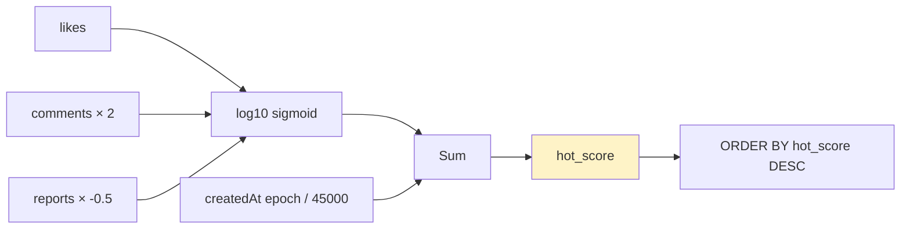

# 인기 글 정렬 — Reddit-style 시간 감쇠

| 문서 버전 | 작성일 | 작성자 | 주요 변경 사항 |
| --- | --- | --- | --- |
| v1.0.0 | 2026-05-15 | engineering-agent/tech-lead | 최초 |

**[[design-decisions|↑ design-decisions hub]]**

> "인기 글 어떻게 정렬하나" — like 만 보면 옛 글이 우위. 시간 감쇠 algorithm 필요.

---

## 1. 본 vault 결정

**Reddit-style hot score**:

```
hot_score = log10(max(likes + comments*2, 1)) + (created_epoch_seconds / 45000)
```

- log10 — viral 효과 감소.
- 시간 항 — 새 글이 우위.
- 45000 = 12.5시간 — 1점 = 12.5h.

DB 의 `posts.hot_score` 컬럼 + 1시간 batch 갱신.

---

## 2. 옵션 비교 — 4구조

### 2.1 단순 likes DESC

```sql
ORDER BY like_count DESC
```

**왜 안 됨**
- 옛 글이 영구 우위 (좋아요 누적).
- 새 글이 노출 X → 작성자 동기 ↓.

---

### 2.2 최신 (createdAt DESC)

```sql
ORDER BY created_at DESC
```

**왜 안 됨 (메인 화면)**
- 좋아요 안 받은 글도 똑같이 노출.
- 평범한 글 / abuse 글이 메인.

---

### 2.3 Reddit hot score (본 vault)

```
score = log10(max(likes + comments*2 - 0.5*reports, 1))
      + (created_epoch_seconds / 45000)
```



**왜 적합**
- log10 → 좋아요 100 vs 1000 의 차이 = 1점 (viral 완화).
- 시간 항 = 12.5h 마다 1점 → 새 글이 12.5h 안에 100배 like 필요해야 옛 글 추월.
- comments × 2 = 적극 참여 가산.
- reports × -0.5 = 모더레이션 약한 페널티.

**참고**: Reddit 의 [공식 algorithm](https://medium.com/hacking-and-gonzo/how-reddit-ranking-algorithms-work-ef111e33d0d9).

---

### 2.4 시간 윈도우 별 (옵션)

```sql
WHERE created_at >= now() - INTERVAL '7 days'
ORDER BY like_count DESC
```

**왜 적합**
- 단순 + 효과적.
- "지난 7일 인기" 직관적.

**왜 본 vault 는 hot score**
- 1시간 / 1일 / 1주 별 별도 query 부담.
- hot score 한 번 계산 = 모든 시점 valid.

---

## 3. 구현

```java
@Component
public class HotScoreCalculator {

    private static final long EPOCH_SECONDS_2026 = 1767225600L;  // 2026-01-01
    private static final double TIME_DIVISOR = 45000;             // 12.5h

    public double calculate(int likes, int comments, int reports, Instant createdAt) {
        double score = likes + comments * 2.0 - reports * 0.5;
        double order = Math.log10(Math.max(Math.abs(score), 1));
        double sign = Math.signum(score);
        double secondsSinceEpoch = createdAt.getEpochSecond() - EPOCH_SECONDS_2026;
        return sign * order + secondsSinceEpoch / TIME_DIVISOR;
    }
}
```

### 3.1 왜 EPOCH_2026 (Unix epoch 아님)

- Unix epoch (1970) 부터 = 매우 큰 숫자.
- 2026-01-01 기준 = score 가 적당한 범위 (수만대).

### 3.2 왜 sign 처리

- score 가 음수 (reports > likes + comments) 시 — log10 의 절대값 + 부호.
- 신고 많은 글은 음수 → 정렬 후순위.

---

## 4. Batch 갱신

```java
@Component
@RequiredArgsConstructor
public class HotScoreBatchJob {

    private final PostRepository posts;
    private final HotScoreCalculator calc;

    @Scheduled(cron = "0 0 * * * *")            // 매시간
    @SchedulerLock(name = "hotScoreBatch", lockAtMostFor = "30m")
    public void updateHotScores() {
        // 최근 30일 글만 갱신 — 옛 글은 cold (점수 안 바뀜)
        var cutoff = Instant.now().minus(Duration.ofDays(30));
        posts.findByCreatedAtAfter(cutoff).forEach(post -> {
            double score = calc.calculate(
                post.likeCount(), post.commentCount(), post.reportCount(),
                post.createdAt()
            );
            posts.updateHotScore(post.id(), score);
        });
    }
}
```

### 4.1 왜 최근 30일만

- 30일 전 글의 hot_score = 30일 후 다시 안 봄 (시간 항이 매우 큼).
- 부담 ↓.

### 4.2 왜 batch (실시간 X)

- 매 좋아요 마다 hot_score 재계산 = 부담.
- 1시간 grace = UX 영향 X.

---

## 5. DB 스키마

```sql
ALTER TABLE posts ADD COLUMN hot_score DOUBLE PRECISION NOT NULL DEFAULT 0;

-- 인기 글 query 인덱스
CREATE INDEX ix_posts_board_hot ON posts (board_id, hot_score DESC, id)
    WHERE status = 'PUBLISHED';
```

### 5.1 왜 partial index (status = 'PUBLISHED')

- HIDDEN / DELETED 글 인덱스에서 제외 → 크기 ↓.

### 5.2 왜 (board_id, hot_score) 복합

- 자유게시판 / Q&A 각 board 의 hot 별도 조회.
- 단일 hot_score 인덱스만 — board 별 join 부담.

---

## 6. Cursor pagination

```sql
-- 첫 페이지
SELECT * FROM posts
WHERE board_id = ? AND status = 'PUBLISHED'
ORDER BY hot_score DESC, id DESC
LIMIT 20;

-- 다음 페이지 (cursor = (last_score, last_id))
SELECT * FROM posts
WHERE board_id = ? AND status = 'PUBLISHED'
  AND (hot_score, id) < (?, ?)
ORDER BY hot_score DESC, id DESC
LIMIT 20;
```

→ tuple comparison 으로 정확한 cursor.

자세히: [[pagination-strategy]].

---

## 7. 함정 모음

### 함정 1 — 단순 likes DESC
옛 글이 영구 우위.
→ 시간 감쇠 적용.

### 함정 2 — 실시간 hot_score 재계산
매 좋아요 마다 → DB 부담.
→ 1시간 batch.

### 함정 3 — 모든 post 갱신 (옛 것도)
1억 row 매시간 update → DB 멈춤.
→ 최근 30일만.

### 함정 4 — index 없음 (hot_score)
정렬 시 풀스캔.
→ (board_id, hot_score DESC) 인덱스.

### 함정 5 — partial index 없이 (HIDDEN 포함)
인덱스 비대.
→ WHERE status = 'PUBLISHED'.

### 함정 6 — comments × 2 너무 높음 (× 10)
댓글 spam 으로 hot 만들기 가능.
→ × 2 정도 균형.

### 함정 7 — Bot like / 어뷰즈
조작 가능.
→ rate limit + bot filter + 신고 시스템.

### 함정 8 — Cold start (좋아요 0)
새 글의 hot_score = 시간 항만 → 0 like 글이 page 1.
→ "hot" 외 "trending" / "discussed" 등 다른 sort 옵션.

---

## 8. 다른 컨텍스트

### 8.1 매거진 / 뉴스

```yaml
ranking: 운영자 픽 + view count + 시간
hot-algorithm: 단순 (시간 윈도우)
```

### 8.2 토론 / 정치 (Reddit 식)

```yaml
ranking: hot / new / top / controversial
algorithm: Reddit hot + controversy 점수
```

### 8.3 큐레이션 우선

```yaml
ranking: featured 우선 + hot
admin-pick: 가중치
```

---

## 9. 관련

- [[design-decisions|↑ hub]]
- [[like-counter]] · [[view-counter]] — counter input
- [[pagination-strategy]] — cursor 정렬
- [[../implementation/search-pagination-impl]]
- 외부 — Reddit ranking algorithm
