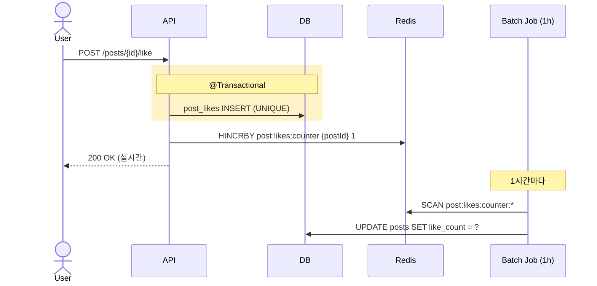

# 좋아요 counter — Redis vs DB vs hybrid

| 문서 버전 | 작성일 | 작성자 | 주요 변경 사항 |
| --- | --- | --- | --- |
| v1.0.0 | 2026-05-15 | engineering-agent/tech-lead | 최초 |

**[[design-decisions|↑ design-decisions hub]]**

> "좋아요 counter 를 어떻게 처리하나" — 인기 글의 좋아요는 분당 수천 건. 잘못 선택하면 **DB 락 폭증 또는 counter 불일치**.

---

## 1. 본 vault 결정

**Hybrid** — Redis HINCRBY (실시간) + 1시간 batch DB sync.

- `post_likes` 테이블: who 좋아요 (UNIQUE per user+target).
- Redis: `post:likes:{postId}` counter.
- DB `posts.like_count`: snapshot (batch sync).
- 조회: Redis counter (실시간) + 장애 시 DB fallback.

---

## 2. 옵션 비교 — 4구조

### 2.1 DB UPDATE (단순)

```java
@Transactional
public void like(UserId userId, PostId postId) {
    likes.insert(userId, postId);
    posts.incrementLikeCount(postId);    // UPDATE posts SET like_count = like_count + 1
}
```

**왜 적합 (소규모)**
- 단순 — counter 가 DB 의 진실의 원천.
- 트랜잭션 일관성 (좋아요 row INSERT + counter UPDATE = atomic).

**왜 안 됨 (인기 글)**
- 인기 글의 같은 row UPDATE 폭주 → row lock 경합.
- 분당 1000+ 좋아요 시 throughput 망함.

---

### 2.2 Redis only (실시간)

```java
public void like(UserId userId, PostId postId) {
    redis.opsForSet().add("post:likes:users:" + postId, userId);
    redis.opsForValue().increment("post:likes:count:" + postId);
}
```

**왜 적합**
- Throughput ↑↑ (Redis HINCRBY = O(1)).
- 즉시 표시.

**왜 안 됨**
- Redis 장애 시 counter 손실.
- DB 와 sync X — audit / 정렬 / 분석 X.

---

### 2.3 Hybrid (본 vault — Redis + DB batch)



**왜 적합 (본 vault)**
- DB 의 `post_likes` 가 진실 (who) — audit.
- Redis 가 실시간 counter — UX 빠름.
- batch sync — DB UPDATE 부담 ↓.

**복구**
- Redis 장애 시 `SELECT COUNT(*) FROM post_likes WHERE post_id=?` 로 재계산.
- batch 가 일정 주기로 sync — 불일치 자연 복구.

**트레이드오프**
- 약간의 eventual consistency (1시간 grace).
- 조회 시 Redis 우선, miss 시 DB count(*) — 약간 더 비쌈.

---

## 3. 구현

```java
@Service
@RequiredArgsConstructor
public class PostLikeService {

    private final PostLikeRepository likes;
    private final RedisTemplate<String, String> redis;
    private final EventPublisher events;

    @Transactional
    public void like(UserId userId, PostId postId) {
        try {
            likes.insert(new PostLike(userId, postId, Instant.now()));
        } catch (DataIntegrityViolationException e) {
            return;   // 이미 좋아요 — silent (idempotent)
        }
        // Redis counter +1 (트랜잭션 commit 후 안전)
        events.publishEvent(new PostLiked(postId, userId));
    }

    @TransactionalEventListener(phase = AFTER_COMMIT)
    public void onLiked(PostLiked e) {
        redis.opsForValue().increment("post:likes:" + e.postId());
    }

    @Transactional
    public void unlike(UserId userId, PostId postId) {
        int deleted = likes.delete(userId, postId);
        if (deleted > 0) {
            events.publishEvent(new PostUnliked(postId, userId));
        }
    }

    @TransactionalEventListener(phase = AFTER_COMMIT)
    public void onUnliked(PostUnliked e) {
        redis.opsForValue().decrement("post:likes:" + e.postId());
    }

    public long count(PostId postId) {
        var redisCount = redis.opsForValue().get("post:likes:" + postId);
        if (redisCount != null) return Long.parseLong(redisCount);

        // Redis miss → DB fallback + cache
        long dbCount = likes.countByPostId(postId);
        redis.opsForValue().set("post:likes:" + postId, String.valueOf(dbCount),
            Duration.ofHours(24));
        return dbCount;
    }
}
```

### 3.1 왜 AFTER_COMMIT 에서 Redis 증가

- 트랜잭션 rollback 시 Redis 만 증가 = 영구 불일치.
- AFTER_COMMIT = DB 확정 후 Redis 갱신.

자세히: [[../../signup/transactions]] · [[../implementation/like-bookmark-impl]].

### 3.2 왜 DataIntegrityViolationException catch

- 같은 user 가 두 번 좋아요 (race) — DB UNIQUE 위반.
- silent ignore = idempotent (사용자 입장 OK).

---

## 4. Batch Sync Job

```java
@Component
@RequiredArgsConstructor
@Slf4j
public class PostLikeCountBatchJob {

    private final PostRepository posts;
    private final RedisTemplate<String, String> redis;

    @Scheduled(cron = "0 0 * * * *")           // 매시 0분
    @SchedulerLock(name = "postLikeCountSync", lockAtMostFor = "30m")
    public void sync() {
        Set<String> keys = redis.keys("post:likes:*");
        for (String key : keys) {
            String postId = key.replace("post:likes:", "");
            Long count = Long.parseLong(redis.opsForValue().get(key));
            posts.updateLikeCount(postId, count);
        }
        log.info("post like count batch sync: {} posts", keys.size());
    }
}
```

### 4.1 왜 ShedLock

- 다중 인스턴스 환경 — 같은 cron 시점에 batch 동시 실행.
- ShedLock 으로 단일 실행 보장.

### 4.2 왜 매시간

- 너무 짧음 (1분) → DB UPDATE 부담 ↑.
- 너무 김 (1일) → 검색 / 정렬 시 정확도 ↓.
- 1시간 = UX 와 부담 균형.

---

## 5. DB 스키마

```sql
CREATE TABLE post_likes (
    user_id    CHAR(26) NOT NULL REFERENCES users(id),
    post_id    CHAR(26) NOT NULL REFERENCES posts(id),
    created_at TIMESTAMPTZ NOT NULL DEFAULT now(),
    PRIMARY KEY (user_id, post_id)            -- 같은 user 가 같은 post 한 번만
);

CREATE INDEX ix_post_likes_post_created ON post_likes (post_id, created_at DESC);
CREATE INDEX ix_post_likes_user_created ON post_likes (user_id, created_at DESC);

-- counter
ALTER TABLE posts ADD COLUMN like_count INTEGER NOT NULL DEFAULT 0;
```

### 5.1 왜 PK (user_id, post_id)

- 같은 user 가 같은 post 두 번 좋아요 차단 (race condition 도 DB UNIQUE 가 잡음).
- 사용자가 좋아요 했는지 조회 = PK lookup (O(1)).

### 5.2 왜 별도 인덱스 (post_id, created_at)

- "이 post 의 최근 좋아요 user" 조회 (옵션 UI).

---

## 6. 함정 모음

### 함정 1 — Redis 만 사용 (DB row 없음)
audit / 정렬 / 분석 X. 장애 시 손실.
→ DB 의 post_likes + Redis counter.

### 함정 2 — DB UPDATE 만 (Redis 없음)
인기 글의 row lock 경합 → throughput 망함.
→ Hybrid.

### 함정 3 — 트랜잭션 안에서 Redis 증가
rollback 시 Redis 만 +1 = 영구 불일치.
→ AFTER_COMMIT.

### 함정 4 — Idempotency 없음
같은 user 의 두 번 좋아요 시 409 / 500 응답 → UX 망함.
→ DataIntegrityViolationException catch + silent.

### 함정 5 — counter 가 DB / Redis 불일치 grace 없음
batch sync 시점에 약간의 불일치 OK.
→ 1시간 grace 명시.

### 함정 6 — Redis key TTL 없음 + 죽은 post
삭제된 post 의 counter 가 영구 누적.
→ post 삭제 시 Redis DEL.

### 함정 7 — Batch job 다중 실행
ShedLock 없음 → 같은 batch 가 다중 인스턴스 → DB UPDATE 폭주.
→ ShedLock.

### 함정 8 — 좋아요 history 안 보존
"누가 언제 좋아요 했는지" X → audit / spam 분석 어려움.
→ post_likes 영구 보존.

---

## 7. 다른 컨텍스트

### 7.1 매우 큰 SaaS (MAU 1억+)

```yaml
counter: redis-cluster (3 shard) + kafka log
batch-sync: 매 10분
read: redis 우선 + cassandra fallback (long-term)
```

### 7.2 강한 정합성 (금융 / 투표)

```yaml
counter: db only (transactional)
optimistic-lock: @Version
sacrifice: throughput
```

### 7.3 매우 작은 SaaS (MAU 1만)

```yaml
counter: db only (UPDATE)
redis: skip
```

---

## 8. 관련

- [[design-decisions|↑ hub]]
- [[view-counter]] — 비슷한 패턴 (조회수)
- [[../implementation/like-bookmark-impl]]
- [[../../signup/transactions]] — AFTER_COMMIT
- [[../../distributed-lock]] — ShedLock
