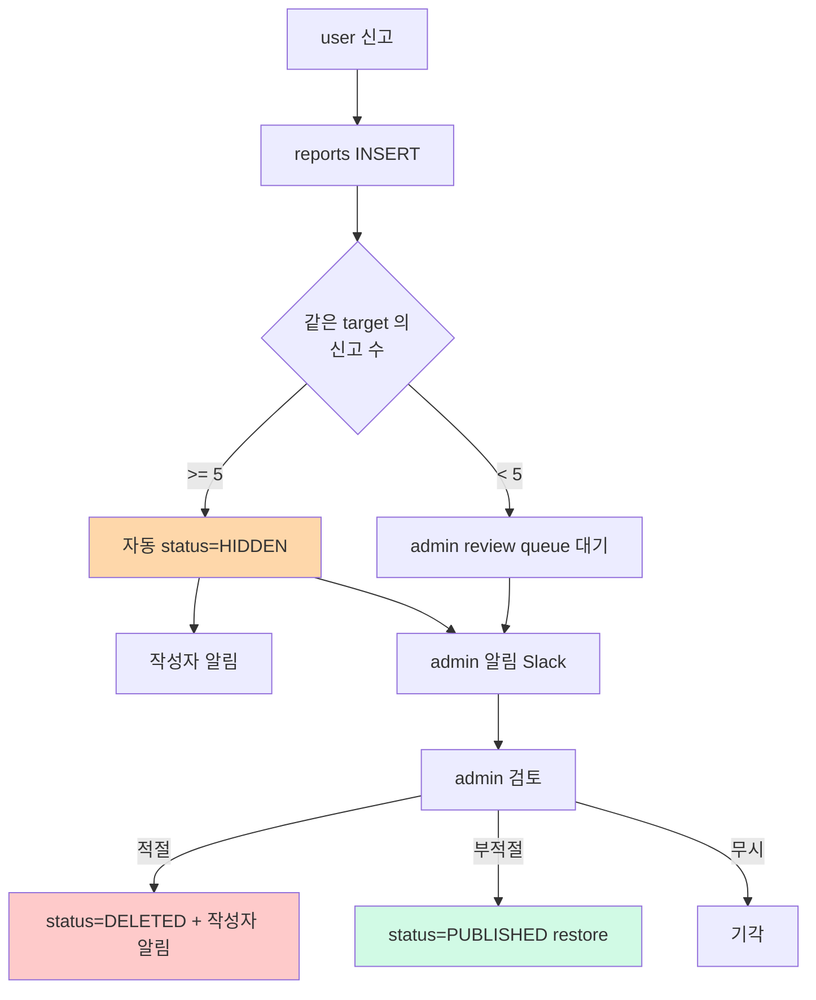
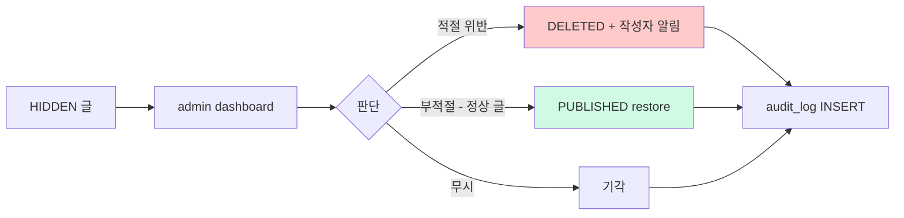

# 모더레이션 정책 — 신고 + 자동 hide + admin review

| 문서 버전 | 작성일 | 작성자 | 주요 변경 사항 |
| --- | --- | --- | --- |
| v1.0.0 | 2026-05-15 | engineering-agent/tech-lead | 최초 |

**[[design-decisions|↑ design-decisions hub]]**

> "신고된 글 어떻게 처리하나" — 무방비 = spam / 불법 / 폭력 콘텐츠 폭증. 자동 + 수동 균형.

---

## 1. 본 vault 결정

**자동 + 수동 hybrid**:

- **자동 hide**: 5회 신고 → `status=HIDDEN` (조회 차단) + 작성자 알림.
- **Admin review**: HIDDEN 글 → 24시간 내 admin 판단.
- **최종**: 승인 → restore / 기각 → DELETED.

---

## 2. 흐름



---

## 3. 신고 사유 — Enum

```java
public enum ReportReason {
    SPAM,              // 광고 / 도배
    INAPPROPRIATE,     // 부적절 / 음란
    HARASSMENT,        // 괴롭힘 / 욕설
    HATE_SPEECH,       // 혐오 발언
    VIOLENCE,          // 폭력 위협
    COPYRIGHT,         // 저작권 침해
    PERSONAL_INFO,     // 개인정보 노출
    OTHER              // 기타 (text 입력)
}
```

### 3.1 왜 enum (자유 text 아님)

- 정형화 → 통계 / 자동 처리 가능.
- "spam 신고가 폭증" 같은 메트릭.
- OTHER 만 자유 text.

---

## 4. 자동 hide 임계값

```yaml
auto-hide-threshold: 5 reports (per target)
```

### 4.1 왜 5

- 너무 낮음 (3) → false positive (정상 글이 abuse 로 hide).
- 너무 높음 (10) → 대응 늦음.
- 5 = 산업 표준 (Reddit / Facebook 비슷한 수치).

### 4.2 가중치 — 신고자 신뢰도

옵션 — 신고자의 과거 신고 정확도 반영:

```java
public double calculateReportWeight(UserId reporterId) {
    var stats = reporterStats.findByUserId(reporterId);
    if (stats == null) return 1.0;
    // 과거 신고의 80% 이상 admin 승인 → 가중치 1.5
    // 50% 미만 → 가중치 0.5
    double accuracy = stats.acceptedReports() / (double) stats.totalReports();
    return accuracy > 0.8 ? 1.5 : accuracy < 0.5 ? 0.5 : 1.0;
}

// auto-hide: SUM(weight) >= 5
```

**왜**
- 신고 bombing 방지 (같은 사람 / 친구들이 단체 신고).
- 신뢰할 만한 신고자 = 빠른 대응.

본 vault 기본: 단순 count (가중치 옵션).

---

## 5. Admin Review



### 5.1 24시간 SLA

```yaml
admin-review-sla: 24h
overdue-alert: 12h 후 Slack
```

- 24h 안 review 없으면 HIDDEN 그대로 (false positive 위험 vs spam 빠른 차단).
- 12h overdue → admin 알람.

### 5.2 audit log

```sql
CREATE TABLE moderation_audit_log (
    id          CHAR(26) PRIMARY KEY,
    target_id   CHAR(26),
    target_type VARCHAR(20),         -- POST / COMMENT
    action      VARCHAR(30),         -- AUTO_HIDDEN / ADMIN_DELETED / ADMIN_RESTORED
    admin_id    CHAR(26),            -- AUTO 시 NULL
    reason      VARCHAR(500),
    created_at  TIMESTAMPTZ
);
```

→ 모든 모더레이션 결정 영구 기록.

---

## 6. 작성자 알림

| 시점 | 알림 |
| --- | --- |
| 자동 HIDDEN | "회원님의 글이 신고로 임시 숨김. 24h 내 admin 검토." |
| ADMIN_DELETED | "회원님의 글이 정책 위반으로 삭제." + 사유 |
| ADMIN_RESTORED | "회원님의 글이 정상으로 확인되어 복원." |

### 6.1 왜 알림

- 사용자에게 처리 결과 통보 = transparency.
- 항의 / appeal 흐름 가능.
- 정상 글 잘못 모더된 경우 사용자 신뢰 회복.

---

## 7. Appeal (재심 — 옵션)

```http
POST /api/v1/posts/{postId}/appeal
{ "reason": "정상적인 의견 표현이라고 생각합니다..." }
```

- DELETED 후 7일 내 appeal 가능.
- admin 재검토 — 최종 판단.

**왜 옵션**
- 사용자 권리 보호.
- 단 — 운영 부담 ↑.

---

## 8. 함정 모음

### 함정 1 — 자동 hide 없음 (admin 만)
spam / 폭력 글이 admin 대응까지 노출.
→ 자동 hide (5회).

### 함정 2 — 임계값 너무 낮음 (3)
신고 bombing 가능.
→ 5 + 가중치 옵션.

### 함정 3 — 같은 user 의 중복 신고 허용
1 user 가 5회 신고 → 자동 hide.
→ UNIQUE (reporter_id, target_id).

### 함정 4 — admin review SLA 없음
HIDDEN 영구 유지 = 정상 글도 피해.
→ 24h SLA + 12h overdue alert.

### 함정 5 — Audit log 없음
"왜 삭제했나" 추적 X.
→ moderation_audit_log.

### 함정 6 — 작성자에게 사유 안 보냄
사용자 항의 / 학습 X.
→ DELETED 시 사유 알림.

### 함정 7 — 신고 후 immediate hide
1 신고 = 즉시 hide → abuse 도구.
→ threshold 필수.

### 함정 8 — Appeal 흐름 없음
정상 글이 잘못 삭제 시 사용자 권리 X.
→ 7일 appeal.

### 함정 9 — 신고자 가중치 없음 (단순 count)
신고 bombing (조직적).
→ 가중치 (정확도 기반).

### 함정 10 — admin 의 모더 권한 audit 없음
admin 의 임의 삭제 가능.
→ admin_id + audit_log 필수.

---

## 9. 다른 컨텍스트

### 9.1 매우 strict (어린이 / 청소년 대상)

```yaml
auto-hide-threshold: 1 신고
ai-moderation: 글 작성 시 자동 분석 (Perspective API)
admin-sla: 1h
```

### 9.2 free speech 우선 (Mastodon / Reddit)

```yaml
auto-hide: 안 함
admin-review: 명백한 위법 (스팸 / 욕설) 만
user-block: 활성 (개인 차단)
```

### 9.3 강제 실명 (네이버 카페)

```yaml
moderation: 실명 user 신고 가중치 ↑
spam: 익명 user 의 글 별도 검토
```

---

## 10. 관련

- [[design-decisions|↑ hub]]
- [[block-policy]] — 차단 사용자 (개인 차단)
- [[../implementation/moderation-impl]]
- [[../security/attack-defense]] — abuse 방어
- [[../security/audit-logging]]
