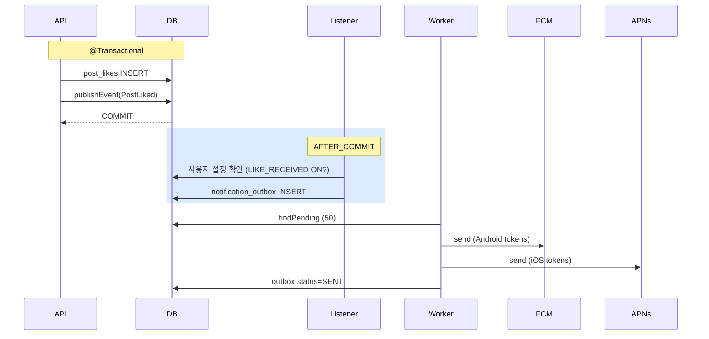

# 알림 정책 — 좋아요 / 댓글 / 멘션

| 문서 버전 | 작성일 | 작성자 | 주요 변경 사항 |
| --- | --- | --- | --- |
| v1.0.0 | 2026-05-15 | engineering-agent/tech-lead | 최초 |

**[[design-decisions|↑ design-decisions hub]]**

> "사용자에게 언제 / 어떻게 알림 보내나" — 너무 많으면 spam, 너무 적으면 engagement ↓.

---

## 1. 본 vault 결정

- **outbox 패턴** — 트랜잭션 안 INSERT, AFTER_COMMIT worker 가 발송.
- **채널**: FCM (Android) + APNs (iOS) + 이메일 (옵션).
- **사용자 설정 가능** — type 별 ON/OFF.
- **rate limit** — 사용자 1시간 50개 알림 (spam 방어).

---

## 2. 알림 type

| Type | 트리거 | 기본 |
| --- | --- | --- |
| LIKE_RECEIVED | 자기 글 / 댓글에 좋아요 | OFF (옵션) |
| COMMENT_RECEIVED | 자기 글에 댓글 | ON |
| REPLY_RECEIVED | 자기 댓글에 대댓글 | ON |
| MENTION | @멘션 받음 | ON |
| MODERATION_HIDDEN | 글 / 댓글 모더 hidden | ON (강제 — OFF 불가) |
| MODERATION_RESTORED | 모더 후 복원 | ON |

### 2.1 왜 LIKE_RECEIVED default OFF

- 좋아요는 빈도 ↑ (인기 글 시 분당 100+).
- 매번 알림 = spam.
- 사용자가 원하면 ON.

### 2.2 왜 모더 알림은 강제 ON

- 사용자가 자기 글 상태 모르면 항의 / 혼동.
- 법적 / 운영 의무 (transparency).

---

## 3. Outbox 흐름



→ signup 의 email_outbox 와 같은 패턴. 자세히: [[../../signup/database/email-outbox-table]].

---

## 4. DB 스키마

```sql
CREATE TABLE notification_outbox (
    id              CHAR(26) PRIMARY KEY,
    user_id         CHAR(26) NOT NULL,         -- 받는 user
    type            VARCHAR(30) NOT NULL,
    title           VARCHAR(200) NOT NULL,
    body            VARCHAR(1000) NOT NULL,
    deeplink        VARCHAR(500),               -- 앱 내 이동
    metadata        JSONB,
    status          VARCHAR(20) NOT NULL DEFAULT 'PENDING',
    attempts        INTEGER NOT NULL DEFAULT 0,
    next_attempt_at TIMESTAMPTZ NOT NULL DEFAULT now(),
    sent_at         TIMESTAMPTZ,
    created_at      TIMESTAMPTZ NOT NULL DEFAULT now()
);

CREATE INDEX ix_notification_outbox_pending
    ON notification_outbox (next_attempt_at, status)
    WHERE status IN ('PENDING', 'PROCESSING');

CREATE TABLE notifications (              -- in-app 알림 목록 (사용자 화면)
    id          CHAR(26) PRIMARY KEY,
    user_id     CHAR(26) NOT NULL,
    type        VARCHAR(30) NOT NULL,
    title       VARCHAR(200) NOT NULL,
    body        VARCHAR(1000),
    deeplink    VARCHAR(500),
    read_at     TIMESTAMPTZ,
    created_at  TIMESTAMPTZ NOT NULL DEFAULT now()
);

CREATE INDEX ix_notifications_user_read ON notifications (user_id, read_at, created_at DESC);

CREATE TABLE user_notification_preferences (
    user_id   CHAR(26) PRIMARY KEY,
    settings  JSONB NOT NULL DEFAULT '{}'    -- { "LIKE_RECEIVED": false, "COMMENT_RECEIVED": true, ... }
);
```

---

## 5. Rate Limit (spam 방어)

```yaml
notification-rate-limit:
  per-user: 50 / hour
  per-user-per-type: 20 / hour
  burst-detection: 10 / 10초 → 자동 throttle
```

### 5.1 왜 rate limit

- 인기 글의 좋아요 폭주 → 작성자에게 분당 100 알림 = spam.
- 사용자 OFF 하기 전에 자동 throttle.

### 5.2 Burst → 집계 알림

```
같은 type 의 10 알림 / 10초 발생 시
  → "12 명이 좋아요" 같은 집계 알림 (개별 X)
```

→ Twitter / Instagram 패턴.

---

## 6. 알림 read 처리

```http
PATCH /api/v1/me/notifications/{id}/read
PATCH /api/v1/me/notifications/read-all
```

```sql
UPDATE notifications SET read_at = now()
WHERE user_id = ? AND read_at IS NULL;
```

### 6.1 왜 read_at 별도 컬럼 (BOOLEAN 아님)

- "언제 읽었는지" audit.
- 알림 통계 (UI 노출 vs 읽음).

---

## 7. 함정 모음

### 함정 1 — 트랜잭션 안에서 FCM 호출
DB 락 + 외부 cascade.
→ outbox + AFTER_COMMIT.

### 함정 2 — 좋아요마다 알림 ON default
spam → 사용자 OFF → 결국 다른 알림도 무시.
→ default OFF (옵션 ON).

### 함정 3 — 사용자 설정 무시
"OFF 했는데 받음" → 신뢰 ↓.
→ 발송 전 설정 검증.

### 함정 4 — Rate limit 없음
인기 글 시 사용자 분당 100 알림.
→ 50/h + burst throttle.

### 함정 5 — Self-notification
자기 글에 자기가 좋아요 → 알림 받음 (재밌지만 의미 X).
→ author_id = recipient_id 시 skip.

### 함정 6 — 모더 알림도 OFF 가능
사용자가 자기 글 상태 모름 → 항의.
→ 모더 알림은 강제 ON.

### 함정 7 — FCM token 만료 처리 안 함
무효 token 에 발송 → 비용 + 알림 실패.
→ FCM 의 invalid token response → DB 에서 삭제.

### 함정 8 — Deeplink 안 함
알림 클릭 → 앱 메인 → 사용자가 해당 글 찾아야.
→ deeplink = `app://post/{postId}`.

---

## 8. 다른 컨텍스트

### 8.1 글로벌 SaaS

```yaml
push: fcm + apns + web-push
locale: per-user (i18n template)
```

### 8.2 매거진 (low engagement)

```yaml
notification: 이메일 only (push 부담)
frequency: daily digest
```

### 8.3 강한 engagement (Instagram)

```yaml
notification: real-time + 집계 + ML personalization
queue: kafka fan-out
```

---

## 9. 관련

- [[design-decisions|↑ hub]]
- [[../../webhook-send]] — 비슷한 outbox 패턴
- [[../../signup/database/email-outbox-table]] — 참고 패턴
- [[../implementation/notification-impl]]
