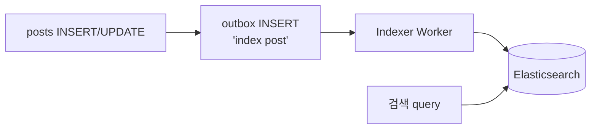
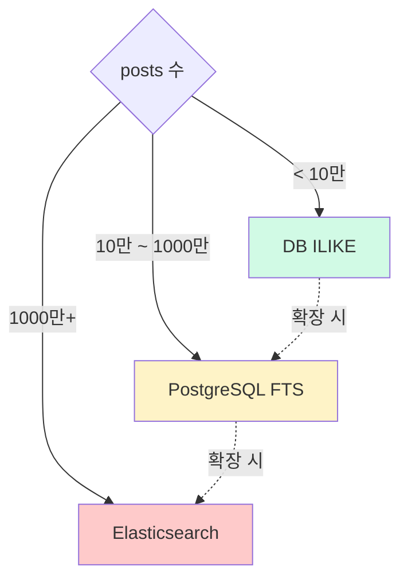

# 검색 전략 — DB ILIKE / PostgreSQL FTS / Elasticsearch

| 문서 버전 | 작성일 | 작성자 | 주요 변경 사항 |
| --- | --- | --- | --- |
| v1.0.0 | 2026-05-15 | engineering-agent/tech-lead | 최초 |

**[[design-decisions|↑ design-decisions hub]]**

> "글 검색 어떤 도구" — posts 수 따라. 잘못 선택하면 **검색 5초+ / 인프라 폭증**.

---

## 1. 본 vault 결정

**단계별 도입**:

| posts 수 | 도구 |
| --- | --- |
| < 10만 | DB ILIKE (단순) |
| 10만 ~ 1000만 | PostgreSQL FTS (tsvector + GIN) |
| 1000만+ | Elasticsearch (별도 cluster) |

---

## 2. 옵션 비교

### 2.1 DB ILIKE (소규모)

```sql
SELECT * FROM posts
WHERE (title ILIKE '%검색어%' OR content ILIKE '%검색어%')
  AND status = 'PUBLISHED'
ORDER BY created_at DESC
LIMIT 20;
```

**왜 적합 (< 10만)**
- 단순 + 추가 인프라 X.
- 빠름 (1만 row p99 < 100ms).

**왜 안 됨 (10만+)**
- `%xxx%` = 인덱스 활용 X → 풀스캔.
- 50만 row 부터 1초+.

---

### 2.2 PostgreSQL FTS (중간)

```sql
ALTER TABLE posts ADD COLUMN content_tsv tsvector
    GENERATED ALWAYS AS (to_tsvector('korean', title || ' ' || content)) STORED;

CREATE INDEX ix_posts_content_tsv ON posts USING GIN (content_tsv);

SELECT * FROM posts
WHERE content_tsv @@ plainto_tsquery('korean', '검색어')
  AND status = 'PUBLISHED'
ORDER BY ts_rank(content_tsv, plainto_tsquery('korean', '검색어')) DESC
LIMIT 20;
```

**왜 적합 (10만 ~ 1000만)**
- GIN 인덱스 → O(log n).
- 한국어 dictionary (`korean`) 형태소 분석.
- 추가 인프라 X (PG 만).

**한계**
- 한국어 형태소 분석이 Elasticsearch 보다 약함 (Mecab vs PG dictionary).
- 1000만 이상 시 GIN 인덱스 update 비용 ↑.

**한국어 dictionary 설정**
```sql
-- pgroonga 또는 mecab-ko 확장 필요
-- 기본 설치는 영어 dictionary 만
```

---

### 2.3 Elasticsearch (대형)

**왜 적합 (1000만+)**
- 분산 인덱스 → 무한 scale.
- 한국어 분석기 (nori / mecab) 강력.
- 정확도 ↑ (BM25 / TF-IDF).
- aggregation (faceted search) 자연.

**왜 안 됨 (소규모)**
- 별도 cluster 운영 부담.
- DB 와 sync (debezium / outbox).
- 학습 곡선.

**indexing flow**



자세히: [[../../elasticsearch-integration]].

---

## 3. 흐름 결정



→ 시작은 ILIKE, 성장 단계마다 점진 이전.

---

## 4. 마이그레이션 — ILIKE → FTS

```sql
-- Step 1: tsvector 컬럼 추가 (generated)
ALTER TABLE posts ADD COLUMN content_tsv tsvector
    GENERATED ALWAYS AS (to_tsvector('korean', title || ' ' || content)) STORED;

-- Step 2: GIN index
CREATE INDEX CONCURRENTLY ix_posts_content_tsv ON posts USING GIN (content_tsv);

-- Step 3: application query 변경 (ILIKE → @@ tsquery)
-- Step 4: 안정 후 ILIKE query 제거
```

→ **expand / contract** 패턴.

---

## 5. 마이그레이션 — FTS → Elasticsearch

```
1. ES cluster 구축 + 한국어 분석기 (nori)
2. outbox 추가 — post INSERT/UPDATE 시 'index post' event
3. Indexer Worker — outbox → ES
4. 초기 backfill — 모든 기존 posts ES 적재 (1회)
5. application 의 검색 query: PG → ES
6. 안정 후 PG tsvector 컬럼 / 인덱스 제거 (옵션)
```

자세히: [[../../elasticsearch-integration]].

---

## 6. 검색 결과 ranking

| 도구 | 기본 ranking |
| --- | --- |
| ILIKE | 순서 보장 X — `ORDER BY created_at` 추가 |
| FTS | `ts_rank()` — TF-IDF 비슷 |
| ES | BM25 (default) — 가장 정교 |

본 vault: hot_score 와 결합 — `ORDER BY ts_rank() DESC, hot_score DESC`.

---

## 7. 함정 모음

### 함정 1 — ILIKE 가 100만+ row
풀스캔 → 5초+.
→ FTS 또는 ES.

### 함정 2 — FTS index 없이 tsvector 만
@@ query 가 풀스캔.
→ GIN 인덱스 필수.

### 함정 3 — 한국어 dictionary 없음
영어 dictionary 로 한국어 분석 → 정확도 ↓.
→ pgroonga / mecab-ko extension.

### 함정 4 — ES sync 누락
post UPDATE 후 ES 안 갱신 → 옛 글 검색.
→ outbox + Indexer worker.

### 함정 5 — ES backfill 누락
초기 도입 시 옛 posts 안 검색.
→ 1회 batch backfill.

### 함정 6 — `%xxx%` 가 인덱스 활용 X 무시
"왜 ILIKE 느리지?" → leading wildcard = full scan.
→ FTS 로 우회.

### 함정 7 — Search query 길이 제한 없음
1MB query → DB 부담.
→ application 단 100 char 제한.

### 함정 8 — Search result 가 HIDDEN 포함
status filter 누락 → 모더된 글이 검색 결과에.
→ WHERE status = 'PUBLISHED'.

---

## 8. 다른 컨텍스트

### 8.1 한국어 정확도 critical

```yaml
search: elasticsearch + nori analyzer
어휘 사전: 도메인 별 추가 (jargon)
```

### 8.2 글로벌 (다국어)

```yaml
search: elasticsearch + language analyzers (per locale)
```

### 8.3 결제 / 광고 (search 가 매출)

```yaml
search: elasticsearch + ML ranking
a/b-test: 다중 ranking algorithm
```

---

## 9. 관련

- [[design-decisions|↑ hub]]
- [[pagination-strategy]] — search 결과 페이지네이션
- [[../implementation/search-pagination-impl]]
- [[../../elasticsearch-integration]]
- [[hot-ranking]] — 정렬 결합
