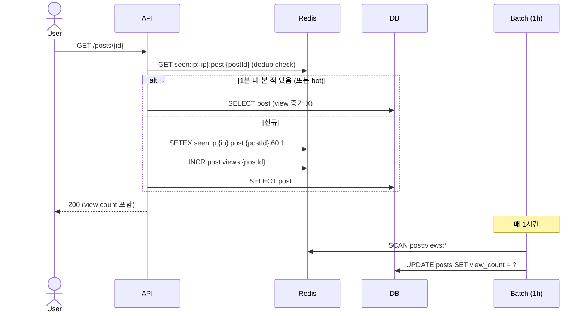

# 조회수 counter — Redis batch + bot filter

| 문서 버전 | 작성일 | 작성자 | 주요 변경 사항 |
| --- | --- | --- | --- |
| v1.0.0 | 2026-05-15 | engineering-agent/tech-lead | 최초 |

**[[design-decisions|↑ design-decisions hub]]**

> "조회수를 매 view 마다 DB UPDATE 하나" — 인기 글은 분당 수만 조회. 잘못하면 **DB 가 view 갱신만 하다 끝남**.

---

## 1. 본 vault 결정

**Redis INCR + 1시간 batch DB sync + bot filter** (UA / IP / 짧은 인터벌 dedup).

- 매 view: Redis `post:views:{postId}` INCR.
- batch: 매시간 Redis → DB `posts.view_count`.
- bot filter: User-Agent + 같은 IP+post 의 1분 dedup.

---

## 2. 옵션 비교

### 2.1 매 view 마다 DB UPDATE (절대 X)

```java
@Transactional
public Post view(PostId postId) {
    posts.incrementView(postId);   // UPDATE posts SET view_count = view_count + 1
    return posts.findById(postId);
}
```

**왜 절대 안 됨**
- 인기 글 1만 view/분 = DB UPDATE 1만/분 — row lock 폭증.
- 정상 조회 차단됨.

**한국 사례**: 디시 / 클리앙 등 옛 게시판이 이 방식으로 운영 → DB 부하 폭증으로 새벽 batch 로 우회.

---

### 2.2 Redis INCR + batch sync (본 vault)



**왜 적합**
- Redis INCR = O(1) → throughput ↑.
- DB UPDATE 부담 1시간 1회.
- bot / dedup 처리로 정확도 ↑.

---

### 2.3 별도 view event 테이블 (대형 SaaS)

```sql
CREATE TABLE post_view_events (
    post_id    CHAR(26),
    viewer_ip  VARCHAR(45),
    viewed_at  TIMESTAMPTZ
);
-- 매일 partition 으로 적재 후 분석
```

**왜 적합**
- 분석 (시간대 별 / 사용자 별) 가능.
- 추천 algorithm input.

**왜 안 됨 (일반 게시판)**
- DB row 폭증 (월 1억+).
- 별도 분석 시스템 (BigQuery / Snowflake) 필요.

**언제 적합**
- 매거진 / 뉴스 site — 분석 critical.
- 일반 게시판은 과잉.

---

## 3. Bot / Dedup Filter

```java
public boolean shouldCount(PostId postId, String ip, String userAgent) {
    // 1. Bot UA 차단
    if (isBot(userAgent)) return false;

    // 2. 같은 IP 의 같은 post — 1분 dedup
    String key = "seen:ip:" + ip + ":post:" + postId;
    Boolean isNew = redis.opsForValue().setIfAbsent(key, "1", Duration.ofMinutes(1));
    return Boolean.TRUE.equals(isNew);
}

private boolean isBot(String ua) {
    if (ua == null) return true;
    var lower = ua.toLowerCase();
    return lower.contains("bot") || lower.contains("spider") ||
           lower.contains("crawler") || lower.contains("scraper");
}
```

### 3.1 왜 IP+post dedup 1분

- 같은 user 의 새로고침 / 뒤로가기 = 의도된 조회 X.
- 너무 짧음 (5초) → 한 사용자가 빠른 스크롤 후 글 들어옴 = double count.
- 1분 = 균형.

### 3.2 왜 Bot UA filter

- Google / Naver 크롤러 = 사용자 view 가 아님.
- 정확도 ↑ + 인기 글 ranking 정확.

### 3.3 한계

- UA 위조 가능 (브라우저 흉내내는 bot).
- 정밀 dedup 은 user_id 기반 (로그인 시).

---

## 4. 인증된 user 의 dedup (옵션 — 더 정확)

```java
public boolean shouldCount(PostId postId, UserId userId) {
    String key = "seen:user:" + userId + ":post:" + postId;
    Boolean isNew = redis.opsForValue().setIfAbsent(key, "1", Duration.ofHours(1));
    return Boolean.TRUE.equals(isNew);
}
```

- 인증 user → 같은 user 의 같은 post 1시간 dedup.
- 비인증 → IP 기반.

---

## 5. Redis schema

```
Key:   post:views:{postId}
Value: counter (INTEGER)
TTL:   없음 (batch sync 시 reset 또는 누적)

Key:   seen:ip:{ip}:post:{postId}  (또는 seen:user:{userId}:post:{postId})
Value: "1"
TTL:   60s (or 1h)
```

### 5.1 batch sync 방식

**옵션 A: 누적 + UPDATE**
```
Redis: post:views:abc = 1000
DB:    posts.view_count = 1000
```

**옵션 B: 증분 + INCR by**
```
Redis: post:views:abc:delta = 100  (지난 1시간만)
DB:    posts.view_count = posts.view_count + 100
Redis: DEL post:views:abc:delta
```

본 vault: **옵션 A (단순)**. 옵션 B 는 race condition 위험 (batch 중 INCR).

---

## 6. 함정 모음

### 함정 1 — 매 view 마다 DB UPDATE
인기 글 DB 멈춤.
→ Redis INCR + batch.

### 함정 2 — Dedup 없음
새로고침 = double count.
→ IP+post 1분 dedup.

### 함정 3 — Bot 카운트
크롤러가 view count 폭증 → 인기 글 ranking 왜곡.
→ UA filter.

### 함정 4 — Redis key TTL 영구
삭제된 post 의 counter 영구 누적.
→ post 삭제 시 DEL.

### 함정 5 — batch 다중 실행
ShedLock 없음 → 같은 시간 다중 update.
→ ShedLock.

### 함정 6 — 트랜잭션 안에서 Redis INCR
post 조회 트랜잭션 안에 외부 호출 = 응답 느림.
→ AFTER 또는 별도 호출.

### 함정 7 — counter 너무 자주 sync (1분)
DB UPDATE 부담.
→ 1시간.

### 함정 8 — dedup key 가 너무 김 (1시간)
사용자가 글 보고 1시간 후 다시 봐도 count X — 정확도 ↓.
→ 1분 (또는 도메인 맞춤).

### 함정 9 — counter 가 음수 가능
dedup 실패 + 동시 dec 시.
→ GREATEST(view_count, 0) DB CHECK.

---

## 7. 다른 컨텍스트

### 7.1 정확도 critical (뉴스 / 매거진)

```yaml
view-tracking: post_view_events 테이블
analytics: bigquery / redshift
dedup: user-level (Fingerprint.js / userAgent + cookie)
```

### 7.2 소규모 게시판

```yaml
counter: db (매 view UPDATE)
dedup: skip
```

→ MAU 1만 이하면 단순.

---

## 8. 관련

- [[design-decisions|↑ hub]]
- [[like-counter]] — 같은 패턴 (좋아요)
- [[../implementation/post-crud-impl]] — view 적용
- [[../../cache-redis]] — Redis 패턴
