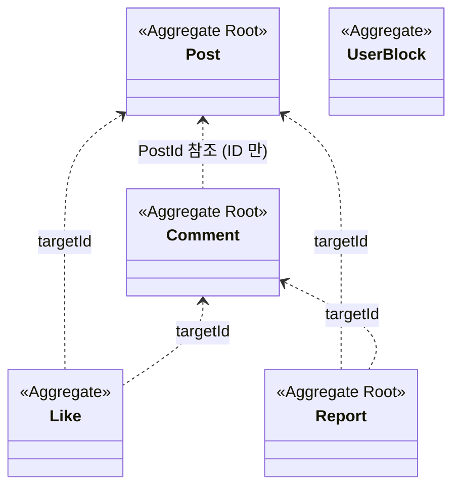

# Aggregate Boundaries — 5 Aggregate 경계

| 문서 버전 | 작성일 | 작성자 | 주요 변경 사항 |
| --- | --- | --- | --- |
| v1.0.0 | 2026-05-15 | engineering-agent/tech-lead | 최초 |

**[[domain-model|↑ domain-model hub]]**

> board 의 Aggregate 5 개 경계 결정 + "왜".

---

## 1. 5 Aggregate



→ 5 Aggregate, ID 참조로만 연결.

---

## 2. 왜 Comment 가 Post 의 일부가 아닌 별도 Aggregate

### 2.1 만약 Post 안에 있다면

```java
public class Post {
    private final List<Comment> comments;        // ❌
    public Comment addComment(...) { ... }
}
```

**문제**
1. **N+1 / 메모리 부담** — post load 시마다 comments 모두 fetch.
2. **인기 글의 댓글 1000+** — Post load = 메모리 폭증.
3. **댓글 추가 = Post @Version dirty** — 낙관 락 충돌 빈발.
4. **댓글 분류 (HIDDEN / DELETED)** 의 변경이 Post 트랜잭션 안.

### 2.2 분리한 본 vault

- Post = 자기 정보 + counter.
- Comment = 별도 Aggregate + PostId 참조.
- `comments.findByPostId(postId)` 로 별도 fetch.

자세히: [[../../signup/domain-model/aggregate-boundaries|↗ signup 의 같은 패턴]].

---

## 3. 왜 Like 가 별도 Aggregate

**왜**
- 단순 (user, target) tuple.
- 매 좋아요마다 Post / Comment load 시 부담.
- counter sync 가 별도 흐름.

**구현**
- `Like` 가 root 의 Aggregate (자체 PK 없음, composite key).
- Post / Comment 와 ID 참조.

---

## 4. 왜 Report 가 별도

**왜**
- target = Post 또는 Comment (다중).
- 신고 흐름 (자동 hide, admin review) 의 자체 lifecycle.
- audit log.

---

## 5. 같은 트랜잭션 안 다중 Aggregate

### 5.1 댓글 작성 — Comment + Post (counter)

```java
@Transactional
public Comment createComment(CommentCreateCmd cmd) {
    var post = posts.findById(cmd.postId()).orElseThrow();
    var comment = Comment.create(...);
    comments.save(comment);
    post.incrementComment();         // Post 의 comment_count++
    posts.save(post);                // Post 의 counter 도 같은 트랜잭션
    return comment;
}
```

**왜 같은 트랜잭션**
- comment 와 counter 의 정합성 critical.
- comment 추가 → counter 안 늘면 UX 망함.

**DDD purist**
- "한 트랜잭션 = 한 Aggregate" — 본 vault 는 실용적으로 2 Aggregate.
- counter 의 sync 우선.

자세히: [[../../signup/domain-model/aggregate-boundaries#7]].

---

## 6. 경계 결정 기준

| 기준 | "안에 둘 것" | "밖으로 뺄 것" |
| --- | --- | --- |
| 같은 트랜잭션에서 항상 변경? | ✅ | ❌ |
| 라이프사이클 같이? | ✅ | ❌ |
| 변경 빈도 비슷? | ✅ | ❌ |
| 컬렉션 무한 증가? | ❌ | ✅ (Comment / Like) |
| 외부에서 직접 조회? | ❌ | ✅ |

### 6.1 Post 가 안에 가진 것

```java
class Post {
    PostId id;
    BoardId boardId;
    UserId authorId;
    String title;
    String content;
    PostStatus status;
    int viewCount / likeCount / commentCount / reportCount;
    // ...
}
```

→ Post 의 **고유 1:1 속성** + counter.

### 6.2 Post 가 안 가진 것

| Entity | 별도 Aggregate | 이유 |
| --- | --- | --- |
| Comment | ✅ | 1:N + 자주 변경 |
| Like | ✅ | 1:N + 자체 lifecycle |
| Bookmark | ✅ | 1:N + per user |
| Report | ✅ | 1:N + 다중 target type |
| Attachment | ⚠️ (옵션 Post 안) | Post 의 1:N — Post 와 라이프사이클 같음. 본 vault: 별도 (S3 cleanup) |

---

## 7. ID 참조 — 컬렉션 X

```java
// ❌
class Post {
    Set<CommentId> commentIds;        // 무한 증가
}

// ✅
class Comment {
    PostId postId;
}
List<Comment> comments = commentRepo.findByPostId(post.id());
```

---

## 8. 함정

### 함정 1 — Post 가 Comment 컬렉션
N+1 / 메모리.
→ ID 참조 + 별도 Repository.

### 함정 2 — Comment 가 Post 의 사용자 객체 참조
```java
class Comment {
    Post post;            // ❌ 다른 Aggregate root 직접
}
```
→ PostId 만.

### 함정 3 — Aggregate 트랜잭션 의존 1개만
실용적 부담 X (counter sync).
→ 2 Aggregate 같은 transaction OK.

### 함정 4 — Like 가 자체 ID
(user, target) tuple PK 가 자연.
→ composite key.

### 함정 5 — Aggregate 가 다른 Aggregate 의 메서드 호출
```java
class Comment {
    void create(...) {
        Post post = postRepo.findById(...);
        post.incrementComment();          // ❌ Post 직접
    }
}
```
→ Application Service 가 조정.

---

## 9. 관련

- [[domain-model|↑ hub]]
- [[../../signup/domain-model/aggregate-boundaries|↗ signup 의 5 Aggregate]] — 같은 패턴
- [[post-aggregate]] · [[comment-aggregate]]
- [[repository-ports]]
