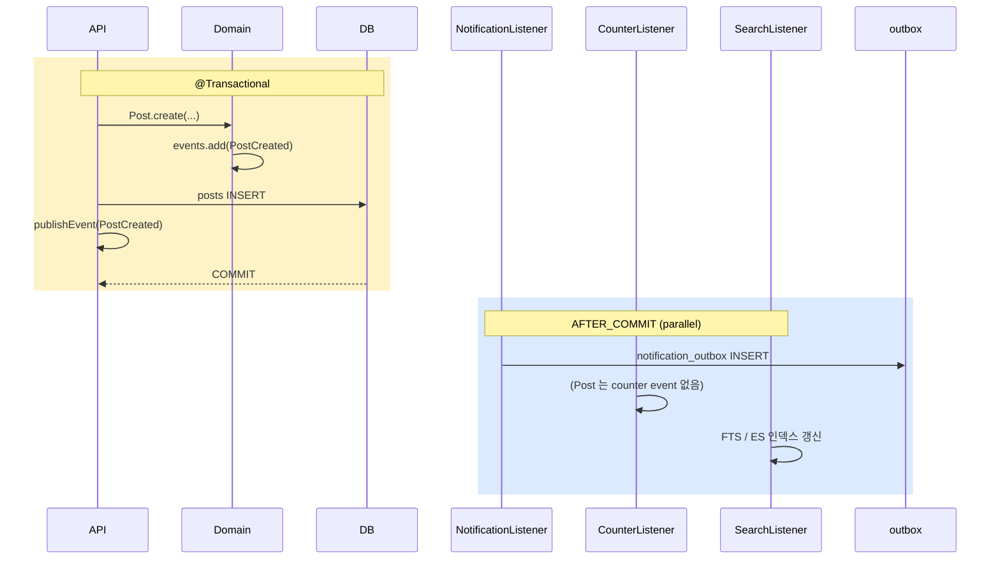

# Domain Events — Post / Comment / Like / Report

| 문서 버전 | 작성일 | 작성자 | 주요 변경 사항 |
| --- | --- | --- | --- |
| v1.0.0 | 2026-05-15 | engineering-agent/tech-lead | 최초 |

**[[domain-model|↑ domain-model hub]]**

> board 의 DomainEvent 카탈로그 + listener 가 어떻게 분기하는지.

---

## 1. Event 카탈로그

```java
public sealed interface DomainEvent permits
    // Post
    PostCreated, PostUpdated, PostHidden, PostRestored, PostDeleted,
    // Comment
    CommentCreated, CommentReplied, CommentHidden, CommentDeleted,
    // Like / Bookmark
    PostLiked, PostUnliked, CommentLiked, CommentUnliked,
    PostBookmarked, PostUnbookmarked,
    // Report
    ReportSubmitted, ReportAutoHidden, ReportResolved,
    // User block
    UserBlocked, UserUnblocked {
    Instant occurredAt();
}
```

### 1.1 sealed 의 이점

- 새 event 추가 시 명시 — listener 의 switch 분기 누락 컴파일 에러.
- pattern matching 활용.

---

## 2. Event 별 의미 + listener

| Event | 누가 발행 | 누가 구독 | 무엇 |
| --- | --- | --- | --- |
| **PostCreated** | Post.create() | NotificationListener | follower 알림 + 검색 인덱싱 |
| **PostUpdated** | Post.update() | SearchListener | FTS / ES 갱신 |
| **PostHidden** | Post.hide() | NotificationListener | 작성자 알림 (모더) |
| **PostRestored** | Post.restore() | NotificationListener | 작성자 알림 |
| **PostDeleted** | Post.delete() | AttachmentListener | S3 file 삭제 |
| **CommentCreated** | Comment.create() | NotificationListener | post 작성자 알림 |
| **CommentReplied** | Comment.reply() | NotificationListener | parent 작성자 알림 (대댓글) |
| **CommentHidden** | Comment.hide() | NotificationListener | 작성자 알림 |
| **PostLiked** | PostLikeService | CounterListener / NotificationListener | Redis INCR + 작성자 알림 (옵션) |
| **PostUnliked** | PostLikeService | CounterListener | Redis DECR |
| **ReportSubmitted** | ReportService | ModerationListener | 5회 이상 시 auto-hide |
| **ReportAutoHidden** | ReportService | NotificationListener / AdminAlertListener | 작성자 알림 + admin slack |

---

## 3. Listener 흐름



### 3.1 왜 listener 분리 (한 listener 가 다 하지 않음)

- 단일 책임 (notification / counter / search 별도).
- 한 listener 실패해도 다른 영향 X.
- 새 후속 처리 추가 = 새 listener (Domain / Service 수정 X).

---

## 4. 코드 예 — NotificationListener

```java
@Component
@RequiredArgsConstructor
public class BoardNotificationListener {

    private final NotificationOutboxRepository outbox;
    private final UserNotificationPreferenceRepository prefs;
    private final IdGenerator ids;
    private final Clock clock;

    @TransactionalEventListener(phase = AFTER_COMMIT)
    public void onCommentCreated(CommentCreated event) {
        var postAuthor = posts.findById(event.postId()).map(Post::authorId).orElseThrow();
        if (postAuthor.equals(event.authorId())) return;   // self-notification skip

        var setting = prefs.getOrDefault(postAuthor);
        if (!setting.enabled("COMMENT_RECEIVED")) return;

        outbox.save(new NotificationOutbox(
            ids.next(), postAuthor, "COMMENT_RECEIVED",
            "새 댓글", "내 글에 댓글이 달렸어요",
            "/posts/" + event.postId().value(),
            Map.of("postId", event.postId().value(), "commentId", event.id().value()),
            Instant.now(clock)
        ));
    }

    @TransactionalEventListener(phase = AFTER_COMMIT)
    public void onCommentReplied(CommentReplied event) {
        // 부모 댓글 작성자에게 알림 (post 작성자가 아님)
        var parentAuthor = comments.findById(event.parentId()).map(Comment::authorId).orElseThrow();
        if (parentAuthor.equals(event.authorId())) return;

        var setting = prefs.getOrDefault(parentAuthor);
        if (!setting.enabled("REPLY_RECEIVED")) return;

        outbox.save(/* ... */);
    }
}
```

### 4.1 왜 self-notification skip

- 자기 글에 자기가 댓글 → 알림 의미 X.

### 4.2 왜 preference 검증

- 사용자가 OFF 한 type → 발송 X.
- application 단 검증 — outbox INSERT 자체 안 함.

자세히: [[../design-decisions/notification-policy]].

---

## 5. AFTER_COMMIT vs BEFORE_COMMIT vs same transaction

| Phase | 사용처 |
| --- | --- |
| **AFTER_COMMIT** | 외부 호출 / 알림 / counter / outbox (대부분 listener) |
| **BEFORE_COMMIT** | 같은 transaction 의 audit log / 추가 DML |
| **Same Transaction** | publishEvent 가 직접 — 일반적 X (transaction rollback 영향) |

본 vault: **AFTER_COMMIT 기본**.

자세히: [[../../signup/transactions]].

---

## 6. 함정

### 함정 1 — sealed 안 함
새 event 추가 시 listener 의 switch 누락 silent.
→ sealed interface.

### 함정 2 — 한 listener 가 다 처리
단일 책임 X + 한 부분 실패가 다른 영향.
→ listener 분리.

### 함정 3 — Same transaction publishEvent
listener 가 외부 호출 → rollback 시 부수효과 영구.
→ AFTER_COMMIT.

### 함정 4 — self-notification 무시
자기 글에 자기 좋아요 알림.
→ author = recipient skip.

### 함정 5 — preference 검증 X
OFF 한 type 도 발송.
→ 발송 전 검증.

### 함정 6 — event 가 큰 metadata 포함
publish 시 메모리 부담.
→ 핵심 ID 만 (listener 가 fetch).

### 함정 7 — event 발행 후 rollback
같은 트랜잭션 안 listener 실행 시 — rollback 도 listener 영향.
→ AFTER_COMMIT.

### 함정 8 — Listener 가 다시 도메인 호출
event 가 다시 event 발행 → 무한 loop.
→ idempotent + cycle 검출.

---

## 7. 관련

- [[domain-model|↑ hub]]
- [[post-aggregate]] · [[comment-aggregate]] — event 발행 소스
- [[../../signup/domain-model/domain-events|↗ signup events]] — 패턴
- [[../design-decisions/notification-policy]] — listener 의 알림 정책
