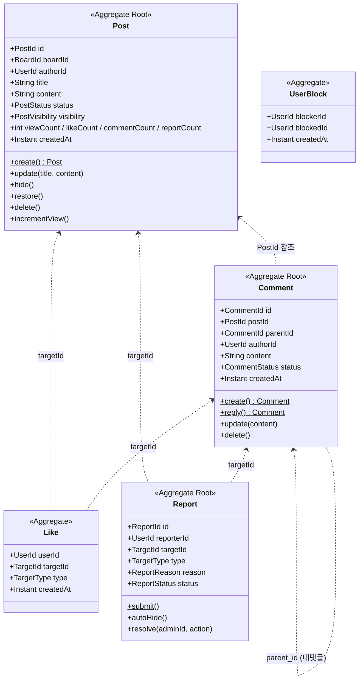
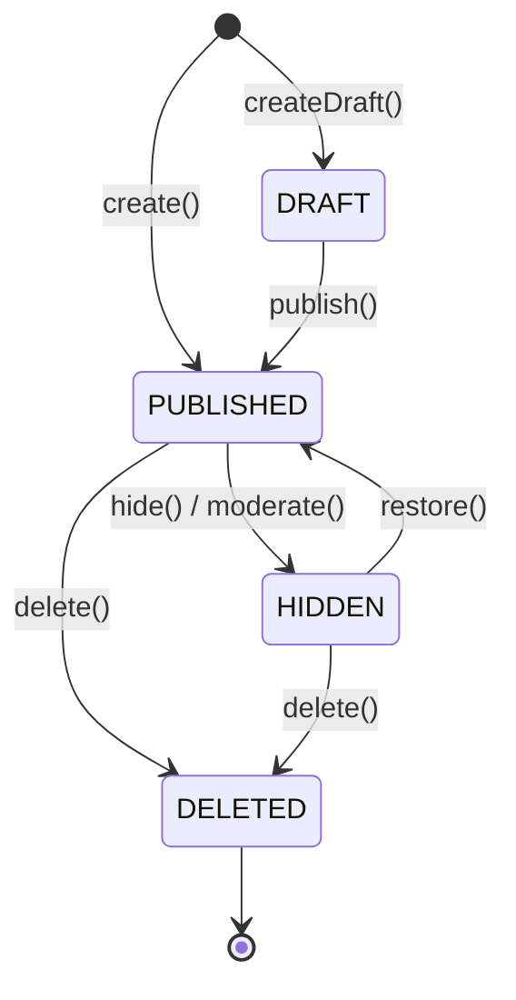
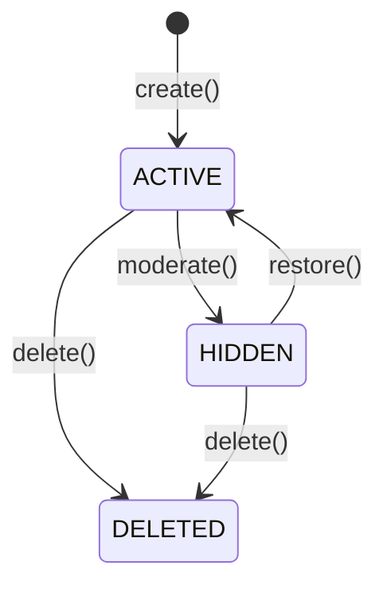
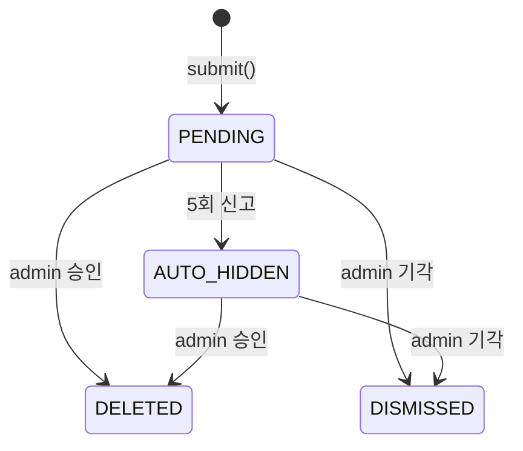

# board §6 — 도메인 모델 (Hub)

| 문서 버전 | 작성일 | 작성자 | 주요 변경 사항 |
| --- | --- | --- | --- |
| v1.0.0 | 2026-05-15 | engineering-agent/tech-lead | 최초 |

**[[../board|↑ board hub]]**  ·  ← [[../database/database]]  ·  → [[../architecture]]

> board 도메인의 Aggregate / Value Object / Event / Port.

---

## 1. 이 폴더의 노트

| 노트 | 무엇 |
| --- | --- |
| [[post-aggregate]] | Post Aggregate (Root) — 게시글 + invariant |
| [[comment-aggregate]] | Comment Aggregate (Root) — 댓글 + 대댓글 |
| [[value-objects]] | PostId / CommentId / TargetId 등 VO |
| [[domain-events]] | PostCreated / CommentAdded / Liked / Reported |
| [[repository-ports]] | 도메인 layer 의 interface |
| [[aggregate-boundaries]] | 5 Aggregate 경계 결정 |

---

## 2. 도메인 그림



---

## 3. 상태 머신

### 3.1 Post



### 3.2 Comment



### 3.3 Report



---

## 4. 의존 관계

```mermaid
flowchart TD
    AR[Aggregate Root<br/>Post / Comment / Report]
    VO[Value Objects<br/>PostId / CommentId / TargetId]
    DE[Domain Events<br/>PostCreated / CommentAdded / Liked / Reported]
    L[Listener<br/>notification outbox / counter / FTS index]
    Port[Repository Port]
    Adapter[JPA Adapter]

    AR --> VO
    AR --> DE
    DE --> L
    Port <-.implements.- Adapter

    style AR fill:#fef3c7
    style Adapter fill:#dbeafe
```

**도메인 layer**:
- `jakarta.validation`, `java.time` 만 import.
- Spring / JPA 의존 0.
- 단위 테스트 ms.

---

## 5. 코드 컨벤션

- record (VO / Event).
- final class + 메서드 (Aggregate).
- compact constructor 검증.
- private constructor + `static create()` factory.
- DomainEvent list + `pullDomainEvents()`.
- setter 없음 (의미 있는 메서드만).

자세히: [[../../signup/domain-model/domain-model|↗ signup 의 패턴]].

---

## 6. 관련

- [[../board|↑ hub]]
- [[../database/database]] — 이전 (§5)
- [[../architecture]] — 다음
- [[../../signup/domain-model/domain-model|↗ signup domain-model]] — 참고
