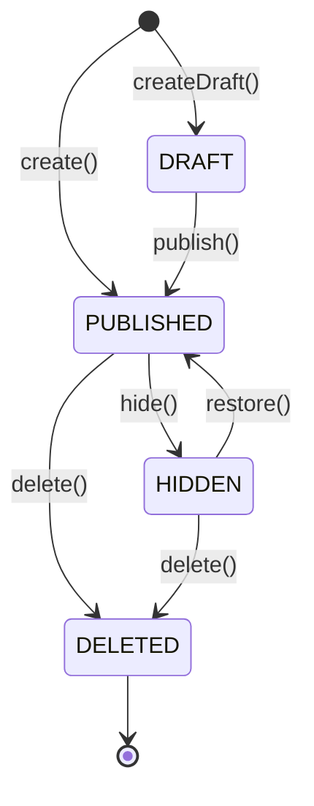

# Post Aggregate — 게시글 도메인

| 문서 버전 | 작성일 | 작성자 | 주요 변경 사항 |
| --- | --- | --- | --- |
| v1.0.0 | 2026-05-15 | engineering-agent/tech-lead | 최초 |

**[[domain-model|↑ domain-model hub]]**

> 게시글의 invariant + 상태 전이 + DomainEvent.

---

## 1. 코드

```java
public final class Post {

    private final PostId id;
    private final BoardId boardId;
    private final UserId authorId;
    private String title;
    private String content;
    private PostStatus status;
    private PostVisibility visibility;
    private int viewCount;
    private int likeCount;
    private int commentCount;
    private int reportCount;
    private final Instant createdAt;
    private Instant updatedAt;
    private final List<DomainEvent> events = new ArrayList<>();

    private Post(PostId id, BoardId boardId, UserId authorId,
                 String title, String content, PostStatus status,
                 PostVisibility visibility, Instant createdAt) {
        this.id = id; this.boardId = boardId; this.authorId = authorId;
        this.title = title; this.content = content;
        this.status = status; this.visibility = visibility;
        this.createdAt = createdAt; this.updatedAt = createdAt;
    }

    public static Post create(PostId id, BoardId boardId, UserId authorId,
                              String title, String content,
                              PostVisibility visibility, Instant now) {
        validateTitle(title);
        validateContent(content);

        var post = new Post(id, boardId, authorId, title, content,
                             PostStatus.PUBLISHED, visibility, now);
        post.events.add(new PostCreated(id, boardId, authorId, now));
        return post;
    }

    public void update(String newTitle, String newContent, Instant now) {
        if (status == PostStatus.DELETED)
            throw new IllegalStateException("deleted post cannot be updated");
        validateTitle(newTitle);
        validateContent(newContent);

        this.title = newTitle;
        this.content = newContent;
        this.updatedAt = now;
        events.add(new PostUpdated(id, now));
    }

    public void hide(String reason, Instant now) {
        if (status != PostStatus.PUBLISHED)
            throw new IllegalStateException("not published: " + status);
        this.status = PostStatus.HIDDEN;
        this.updatedAt = now;
        events.add(new PostHidden(id, reason, now));
    }

    public void restore(Instant now) {
        if (status != PostStatus.HIDDEN)
            throw new IllegalStateException("not hidden: " + status);
        this.status = PostStatus.PUBLISHED;
        this.updatedAt = now;
        events.add(new PostRestored(id, now));
    }

    public void delete(Instant now) {
        if (status == PostStatus.DELETED) return;       // idempotent
        this.status = PostStatus.DELETED;
        this.updatedAt = now;
        events.add(new PostDeleted(id, now));
    }

    public void incrementView() {
        this.viewCount++;
        // event 안 발행 — counter 는 Redis + batch (도메인 event 부담)
    }

    public void incrementLike() { this.likeCount++; }
    public void decrementLike() { this.likeCount = Math.max(0, this.likeCount - 1); }
    public void incrementComment() { this.commentCount++; }
    public void decrementComment() { this.commentCount = Math.max(0, this.commentCount - 1); }
    public void incrementReport() { this.reportCount++; }

    public boolean isOwnedBy(UserId userId) { return authorId.equals(userId); }
    public boolean isVisible() { return status == PostStatus.PUBLISHED; }

    private static void validateTitle(String title) {
        if (title == null || title.isBlank())
            throw new IllegalArgumentException("title required");
        if (title.length() > 200)
            throw new IllegalArgumentException("title too long (max 200)");
    }
    private static void validateContent(String content) {
        if (content == null || content.isBlank())
            throw new IllegalArgumentException("content required");
        if (content.length() > 50000)
            throw new IllegalArgumentException("content too long (max 50000)");
    }

    public List<DomainEvent> pullDomainEvents() {
        var copy = List.copyOf(events); events.clear(); return copy;
    }

    public static Post reconstitute(PostId id, BoardId boardId, UserId authorId,
                                    String title, String content,
                                    PostStatus status, PostVisibility visibility,
                                    int viewCount, int likeCount, int commentCount, int reportCount,
                                    Instant createdAt, Instant updatedAt) {
        var post = new Post(id, boardId, authorId, title, content, status, visibility, createdAt);
        post.viewCount = viewCount;
        post.likeCount = likeCount;
        post.commentCount = commentCount;
        post.reportCount = reportCount;
        post.updatedAt = updatedAt;
        return post;
    }

    // accessors ...
}
```

---

## 2. 주요 "왜"

### 2.1 왜 `final` class

- 상속으로 invariant 깨짐 방지.
- "이 도메인은 확장하지 마라" 명시.

### 2.2 왜 `create()` vs `reconstitute()`

- `create()` = 신규 (validation + event).
- `reconstitute()` = DB load (검증 최소, event X).
- Adapter 가 명시 사용.

자세히: [[../../signup/domain-model/user-aggregate#3.2]].

### 2.3 왜 setter 없음

- 의미 있는 메서드 (`update` / `hide` / `restore` / `delete`).
- 상태 전이 invariant 강제.

### 2.4 왜 `incrementView()` 가 event 발행 X

- counter 는 매 view 마다 → event 발행 시 부담 폭증.
- 도메인 event 는 "의미 있는" 변경만 (CREATED / HIDDEN / DELETED).

### 2.5 왜 `decrementLike(Math.max(0, ...))`

- counter 가 음수 가는 race condition 방어.
- DB CHECK 와 이중.

### 2.6 왜 `isOwnedBy()` 메서드

- application service 가 권한 검증 시 명확.
```java
if (!post.isOwnedBy(currentUserId))
    throw new ForbiddenException();
```

### 2.7 왜 PostStatus 가 enum

- 4-state (DRAFT / PUBLISHED / HIDDEN / DELETED).
- 자세히: [[../enums/post-status]] (todo).

---

## 3. 상태 전이 규칙



### 3.1 invariant

| 전이 | 조건 |
| --- | --- |
| update() | status != DELETED |
| hide() | status == PUBLISHED |
| restore() | status == HIDDEN |
| delete() | idempotent (이미 DELETED 면 no-op) |

---

## 4. Domain Events

```java
public sealed interface DomainEvent
    permits PostCreated, PostUpdated, PostHidden, PostRestored, PostDeleted { }

public record PostCreated(PostId postId, BoardId boardId, UserId authorId, Instant occurredAt) implements DomainEvent {}
public record PostUpdated(PostId postId, Instant occurredAt) implements DomainEvent {}
public record PostHidden(PostId postId, String reason, Instant occurredAt) implements DomainEvent {}
public record PostRestored(PostId postId, Instant occurredAt) implements DomainEvent {}
public record PostDeleted(PostId postId, Instant occurredAt) implements DomainEvent {}
```

자세히: [[domain-events]].

---

## 5. 함정

### 함정 1 — setter 노출
어디서든 status 변경 → invariant 깨짐.
→ 메서드만.

### 함정 2 — DELETED 의 update 허용
도메인 invariant 위반.
→ status 검증.

### 함정 3 — counter 가 event 발행
매 view 마다 event → listener 폭증.
→ counter 는 직접.

### 함정 4 — `decrement` 의 음수
counter < 0 가능.
→ Math.max(0, ...).

### 함정 5 — `reconstitute()` 가 event 발행
DB load 시마다 PostCreated → 사용자 알림 무한.
→ events 빈 list.

### 함정 6 — `incrementView()` 의 동시 호출
같은 객체 동시 incr — race.
→ DB / Redis 가 atomic (도메인 객체는 in-memory 변경).

### 함정 7 — title / content 길이 검증 누락
DB 까지 가서 fail.
→ 도메인 단 validation.

### 함정 8 — `isOwnedBy` 누락 → application 단에서 비교
공통 로직 분산.
→ aggregate 메서드.

---

## 6. 관련

- [[domain-model|↑ hub]]
- [[../database/posts-table]] — 매핑
- [[../enums/post-status]] (todo)
- [[domain-events]]
- [[../../signup/domain-model/user-aggregate|↗ User 의 패턴]]
