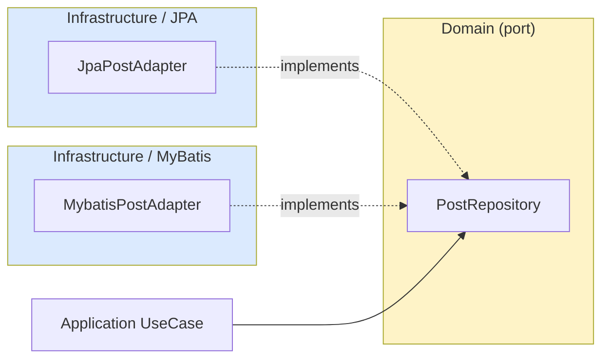

# Repository Ports — 도메인 layer interface

| 문서 버전 | 작성일 | 작성자 | 주요 변경 사항 |
| --- | --- | --- | --- |
| v1.0.0 | 2026-05-15 | engineering-agent/tech-lead | 최초 |

**[[domain-model|↑ domain-model hub]]**

> 도메인이 의존하는 interface. Adapter (infrastructure) 가 구현.

---

## 1. Port 목록

```java
package com.example.shop.domain.board;

public interface BoardRepository {
    Optional<Board> findById(BoardId id);
    Optional<Board> findByCode(String code);
    List<Board> findAllActive();
}

public interface PostRepository {
    Optional<Post> findById(PostId id);
    Post save(Post post);

    // 페이지네이션 (cursor)
    List<Post> findByBoardOrderByHotScore(BoardId boardId, Cursor cursor, int limit);
    List<Post> findByBoardOrderByCreated(BoardId boardId, Cursor cursor, int limit);
    List<Post> findByAuthor(UserId authorId, Cursor cursor, int limit);
    List<Post> search(String query, BoardId boardId, Cursor cursor, int limit);

    // counter (Redis sync 후 DB)
    void updateLikeCount(PostId id, long count);
    void updateViewCount(PostId id, long count);
    void updateCommentCount(PostId id, int count);
    void updateHotScore(PostId id, double score);
}

public interface CommentRepository {
    Optional<Comment> findById(CommentId id);
    Comment save(Comment comment);

    // post 의 댓글 + 대댓글 tree
    List<Comment> findByPostId(PostId postId);
    long countByPostId(PostId postId);
    long countByAuthor(UserId authorId);
}

public interface PostLikeRepository {
    void insert(PostLike like);                            // race 시 IntegrityViolation 던짐
    int delete(UserId userId, PostId postId);
    boolean exists(UserId userId, PostId postId);
    long countByPostId(PostId postId);
}

public interface ReportRepository {
    Report save(Report report);
    long countByTarget(TargetId targetId, TargetType type);
    List<Report> findPending(Cursor cursor, int limit);
}

public interface UserBlockRepository {
    void insert(UserBlock block);
    int delete(UserId blockerId, UserId blockedId);
    Set<UserId> findRelatedTo(UserId userId);        // 양방향
    long countByBlockerId(UserId blockerId);
}

public interface TagRepository {
    Optional<Tag> findByName(String name);
    Tag save(Tag tag);
    void incrementUsage(TagId id);
    List<Tag> findPopular(int limit);
}
```

---

## 2. 왜 도메인 layer 의 interface



### 2.1 의존성 역전

- 도메인 → Adapter 의존 X.
- Adapter → 도메인 port 의존.
- 도메인은 JPA / MyBatis 모름.

자세히: [[../../signup/domain-model/repository-ports|↗ signup repository-ports]].

### 2.2 ORM 변경 시 영향 X

- JPA → MyBatis 변경 = Adapter 만 새로.
- 도메인 / UseCase 변동 X.

---

## 3. Cursor pagination port 설계

```java
List<Post> findByBoardOrderByHotScore(BoardId boardId, Cursor cursor, int limit);
```

- `Cursor` 가 도메인 VO ([[value-objects#3.4]]).
- Adapter 가 cursor → SQL tuple comparison 변환.

```java
// JPA Adapter 안
@Query("""
    SELECT p FROM PostJpaEntity p
    WHERE p.boardId = :boardId
      AND p.status = 'PUBLISHED'
      AND (p.hotScore < :hotScore
           OR (p.hotScore = :hotScore AND p.id < :id))
    ORDER BY p.hotScore DESC, p.id DESC
""")
List<PostJpaEntity> findByBoardOrderByHotScore(
    @Param("boardId") String boardId,
    @Param("hotScore") double hotScore,
    @Param("id") String id,
    Pageable pageable);
```

자세히: [[../design-decisions/pagination-strategy]].

---

## 4. Counter port — 별도 method

```java
void updateLikeCount(PostId id, long count);
void updateViewCount(PostId id, long count);
```

**왜 별도 method (save 안 아님)**
- counter 갱신은 1h batch — `save` 의 일반 update 와 다른 흐름.
- 동시성 issue (다른 column 들도 변경됨) 회피.
- SQL: `UPDATE posts SET like_count = ? WHERE id = ?` (다른 column 영향 X).

---

## 5. JPA Adapter 패턴

```java
@Repository
@RequiredArgsConstructor
public class JpaPostRepositoryAdapter implements PostRepository {

    private final PostJpaRepository jpa;
    private final Clock clock;

    @Override
    public Optional<Post> findById(PostId id) {
        return jpa.findById(id.value()).map(this::toDomain);
    }

    @Override
    public Post save(Post post) {
        var entity = jpa.findById(post.id().value())
            .map(e -> { e.apply(post, Instant.now(clock)); return e; })
            .orElseGet(() -> PostJpaEntity.fromDomain(post));
        return toDomain(jpa.save(entity));
    }

    @Override
    public List<Post> findByBoardOrderByHotScore(BoardId boardId, Cursor cursor, int limit) {
        var posts = jpa.findByBoardOrderByHotScore(
            boardId.value(),
            cursor.hotScore(),
            cursor.id(),
            PageRequest.of(0, limit));
        return posts.stream().map(this::toDomain).toList();
    }

    private Post toDomain(PostJpaEntity e) {
        return Post.reconstitute(
            new PostId(e.getId()), new BoardId(e.getBoardId()),
            new UserId(e.getAuthorId()),
            e.getTitle(), e.getContent(),
            e.getStatus(), e.getVisibility(),
            e.getViewCount(), e.getLikeCount(), e.getCommentCount(), e.getReportCount(),
            e.getCreatedAt(), e.getUpdatedAt()
        );
    }
}
```

---

## 6. 함정

### 함정 1 — Port 가 JPA 의존
도메인이 JpaRepository import.
→ 도메인 layer 의 interface 만.

### 함정 2 — Pageable / Page 같은 Spring 타입 port 에
도메인이 Spring 의존.
→ 도메인 Cursor / List<T>.

### 함정 3 — JpaPostEntity 가 port return type
도메인이 entity 의존.
→ 도메인 객체로 변환.

### 함정 4 — Adapter 가 도메인 method 호출
infra → domain 호출 OK (역전 X).
→ 도메인 port 만 구현.

### 함정 5 — Reconstitute 가 event 발행
DB load 시마다 이벤트 → 무한 알림.
→ reconstitute 는 events 빈 list.

### 함정 6 — Counter update 가 save() 안
다른 column 도 update — 의도하지 않은 변경.
→ 별도 method.

---

## 7. 관련

- [[domain-model|↑ hub]]
- [[../../signup/domain-model/repository-ports|↗ signup port]] — 같은 패턴
- [[../../database/jpa#11.5.1]] — JPA Adapter 깊이
- [[post-aggregate]] · [[comment-aggregate]] — port 의 client
