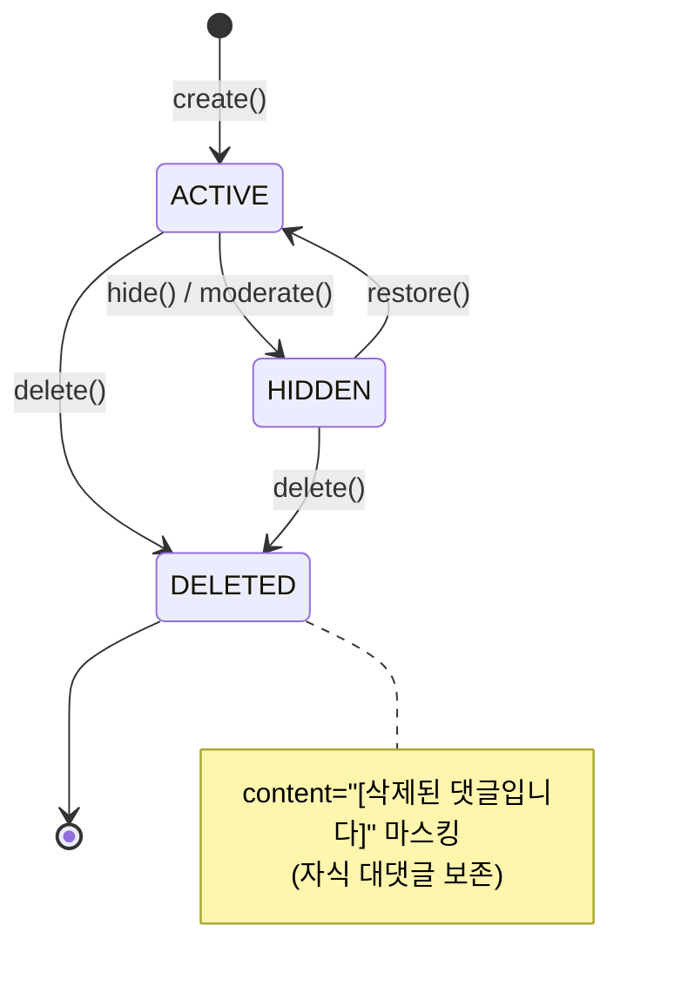

# CommentStatus — ACTIVE / HIDDEN / DELETED

| 문서 버전 | 작성일 | 작성자 | 주요 변경 사항 |
| --- | --- | --- | --- |
| v1.0.0 | 2026-05-15 | engineering-agent/tech-lead | 최초 |

**[[enums|↑ enums hub]]**

---

## 1. 코드

```java
public enum CommentStatus {
    ACTIVE,        // 정상
    HIDDEN,        // 모더 hidden
    DELETED;       // soft delete + content 마스킹

    public boolean isVisible() { return this == ACTIVE; }
}
```

---

## 2. PostStatus 와의 차이

- **DRAFT 없음** — 댓글은 즉시 발행 (임시 저장 불필요).
- **HIDDEN / DELETED** 같은 의미.

---

## 3. 상태 전이



---

## 4. 함정

### 함정 1 — DRAFT 추가 (댓글 임시 저장)
의미 X, UX 불필요.
→ 3-state 만.

### 함정 2 — DELETED 후 content 마스킹 안 함
사용자가 옛 댓글 내용 봄 (의도 X).
→ content="[삭제된 댓글입니다]" + content_tsv 갱신.

### 함정 3 — HIDDEN 댓글의 대댓글 노출
부모 hidden 인데 자식 그대로.
→ tree 조회 시 부모 status 검증.

---

## 5. 관련

- [[enums|↑ hub]]
- [[../domain-model/comment-aggregate]]
- [[../database/comments-table]]
