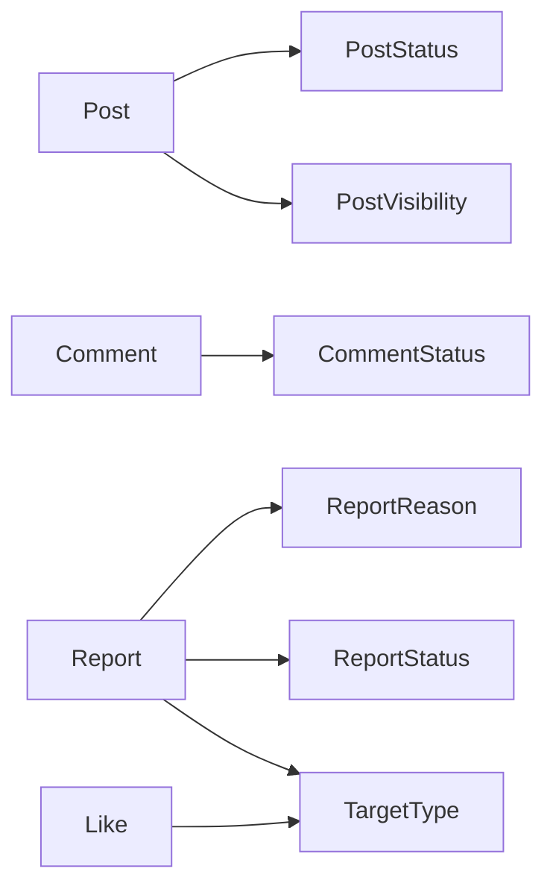

# board — 도메인 Enums (Hub)

| 문서 버전 | 작성일 | 작성자 | 주요 변경 사항 |
| --- | --- | --- | --- |
| v1.0.0 | 2026-05-15 | engineering-agent/tech-lead | 최초 |

**[[../board|↑ board hub]]**

> 각 enum 은 도메인 의사결정. 단순 값 모음 X.

---

## 1. 목록

| Enum | 노트 | 책임 |
| --- | --- | --- |
| **PostStatus** | [[post-status]] | 게시글 lifecycle (DRAFT / PUBLISHED / HIDDEN / DELETED) |
| **PostVisibility** | [[post-visibility]] | 가시성 (PUBLIC / MEMBERS / PRIVATE) |
| **CommentStatus** | [[comment-status]] | 댓글 lifecycle (ACTIVE / HIDDEN / DELETED) |
| **ReportReason** | [[report-reason]] | 신고 사유 (8 종) |
| **ReportStatus** | [[report-status]] | 신고 처리 (PENDING / AUTO_HIDDEN / DELETED / DISMISSED) |
| **TargetType** | [[target-type]] | Report / Like 의 target 종류 (POST / COMMENT) |

→ 자세히는 [[../../signup/enums/enums|↗ signup enums]] 의 패턴 따름.

---

## 2. enum 관계

---

## 3. 공통 컨벤션

자세히: [[../../signup/enums/enums#2 설계 원칙]].

- 단수형 (`PostStatus` not `PostStatuses`).
- UPPER_SNAKE_CASE.
- JPA `@Enumerated(EnumType.STRING)` 강제.
- DB CHECK 제약 같이.
- 새 값 추가 OK, **이름 변경 절대 X**.

---

## 4. 관련

- [[../board|↑ hub]]
- [[../../signup/enums/enums|↗ signup enums]] — 패턴
