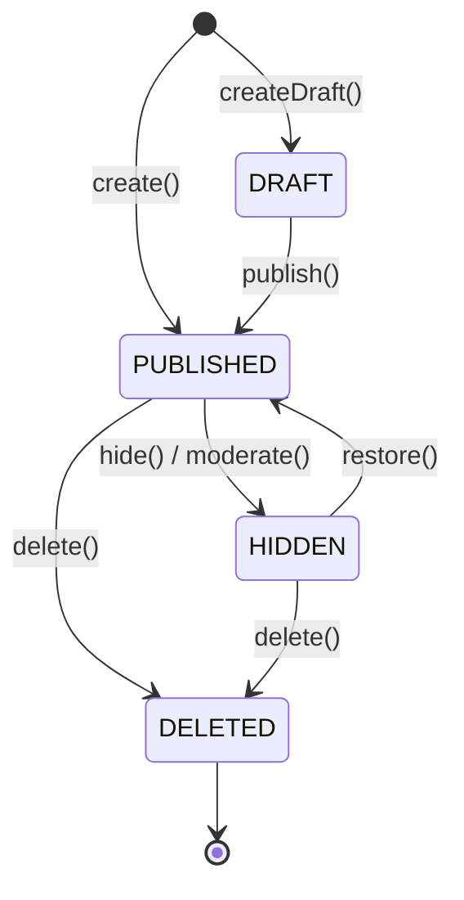

# PostStatus — DRAFT / PUBLISHED / HIDDEN / DELETED

| 문서 버전 | 작성일 | 작성자 | 주요 변경 사항 |
| --- | --- | --- | --- |
| v1.0.0 | 2026-05-15 | engineering-agent/tech-lead | 최초 |

**[[enums|↑ enums hub]]**

---

## 1. 코드

```java
public enum PostStatus {
    DRAFT,              // 임시 저장 (작성자만)
    PUBLISHED,          // 공개 (default)
    HIDDEN,             // 모더 또는 작성자 임시 숨김
    DELETED;            // soft delete

    public boolean isVisible() { return this == PUBLISHED; }
    public boolean isFinal() { return this == DELETED; }
    public boolean canTransitionTo(PostStatus target) {
        return switch (this) {
            case DRAFT -> target == PUBLISHED || target == DELETED;
            case PUBLISHED -> target == HIDDEN || target == DELETED;
            case HIDDEN -> target == PUBLISHED || target == DELETED;
            case DELETED -> false;       // 종착
        };
    }
}
```

---

## 2. 상태 전이



---

## 3. 각 상태의 "왜"

### 3.1 왜 4개 (2개 / 3개 아님)

| 상태 | 의미 | 노출 |
| --- | --- | --- |
| DRAFT | 임시 저장 | 작성자만 |
| PUBLISHED | 정상 공개 | 모두 (visibility 기준) |
| HIDDEN | 모더 / 임시 숨김 | 작성자 + admin |
| DELETED | soft delete | 누구도 (admin audit) |

**왜 4개**
- DRAFT 와 PUBLISHED 분리 — 미발행 임시 저장.
- HIDDEN 과 DELETED 분리 — 복원 가능 vs 종착.

**왜 BOOLEAN 부족**
- 4 상태 표현 X.
- 모더 사유 vs 작성자 의도 vs 복원 가능성 구분 X.

---

## 4. 노출 정책

| 상태 | List | 상세 | 작성자 | Admin |
| --- | --- | --- | --- | --- |
| DRAFT | X | 작성자만 | ✅ | ✅ |
| PUBLISHED | ✅ | ✅ | ✅ | ✅ |
| HIDDEN | X | 작성자 + admin | ✅ | ✅ |
| DELETED | X | X | X | ✅ (audit) |

---

## 5. JPA 매핑

```java
@Enumerated(EnumType.STRING)
@Column(nullable = false, length = 20)
private PostStatus status;
```

→ DB 의 VARCHAR + CHECK 제약과 일치.

---

## 6. 함정

### 함정 1 — ORDINAL 사용
순서 바꿀 때 모든 row 의미 깨짐.
→ STRING 강제.

### 함정 2 — DRAFT 의 가시성
작성자 외 노출 시 미발행 글 leak.
→ author 검증 필수.

### 함정 3 — DELETED 의 상세 조회 X (admin 도)
audit 못함.
→ admin role 은 access 가능.

### 함정 4 — HIDDEN 의 작성자 알림 누락
"내 글 왜 안 보여?" CS.
→ HIDDEN 전이 시 알림.

### 함정 5 — 임의 상태 전이 (HIDDEN → DRAFT)
의미 불명.
→ canTransitionTo() 검증.

---

## 7. 관련

- [[enums|↑ hub]]
- [[../domain-model/post-aggregate]]
- [[../database/posts-table]]
- [[../security/authentication-authorization]] (todo)
