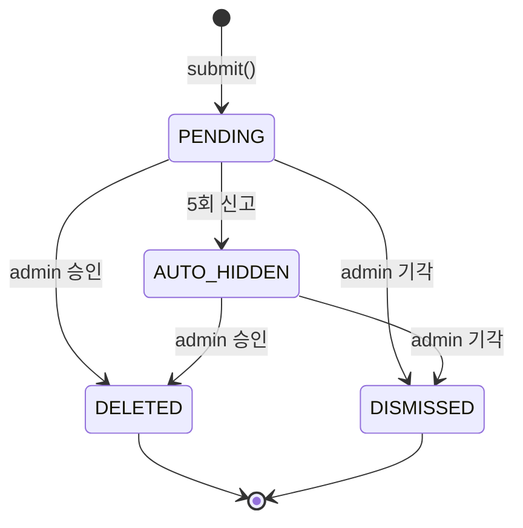

# ReportStatus — PENDING / AUTO_HIDDEN / DELETED / DISMISSED

| 문서 버전 | 작성일 | 작성자 | 주요 변경 사항 |
| --- | --- | --- | --- |
| v1.0.0 | 2026-05-15 | engineering-agent/tech-lead | 최초 |

**[[enums|↑ enums hub]]**

---

## 1. 코드

```java
public enum ReportStatus {
    PENDING,        // admin review 대기
    AUTO_HIDDEN,    // 5회 신고 자동 hide (admin review 대기)
    DELETED,        // admin 이 target 삭제
    DISMISSED;      // admin 기각

    public boolean isResolved() { return this == DELETED || this == DISMISSED; }
    public boolean needsAdminReview() { return this == PENDING || this == AUTO_HIDDEN; }
}
```

---

## 2. 상태 전이



---

## 3. 왜 4-state

| 상태 | 의미 |
| --- | --- |
| PENDING | admin 검토 전 (target 정상 노출) |
| AUTO_HIDDEN | 5회 신고 → target HIDDEN (admin 검토 대기) |
| DELETED | admin 이 target 삭제 (위반 확인) |
| DISMISSED | admin 이 정상 글로 판단 → target 복원 |

**왜 PENDING + AUTO_HIDDEN 분리**
- PENDING = "신고 받음, target 그대로".
- AUTO_HIDDEN = "5회 누적, target 임시 hide".
- 둘 다 admin review 대기지만 target 상태 다름.

---

## 4. 함정

### 함정 1 — AUTO_HIDDEN 후 admin review 안 옴
HIDDEN 영구 → 정상 글 피해.
→ 24h SLA + 12h overdue alert.

### 함정 2 — DELETED / DISMISSED 후 status 변경
잘못된 admin 판단의 재고려 어려움.
→ 새 row 만들지 말고 admin_note 에 history.

### 함정 3 — 처리 안 된 신고 만료
PENDING 영구 → admin dashboard 폭증.
→ 30일 자동 정리 또는 archive.

---

## 5. 관련

- [[enums|↑ hub]]
- [[../database/reports-table]]
- [[../design-decisions/moderation-policy]]
