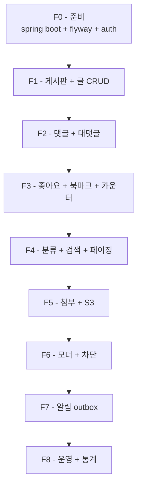

# 구현 순서 — PR 단위 분할 to-do

| 문서 버전 | 작성일 | 작성자 | 주요 변경 사항 |
| --- | --- | --- | --- |
| v1.0.0 | 2026-05-15 | engineering-agent/tech-lead | 최초 |

**[[board|↑ board hub]]**

> board recipe 전체를 단계 별 PR 로 분할. 각 PR 은 독립 배포 가능 + 회귀 OK.

---

## 0. 원칙

- **각 PR = 1 기능 + 1 migration + tests + docs**.
- **F0 → F8** 순서 — 이전 단계 완료 후 다음 시작.
- **회귀 테스트** 반드시 PASS.
- **feature flag** (gate) — production 위험한 기능 (search/attachment/notification) 은 flag.

---

## 1. 전체 흐름



---

## 2. 단계 별 PR

### F0 — 준비 (1주)

| 항목 | 내용 |
| --- | --- |
| Tech | Spring Boot 3.3, Java 21, PostgreSQL 16, Redis 7 |
| 인증 | signup 의 JWT 인증 그대로 사용 ([[../signup/security/security]] 참고) |
| 패키지 | `com.example.board` (Hexagonal) |
| Migration | Flyway 초기 셋업 |
| Tests | Testcontainers (PostgreSQL + Redis) |

**왜**: 모든 기능의 토대. signup 과 인증 통합 검증.

### F1 — 게시판 + 글 CRUD (2주)

| 항목 | 내용 |
| --- | --- |
| 테이블 | `boards`, `posts` |
| API | `POST /api/v1/boards`, `GET /api/v1/boards`, `POST /api/v1/posts`, `GET /api/v1/posts/{id}`, `PATCH`, `DELETE` |
| 도메인 | `Post` aggregate, `Board` entity, `PostStatus` enum |
| Security | XSS sanitization (OWASP HTML Sanitizer) |
| Tests | unit (Post aggregate) + integration (CRUD + XSS) |

**참고**: [[implementation/post-crud-impl]], [[database/posts-table]], [[security/xss-defense]].

### F2 — 댓글 + 대댓글 (1주)

| 항목 | 내용 |
| --- | --- |
| 테이블 | `comments` (2-level: parent_id) |
| API | `POST /api/v1/posts/{id}/comments`, `POST /api/v1/comments/{id}/replies`, `GET`, `DELETE` |
| 도메인 | `Comment` aggregate, `CommentStatus` enum |
| Counter | `posts.comment_count` 동기화 (deferred trigger or app-level) |
| Tests | unit + integration |

**참고**: [[implementation/comment-impl]], [[design-decisions/comment-structure]].

### F3 — 좋아요 + 북마크 + 카운터 (1.5주)

| 항목 | 내용 |
| --- | --- |
| 테이블 | `post_likes`, `comment_likes`, `bookmarks` |
| API | `POST /api/v1/posts/{id}/like`, `DELETE`, `POST /bookmark`, ... |
| 캐시 | Redis INCR/DECR + 1h batch flush |
| 도메인 | `LikeService` (idempotent ON CONFLICT) |
| Tests | concurrency test (100 thread 좋아요) |

**참고**: [[implementation/like-bookmark-impl]], [[design-decisions/like-counter]], [[pitfalls/counter-pitfalls]].

**왜 별도 단계**: counter race condition 검증 + Redis 통합 = 위험. signup 보다 신중.

### F4 — 분류 + 검색 + 페이징 (2주)

| 항목 | 내용 |
| --- | --- |
| 테이블 | `categories`, `tags`, `post_tags` |
| API | 검색 (`?q=`), 카테고리/태그 filter, 정렬 (latest/hot/comment_count) |
| 검색 | Phase 1: `ILIKE` → Phase 2: PostgreSQL FTS (`tsvector` + GIN) |
| 페이징 | cursor-based (OFFSET 금지) |
| Tests | EXPLAIN ANALYZE (1M row 시 < 50ms) |

**참고**: [[implementation/search-pagination-impl]], [[implementation/taxonomy-impl]], [[design-decisions/pagination-strategy]], [[design-decisions/search-strategy]].

**Feature flag**: `board.search.fts-enabled` (Phase 1 → Phase 2 전환).

### F5 — 첨부 + S3 (1.5주)

| 항목 | 내용 |
| --- | --- |
| 테이블 | `attachments` |
| API | presigned URL 발급 → 클라이언트 직접 S3 → confirm |
| 검증 | MIME (magic byte), 크기 (이미지 10MB / 동영상 200MB) |
| Storage | S3 + CloudFront CDN |
| Tests | integration (LocalStack S3) |

**참고**: [[implementation/attachment-impl]], [[design-decisions/attachment-storage]].

**Feature flag**: `board.attachment.enabled` (점진적 ramp).

### F6 — 모더 + 차단 (1주)

| 항목 | 내용 |
| --- | --- |
| 테이블 | `reports`, `user_blocks` |
| API | `POST /api/v1/reports`, `POST /api/v1/users/{id}/block`, admin API |
| 자동 모더 | 5회 신고 → 자동 HIDDEN |
| Filter | 모든 list API 에 block filter 적용 |
| Tests | integration (block → 글 안 보임 검증) |

**참고**: [[security/moderation-impl]], [[security/block-filter]], [[design-decisions/moderation-policy]], [[design-decisions/block-policy]].

### F7 — 알림 outbox (1주)

| 항목 | 내용 |
| --- | --- |
| 테이블 | `notification_outbox`, `notifications`, `user_notification_preferences` |
| 패턴 | signup email_outbox 그대로 — AFTER_COMMIT listener + worker |
| 채널 | FCM (Android) + APNs (iOS) |
| API | in-app 조회, read, preferences |
| Tests | integration (좋아요 → outbox INSERT) |

**참고**: [[implementation/notification-impl]], [[database/notification-tables]], [[design-decisions/notification-policy]].

**Feature flag**: `board.notification.enabled` (FCM key 준비 후 ramp).

### F8 — 운영 + 통계 (1주)

| 항목 | 내용 |
| --- | --- |
| 메트릭 | Prometheus (`board_post_create_total`, `board_search_duration_p95`, ...) |
| 대시보드 | Grafana (글 / 댓글 / 좋아요 / 신고 / 알림) |
| 알람 | Slack #board-alerts (5xx > 1%, 검색 p95 > 1s) |
| Runbook | 장애 시나리오 5가지 ([[operations/runbook]]) |
| Audit | `board_audit_log` cleanup cron |

**참고**: [[operations/observability]], [[operations/runbook]], [[security/audit-logging]].

---

## 3. 의존성

| Feature | 의존 |
| --- | --- |
| F0 | signup 의 인증 ([[../signup/security/security]]) |
| F1 | F0 |
| F2 | F1 |
| F3 | F1 (+ F2 의 comment_likes) |
| F4 | F1, F2 |
| F5 | F1 |
| F6 | F1, F2 |
| F7 | F1, F2, F3, F6 (이벤트 publish) |
| F8 | 전체 |

→ F1~F2 는 직렬, F3~F6 은 부분 병렬 가능.

---

## 4. 회귀 / 회피 체크리스트

각 PR 머지 전 확인:

- [ ] Migration 의 down 가능 (롤백 시나리오 검증)
- [ ] feature flag 적용 (위험한 기능)
- [ ] signup 회귀 PASS (인증 흐름 깨지지 않음)
- [ ] 이전 단계 회귀 PASS
- [ ] EXPLAIN ANALYZE 첨부 (DB query)
- [ ] runbook 의 알람 / 메트릭 등록
- [ ] [[pitfalls]] 의 함정 점검

---

## 5. 일정 (예상)

```
F0: 1주
F1: 2주
F2: 1주
F3: 1.5주
F4: 2주
F5: 1.5주
F6: 1주
F7: 1주
F8: 1주

총: 12주 (3개월)
```

→ 팀 2명 가정. 1명이면 ~5개월.

---

## 6. 다른 컨텍스트

### 6.1 MVP (3주)
- F0 + F1 + F2 (글 + 댓글) 만.
- 좋아요 / 검색 / 첨부 / 알림 X.

### 6.2 Reddit-scale
- F0~F8 + ElasticSearch + Kafka fan-out + ML 추천.

---

## 7. 관련

- [[board|↑ hub]]
- [[overview]] — end-to-end 흐름
- [[prerequisites]] — 시작 전 준비
- [[requirements]] — 45 AC
- [[../signup/implementation-order|↗ signup 구현 순서]] (참고 패턴)
