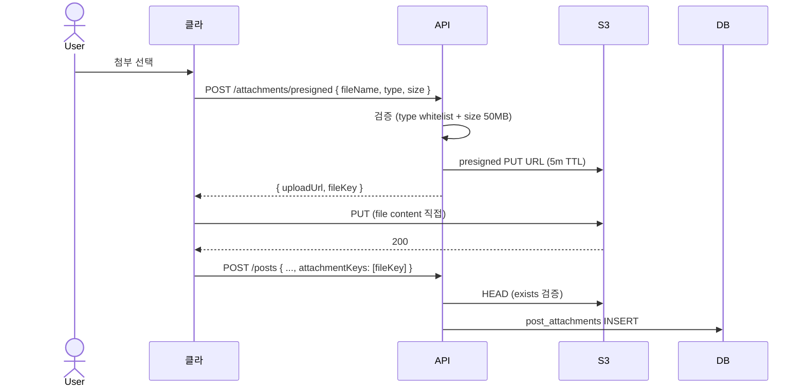

# 첨부 파일 구현 — S3 presigned

| 문서 버전 | 작성일 | 작성자 | 주요 변경 사항 |
| --- | --- | --- | --- |
| v1.0.0 | 2026-05-15 | engineering-agent/tech-lead | 최초 |

**[[implementation|↑ implementation hub]]**

> S3 presigned URL — backend 우회 직접 upload. 정책: [[../design-decisions/attachment-storage]].

---

## 1. 흐름



---

## 2. Service

```java
@Service
@RequiredArgsConstructor
public class AttachmentService {

    private final S3Presigner presigner;
    private final S3Client s3;
    private final PostAttachmentRepository attachments;
    private final IdGenerator ids;

    private static final Set<String> ALLOWED_TYPES = Set.of(
        "image/jpeg", "image/png", "image/webp", "image/gif",
        "video/mp4", "video/webm",
        "application/pdf"
    );
    private static final long MAX_SIZE = 50 * 1024 * 1024;

    @Value("${app.s3.bucket}") String bucket;

    public PresignedResponse createPresignedUrl(UserId userId, PresignedRequest req) {
        // 검증
        if (!ALLOWED_TYPES.contains(req.contentType()))
            throw new BusinessException(ResponseCode.INVALID_INPUT_FORMAT, "unsupported type");
        if (req.size() > MAX_SIZE)
            throw new BusinessException(ResponseCode.INVALID_INPUT_FORMAT, "file too large");
        if (req.fileName() == null || req.fileName().isBlank())
            throw new BusinessException(ResponseCode.INVALID_INPUT_FORMAT, "fileName required");

        // file key 생성
        var key = "%s/%s/%s-%s".formatted(
            userId.value(),
            YearMonth.now(),
            UlidCreator.getMonotonicUlid(),
            sanitize(req.fileName())
        );

        // presigned URL
        var putReq = PutObjectRequest.builder()
            .bucket(bucket).key(key)
            .contentType(req.contentType())
            .contentLength(req.size())
            .build();
        var presigned = presigner.presignPutObject(b -> b
            .signatureDuration(Duration.ofMinutes(5))
            .putObjectRequest(putReq));

        return new PresignedResponse(
            presigned.url().toString(),
            key,
            Instant.now().plus(Duration.ofMinutes(5))
        );
    }

    public boolean verifyExists(String key) {
        try {
            s3.headObject(b -> b.bucket(bucket).key(key));
            return true;
        } catch (NoSuchKeyException e) {
            return false;
        }
    }

    private String sanitize(String name) {
        return name.replaceAll("[^a-zA-Z0-9._-]", "_");
    }
}
```

---

## 3. Post 작성 시 매핑

```java
// PostService.create() 안
for (var key : cmd.attachmentKeys()) {
    if (!attachmentService.verifyExists(key))
        throw new BusinessException(ResponseCode.NOT_FOUND, "attachment not uploaded: " + key);

    // metadata 추출 (옵션 — 이미지 width / height)
    var metadata = s3.headObject(b -> b.bucket(bucket).key(key));

    attachments.save(new PostAttachment(
        new AttachmentId(ids.next()),
        post.id(),
        key,
        extractFileName(key),
        metadata.contentType(),
        metadata.contentLength(),
        // width / height — image 라면 image lib 으로 추출
        order,
        Instant.now()
    ));
}
```

---

## 4. S3 cleanup

```java
@TransactionalEventListener(phase = AFTER_COMMIT)
public void onPostDeleted(PostDeleted event) {
    // post hard delete 시 (또는 30일 후 cleanup) S3 file 삭제
    var keys = attachmentRepo.findByPostId(event.postId()).stream()
        .map(PostAttachment::fileKey)
        .toList();
    s3.deleteObjects(b -> b.bucket(bucket).delete(d -> d.objects(
        keys.stream().map(k -> ObjectIdentifier.builder().key(k).build()).toList()
    )));
}
```

### 4.1 S3 lifecycle (orphan)

```json
// S3 bucket lifecycle (1일 prefix tag 안 단 file 삭제)
{
  "Rules": [{
    "ID": "DeleteOrphans",
    "Status": "Enabled",
    "Filter": { "Tag": { "Key": "status", "Value": "orphan" } },
    "Expiration": { "Days": 1 }
  }]
}
```

자세히: [[../design-decisions/attachment-storage#5]].

---

## 5. Controller

```java
@RestController
@RequestMapping("/api/v1/attachments")
@RequiredArgsConstructor
public class AttachmentController {

    private final AttachmentService service;

    @PostMapping("/presigned")
    public CommonResponse<PresignedResponse> presigned(
        @Valid @RequestBody PresignedRequest req,
        @AuthenticationPrincipal AuthUser auth
    ) {
        return CommonResponse.success(ResponseCode.OK,
            service.createPresignedUrl(auth.id(), req));
    }
}
```

---

## 6. 함정

자세히: [[../design-decisions/attachment-storage#7 함정]].

### 함정 1 — Type 검증 없이
.exe 업로드 가능.
→ whitelist.

### 함정 2 — Size 무제한
1GB file abuse.
→ 50MB max.

### 함정 3 — Presigned TTL 영구
도난 시 무한.
→ 5분.

### 함정 4 — S3 exists 검증 X
fake key 매핑.
→ HEAD request.

### 함정 5 — orphan cleanup 없음
업로드 후 post 안 만든 file 영구.
→ S3 lifecycle 1일.

### 함정 6 — Post 삭제 시 S3 file 안 삭제
storage 비용 누적.
→ AFTER_COMMIT listener 또는 batch.

### 함정 7 — file_name 사용자 입력 그대로
path traversal.
→ sanitize.

---

## 7. 관련

- [[implementation|↑ hub]]
- [[../design-decisions/attachment-storage]]
- [[../database/attachments-table]]
- [[../../file-upload-s3]] — file upload recipe
