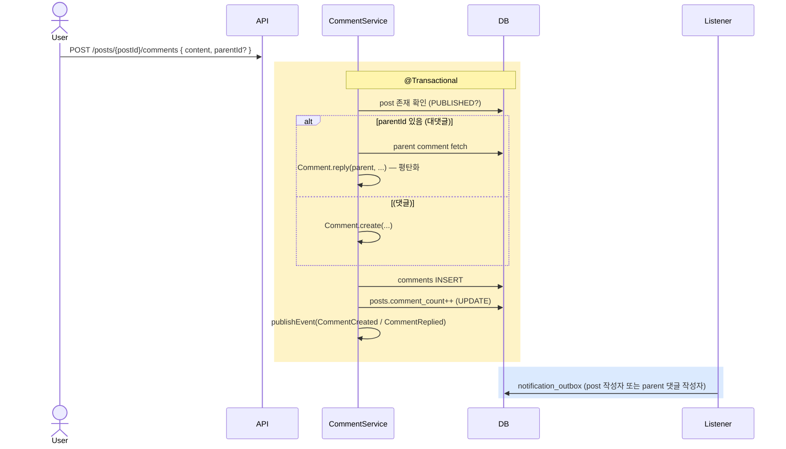

# 댓글 / 대댓글 구현

| 문서 버전 | 작성일 | 작성자 | 주요 변경 사항 |
| --- | --- | --- | --- |
| v1.0.0 | 2026-05-15 | engineering-agent/tech-lead | 최초 |

**[[implementation|↑ implementation hub]]**

> 2-level 댓글 + 대댓글. Comment.reply() 가 평탄화.

---

## 1. 흐름 개요



---

## 2. API spec

```http
POST /api/v1/posts/{postId}/comments              { content }
POST /api/v1/comments/{parentId}/reply            { content }
GET  /api/v1/posts/{postId}/comments              # tree
PATCH /api/v1/comments/{commentId}                { content }
DELETE /api/v1/comments/{commentId}
```

---

## 3. Service

```java
@Service
@RequiredArgsConstructor
public class CommentService {

    private final PostRepository posts;
    private final CommentRepository comments;
    private final ApplicationEventPublisher events;
    private final IdGenerator ids;
    private final Clock clock;

    @Transactional
    public Comment create(PostId postId, UserId authorId, String content, CommentId parentId) {
        var post = posts.findById(postId).orElseThrow(() -> new NotFoundException("post"));
        if (!post.isVisible()) throw new BusinessException(ResponseCode.NOT_FOUND);

        var commentId = new CommentId(ids.next());

        Comment comment;
        if (parentId != null) {
            var parent = comments.findById(parentId).orElseThrow();
            comment = Comment.reply(commentId, parent, authorId, content, Instant.now(clock));
        } else {
            comment = Comment.create(commentId, postId, authorId, content, Instant.now(clock));
        }

        comments.save(comment);

        // post.comment_count UPDATE — atomic 으로
        posts.incrementCommentCount(postId);

        comment.pullDomainEvents().forEach(events::publishEvent);
        return comment;
    }

    @Transactional(readOnly = true)
    public List<CommentTree> findTree(PostId postId) {
        var all = comments.findByPostId(postId);
        return buildTree(all);
    }

    private List<CommentTree> buildTree(List<Comment> all) {
        var byParent = all.stream()
            .filter(c -> c.parentId() != null)
            .collect(Collectors.groupingBy(Comment::parentId));

        return all.stream()
            .filter(c -> c.parentId() == null)
            .map(c -> new CommentTree(c, byParent.getOrDefault(c.id(), List.of())))
            .toList();
    }
}
```

### 3.1 왜 `incrementCommentCount` (atomic UPDATE)

- `UPDATE posts SET comment_count = comment_count + 1 WHERE id = ?` — atomic.
- 동시 댓글 시 race condition 없음.
- @Version 낙관 락 충돌 회피.

### 3.2 왜 tree 구성이 application 단

- 한 query 로 모든 comment fetch.
- application Map 으로 그룹화 — N+1 회피.

자세히: [[../design-decisions/comment-structure#4]].

---

## 4. 삭제 — soft delete + 자식 보존

```java
@Transactional
public void delete(CommentId commentId, UserId currentUser, boolean isAdmin) {
    var comment = comments.findById(commentId).orElseThrow();
    if (!isAdmin && !comment.isOwnedBy(currentUser))
        throw new ForbiddenException();

    // 자식 (대댓글) 있는지 확인
    long childCount = comments.countByParentId(commentId);

    if (childCount > 0) {
        // soft delete + content 마스킹
        comment.delete(Instant.now(clock));     // content 자동 마스킹
        comments.save(comment);
    } else {
        // 자식 없음 — hard delete (옵션)
        comments.deleteById(commentId);
    }

    posts.decrementCommentCount(comment.postId());
    comment.pullDomainEvents().forEach(events::publishEvent);
}
```

### 4.1 왜 자식 있으면 soft delete

- 자식 (대댓글) 의 parent_id 가 dangling 되면 표시 X.
- content="[삭제된 댓글입니다]" 로 placeholder 유지.

---

## 5. Controller

```java
@Tag(name = "댓글")
@RestController
@RequestMapping("/api/v1")
@RequiredArgsConstructor
public class CommentController {

    private final CommentService service;

    @PostMapping("/posts/{postId}/comments")
    public ResponseEntity<CommonResponse<CommentResponse>> create(
        @PathVariable PostId postId,
        @Valid @RequestBody CommentCreateRequest req,
        @AuthenticationPrincipal AuthUser auth
    ) {
        var comment = service.create(postId, auth.id(), req.content(), null);
        return ResponseEntity.status(201).body(
            CommonResponse.success(ResponseCode.OK, CommentResponse.of(comment)));
    }

    @PostMapping("/comments/{parentId}/reply")
    public ResponseEntity<CommonResponse<CommentResponse>> reply(
        @PathVariable CommentId parentId,
        @Valid @RequestBody CommentCreateRequest req,
        @AuthenticationPrincipal AuthUser auth
    ) {
        var parent = service.findById(parentId);
        var comment = service.create(parent.postId(), auth.id(), req.content(), parentId);
        return ResponseEntity.status(201).body(
            CommonResponse.success(ResponseCode.OK, CommentResponse.of(comment)));
    }

    @GetMapping("/posts/{postId}/comments")
    public CommonResponse<List<CommentTreeResponse>> tree(@PathVariable PostId postId) {
        return CommonResponse.success(ResponseCode.OK,
            service.findTree(postId).stream().map(CommentTreeResponse::of).toList());
    }

    @PatchMapping("/comments/{commentId}")
    @PreAuthorize("@boardSecurity.isCommentAuthor(#commentId, authentication)")
    public CommonResponse<CommentResponse> update(...) { ... }
}
```

---

## 6. 함정

### 함정 1 — Tree 구성 시 N+1
댓글마다 자식 조회.
→ 한 query + Map 그룹화.

### 함정 2 — comment_count race
같은 row UPDATE 의 race.
→ atomic UPDATE (`comment_count = comment_count + 1`).

### 함정 3 — 부모 hard delete
자식 (대댓글) 고아.
→ 자식 있으면 soft delete.

### 함정 4 — 대대댓글 reject 응답
"답글 못 씁니다" — UX 망함.
→ 평탄화 (Comment.reply() 가 처리).

### 함정 5 — 비공개 post 의 댓글
post visibility 검증 누락.
→ post 검증 후 comment.

### 함정 6 — DELETED post 의 댓글 조회
사용자에 잠시 노출.
→ JOIN + post.status != 'DELETED'.

### 함정 7 — 차단 사용자 댓글
list 에 노출.
→ block filter ([[../security/block-filter]]).

### 함정 8 — XSS 가드 누락
댓글 content 의 `<script>`.
→ markdown 렌더링 + sanitize.

---

## 7. 관련

- [[implementation|↑ hub]]
- [[../database/comments-table]]
- [[../domain-model/comment-aggregate]]
- [[../design-decisions/comment-structure]]
- [[../security/xss-defense]]
