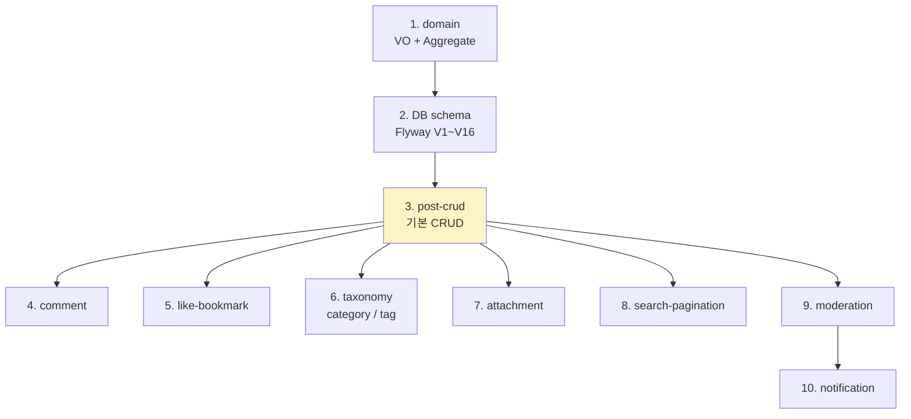

# board §10 — 구현 (Hub)

| 문서 버전 | 작성일 | 작성자 | 주요 변경 사항 |
| --- | --- | --- | --- |
| v1.0.0 | 2026-05-15 | engineering-agent/tech-lead | 최초 |

**[[../board|↑ board hub]]**  ·  ← [[../security/security]]  ·  → [[../transactions]]

> 8 핵심 흐름. signup 의 implementation 패턴 따름.

---

## 1. 8 핵심 흐름

| 노트 | 무엇 | 의존성 |
| --- | --- | --- |
| [[post-crud-impl]] | 게시글 CRUD + soft delete + 권한 | DB |
| [[comment-impl]] | 댓글 / 대댓글 + tree 조회 | DB |
| [[like-bookmark-impl]] | 좋아요 / 북마크 toggle + Redis counter | DB, Redis |
| [[search-pagination-impl]] | 검색 / 정렬 / cursor pagination | DB (FTS 옵션) |
| [[taxonomy-impl]] | 카테고리 / 태그 (자동 생성) | DB |
| [[attachment-impl]] | S3 presigned + post 매핑 | S3 |
| [[moderation-impl]] | 신고 / 자동 hide / admin review | DB |
| [[notification-impl]] | 좋아요 / 댓글 알림 (outbox + FCM) | DB, FCM |

---

## 2. 구현 순서



**왜 post-crud 가 먼저**
- 다른 흐름 모두 post 의 후속.
- comment / like / search 다 post 가 있어야 의미.

자세히: [[../implementation-order]] (todo).

---

## 3. 공통 패턴

### 3.1 Controller → Service → Domain + Repository

```
[Controller] HTTP / DTO / Bean Validation
[Service @Transactional] 비즈니스 흐름
[Domain] invariant + Event
[Repository port → Adapter]
```

### 3.2 4계층 검증

| Layer | 책임 |
| --- | --- |
| Bean Validation | 형식 / length |
| Domain VO | 도메인 규칙 |
| DB CHECK | safety net |
| DB UNIQUE | race condition |

### 3.3 AFTER_COMMIT listener

- counter (Redis INCR)
- 알림 (notification_outbox INSERT)
- 검색 인덱스 (FTS / ES)

자세히: [[../transactions]].

---

## 4. 공통 의존성

```kotlin
implementation("org.springframework.boot:spring-boot-starter-web")
implementation("org.springframework.boot:spring-boot-starter-data-jpa")
implementation("org.springframework.boot:spring-boot-starter-data-redis")
implementation("org.springframework.boot:spring-boot-starter-validation")
implementation("org.springframework.boot:spring-boot-starter-security")

implementation("org.commonmark:commonmark:0.22.0")                           // markdown
implementation("com.googlecode.owasp-java-html-sanitizer:owasp-java-html-sanitizer:20240325.1")
implementation("software.amazon.awssdk:s3:2.25.50")
implementation("com.github.f4b6a3:ulid-creator:5.2.3")
```

자세히: [[../../signup/design-decisions/dependencies|↗ signup dependencies]].

---

## 5. 응답 / 에러 표준

[[../../common/response-envelope|↗ CommonResponse]] 그대로.

```json
{
  "code": "OK_001",
  "message": "...",
  "data": { ... }
}
```

---

## 6. 관련

- [[../board|↑ hub]]
- [[../security/security]] — 이전
- [[../transactions]] — 다음
- [[../../signup/implementation/implementation|↗ signup implementation]] — 패턴
