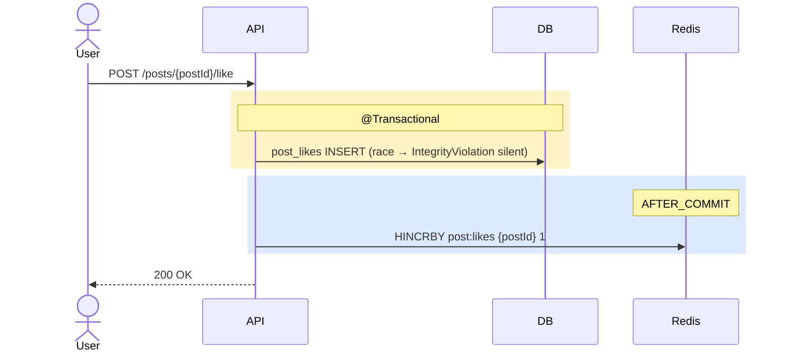

# 좋아요 / 북마크 구현

| 문서 버전 | 작성일 | 작성자 | 주요 변경 사항 |
| --- | --- | --- | --- |
| v1.0.0 | 2026-05-15 | engineering-agent/tech-lead | 최초 |

**[[implementation|↑ implementation hub]]**

> Toggle + Redis counter + AFTER_COMMIT INCR. 정책: [[../design-decisions/like-counter]].

---

## 1. 흐름



---

## 2. Service

```java
@Service
@RequiredArgsConstructor
public class LikeService {

    private final PostLikeRepository likes;
    private final CommentLikeRepository commentLikes;
    private final BookmarkRepository bookmarks;
    private final RedisTemplate<String, String> redis;
    private final ApplicationEventPublisher events;
    private final Clock clock;

    @Transactional
    public void likePost(UserId userId, PostId postId) {
        try {
            likes.insert(new PostLike(userId, postId, Instant.now(clock)));
        } catch (DataIntegrityViolationException e) {
            return;     // 이미 좋아요 — silent (idempotent)
        }
        events.publishEvent(new PostLiked(postId, userId));
    }

    @TransactionalEventListener(phase = AFTER_COMMIT)
    public void onPostLiked(PostLiked event) {
        redis.opsForValue().increment("post:likes:" + event.postId().value());
    }

    @Transactional
    public void unlikePost(UserId userId, PostId postId) {
        int deleted = likes.delete(userId, postId);
        if (deleted > 0) {
            events.publishEvent(new PostUnliked(postId, userId));
        }
    }

    @TransactionalEventListener(phase = AFTER_COMMIT)
    public void onPostUnliked(PostUnliked event) {
        redis.opsForValue().decrement("post:likes:" + event.postId().value());
    }

    @Transactional
    public void bookmarkPost(UserId userId, PostId postId) {
        try {
            bookmarks.insert(new PostBookmark(userId, postId, Instant.now(clock)));
        } catch (DataIntegrityViolationException e) {
            return;
        }
    }

    @Transactional
    public void unbookmarkPost(UserId userId, PostId postId) {
        bookmarks.delete(userId, postId);
    }
}
```

---

## 3. Batch sync (1h)

```java
@Component
public class LikeCountBatchJob {

    @Scheduled(cron = "0 0 * * * *")
    @SchedulerLock(name = "likeCountSync", lockAtMostFor = "30m")
    public void sync() {
        Set<String> keys = redis.keys("post:likes:*");
        for (String key : keys) {
            String postId = key.replace("post:likes:", "");
            Long count = Long.parseLong(redis.opsForValue().get(key));
            posts.updateLikeCount(postId, count);
        }
    }
}
```

자세히: [[../design-decisions/like-counter#4]].

---

## 4. Controller

```java
@RestController
@RequestMapping("/api/v1")
@RequiredArgsConstructor
public class LikeController {

    private final LikeService service;

    @PostMapping("/posts/{postId}/like")
    public ResponseEntity<CommonResponse<Void>> like(
        @PathVariable PostId postId,
        @AuthenticationPrincipal AuthUser auth
    ) {
        service.likePost(auth.id(), postId);
        return ResponseEntity.ok(CommonResponse.success(ResponseCode.OK));
    }

    @DeleteMapping("/posts/{postId}/like")
    public ResponseEntity<CommonResponse<Void>> unlike(
        @PathVariable PostId postId,
        @AuthenticationPrincipal AuthUser auth
    ) {
        service.unlikePost(auth.id(), postId);
        return ResponseEntity.ok(CommonResponse.success(ResponseCode.OK));
    }

    // POST/DELETE bookmark — 같은 패턴
    // POST/DELETE comments/{id}/like — 같은 패턴
}
```

---

## 5. Rate limit

```yaml
like-toggle: 60 / min / user
bookmark-toggle: 30 / min / user
```

→ abuse 방어 (분당 1000 toggle = bot).

---

## 6. 함정

### 함정 1 — 트랜잭션 안 Redis INCR
rollback 시 Redis 만 +1.
→ AFTER_COMMIT.

### 함정 2 — DataIntegrityViolationException 안 catch
중복 좋아요 500.
→ silent catch.

### 함정 3 — Counter 가 매번 DB UPDATE
인기 글의 lock 폭증.
→ Redis + 1h batch.

### 함정 4 — Rate limit 없음
bot 의 좋아요 / 북마크 폭증.
→ Bucket4j.

### 함정 5 — Toggle 의 응답에 like_count
실시간 count 불일치 (Redis sync 전).
→ Redis 의 최신 값 또는 client 에서 +1.

### 함정 6 — Self-like 허용
자기 글에 좋아요 → 의미 없음 (counter 부풀림).
→ author_id == userId 시 reject (옵션).

---

## 7. 관련

- [[implementation|↑ hub]]
- [[../database/likes-tables]] · [[../database/bookmarks-table]]
- [[../design-decisions/like-counter]] — 정책
- [[../transactions]]
