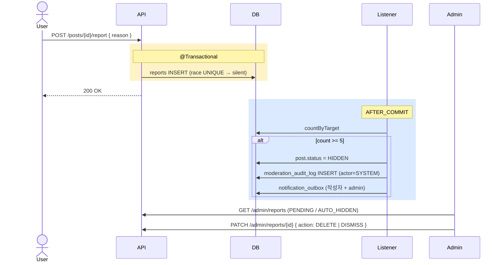

# 신고 / 모더레이션 구현

| 문서 버전 | 작성일 | 작성자 | 주요 변경 사항 |
| --- | --- | --- | --- |
| v1.0.0 | 2026-05-15 | engineering-agent/tech-lead | 최초 |

**[[implementation|↑ implementation hub]]**

> 신고 + 5회 자동 hide + admin review + 차단. [[../security/moderation-impl|↗ security 의 admin action]] 과 연결.

---

## 1. 흐름 — 신고 + 자동 hide



---

## 2. Service — 신고

```java
@Service
@RequiredArgsConstructor
public class ReportService {

    private final ReportRepository reports;
    private final PostRepository posts;
    private final CommentRepository comments;
    private final ApplicationEventPublisher events;
    private final IdGenerator ids;
    private final Clock clock;

    @Transactional
    public void submit(UserId reporterId, TargetId targetId, ReportReason reason, String detail) {
        // target 존재 검증
        if (!targetExists(targetId)) throw new NotFoundException("target");

        // self-report 차단
        var authorId = getTargetAuthor(targetId);
        if (authorId.equals(reporterId))
            throw new BusinessException(ResponseCode.INVALID_INPUT_FORMAT, "self-report");

        try {
            var report = new Report(
                new ReportId(ids.next()),
                reporterId, targetId, reason, detail,
                ReportStatus.PENDING, Instant.now(clock)
            );
            reports.save(report);
        } catch (DataIntegrityViolationException e) {
            return;     // 중복 신고 — silent (idempotent)
        }

        events.publishEvent(new ReportSubmitted(targetId, reporterId, reason));
    }

    @TransactionalEventListener(phase = AFTER_COMMIT)
    public void onReportSubmitted(ReportSubmitted event) {
        long count = reports.countByTarget(event.targetId(), event.targetId().type());
        if (count >= 5) {
            autoHide(event.targetId());
        }
    }

    @Transactional
    public void autoHide(TargetId targetId) {
        switch (targetId.type()) {
            case POST -> {
                var post = posts.findById(targetId.toPostId()).orElseThrow();
                if (post.status() != PostStatus.PUBLISHED) return;     // idempotent
                post.hide("5회 신고 자동 hide", Instant.now(clock));
                posts.save(post);
            }
            case COMMENT -> {
                var comment = comments.findById(targetId.toCommentId()).orElseThrow();
                if (comment.status() != CommentStatus.ACTIVE) return;
                comment.hide("5회 신고", Instant.now(clock));
                comments.save(comment);
            }
        }

        moderationAudit.save(/* SYSTEM action */);
        notifier.notifyAuthor(getTargetAuthor(targetId), "신고로 인한 임시 hide");
    }
}
```

### 2.1 왜 self-report 차단

- 의미 없음 + counter 부풀림.

### 2.2 왜 자동 hide 가 idempotent

- 5번째 신고가 동시 발생 시 두 번 hide 시도.
- status 검증 후 변경 — no-op.

자세히: [[../design-decisions/moderation-policy]] · [[../security/moderation-impl]].

---

## 3. Admin Review

```java
@Service
@PreAuthorize("hasRole('ADMIN')")
@RequiredArgsConstructor
public class AdminReportService {

    @Transactional
    public void resolve(ReportId reportId, ResolveAction action, String adminNote,
                         UserId adminId) {
        var report = reports.findById(reportId).orElseThrow();

        switch (action) {
            case DELETE -> {
                deleteTarget(report.targetId());
                report.markResolved(adminId, ReportStatus.DELETED, adminNote);
            }
            case DISMISS -> {
                restoreTarget(report.targetId());      // HIDDEN 였다면 복원
                report.markResolved(adminId, ReportStatus.DISMISSED, adminNote);
            }
        }
        reports.save(report);
        moderationAudit.save(/* ADMIN action */);
        notifier.notifyAuthor(getTargetAuthor(report.targetId()), action);
    }
}
```

---

## 4. Block

```java
@Service
@RequiredArgsConstructor
public class BlockService {

    @Transactional
    public void block(UserId blockerId, UserId blockedId) {
        if (blockerId.equals(blockedId))
            throw new BusinessException(ResponseCode.INVALID_INPUT_FORMAT, "self-block");

        long currentBlocks = userBlocks.countByBlockerId(blockerId);
        if (currentBlocks >= 1000)
            throw new BusinessException(ResponseCode.LIMIT_EXCEEDED, "max 1000 blocks");

        try {
            userBlocks.insert(new UserBlock(blockerId, blockedId, Instant.now()));
            events.publishEvent(new UserBlocked(blockerId, blockedId));
        } catch (DataIntegrityViolationException e) {
            return;     // 이미 차단 — silent
        }
    }

    @TransactionalEventListener(phase = AFTER_COMMIT)
    public void onBlocked(UserBlocked event) {
        // Redis cache invalidate
        redis.delete("user:blocks:" + event.blockerId().value());
        redis.delete("user:blocks:" + event.blockedId().value());
    }
}
```

자세히: [[../security/block-filter]].

---

## 5. Controller

```java
@RestController
@RequestMapping("/api/v1")
@RequiredArgsConstructor
public class ReportController {

    @PostMapping("/posts/{postId}/report")
    public CommonResponse<Void> reportPost(
        @PathVariable PostId postId,
        @Valid @RequestBody ReportRequest req,
        @AuthenticationPrincipal AuthUser auth
    ) {
        service.submit(auth.id(), TargetId.of(postId), req.reason(), req.detail());
        return CommonResponse.success(ResponseCode.OK);
    }

    @PostMapping("/users/{userId}/block")
    public CommonResponse<Void> block(
        @PathVariable UserId userId,
        @AuthenticationPrincipal AuthUser auth
    ) {
        blockService.block(auth.id(), userId);
        return CommonResponse.success(ResponseCode.OK);
    }
}

@RestController
@RequestMapping("/api/v1/admin")
@PreAuthorize("hasRole('ADMIN')")
public class AdminReportController {

    @GetMapping("/reports")
    public PageResponse<ReportResponse> list(@RequestParam ReportStatus status, ...) { }

    @PatchMapping("/reports/{reportId}")
    public CommonResponse<Void> resolve(...) { }
}
```

---

## 6. 함정

### 함정 1 — Self-report 허용
의미 없음 + 자동 hide 자기 글.
→ 차단.

### 함정 2 — 중복 신고 허용
한 사람이 5회 신고 = 자동 hide.
→ UNIQUE (reporter, target).

### 함정 3 — 자동 hide idempotency X
race 시 2번 hide.
→ status 검증.

### 함정 4 — Auto-hide 가 트랜잭션 안
report INSERT 와 같이 → 처리 시간 ↑.
→ AFTER_COMMIT listener.

### 함정 5 — Admin action audit 누락
무단 모더 추적 X.
→ moderation_audit_log.

### 함정 6 — Block 한도 없음
무한 차단.
→ 1000 max.

### 함정 7 — Block cache 갱신 X
차단 후 옛 cache 의 글 봄.
→ AFTER_COMMIT 시 DEL.

---

## 7. 관련

- [[implementation|↑ hub]]
- [[../design-decisions/moderation-policy]] · [[../design-decisions/block-policy]]
- [[../security/moderation-impl]] · [[../security/block-filter]]
- [[../database/reports-table]] · [[../database/user-blocks-table]]
