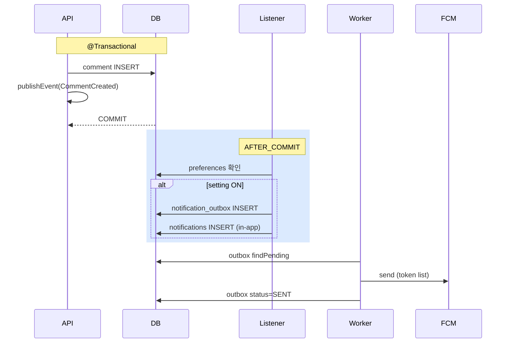

# 알림 구현 — outbox + FCM/APNs

| 문서 버전 | 작성일 | 작성자 | 주요 변경 사항 |
| --- | --- | --- | --- |
| v1.0.0 | 2026-05-15 | engineering-agent/tech-lead | 최초 |

**[[implementation|↑ implementation hub]]**

> 좋아요 / 댓글 / 모더 알림. outbox + worker + FCM. signup email_outbox 패턴.

---

## 1. 흐름



---

## 2. Listener

```java
@Component
@RequiredArgsConstructor
public class BoardNotificationListener {

    private final NotificationOutboxRepository outbox;
    private final InAppNotificationRepository inApp;
    private final UserNotificationPreferenceRepository prefs;
    private final PostRepository posts;
    private final CommentRepository comments;
    private final IdGenerator ids;
    private final Clock clock;

    @TransactionalEventListener(phase = AFTER_COMMIT)
    public void onCommentCreated(CommentCreated event) {
        var post = posts.findById(event.postId()).orElseThrow();
        if (post.authorId().equals(event.authorId())) return;     // self skip

        if (!prefs.isEnabled(post.authorId(), "COMMENT_RECEIVED")) return;

        var notif = buildNotification(
            post.authorId(),
            "COMMENT_RECEIVED",
            "새 댓글",
            "내 글에 댓글이 달렸어요",
            "/posts/" + event.postId().value(),
            Map.of("postId", event.postId().value(), "commentId", event.id().value())
        );
        outbox.save(notif.toOutbox());
        inApp.save(notif.toInApp());
    }

    @TransactionalEventListener(phase = AFTER_COMMIT)
    public void onCommentReplied(CommentReplied event) {
        var parent = comments.findById(event.parentId()).orElseThrow();
        if (parent.authorId().equals(event.authorId())) return;

        if (!prefs.isEnabled(parent.authorId(), "REPLY_RECEIVED")) return;

        var notif = buildNotification(/* ... */);
        outbox.save(notif.toOutbox());
        inApp.save(notif.toInApp());
    }

    @TransactionalEventListener(phase = AFTER_COMMIT)
    public void onPostLiked(PostLiked event) {
        var post = posts.findById(event.postId()).orElseThrow();
        if (post.authorId().equals(event.userId())) return;

        if (!prefs.isEnabled(post.authorId(), "LIKE_RECEIVED")) return;

        // 좋아요는 burst — 집계 후 발송 (옵션)
        // outbox.save(...);
    }
}
```

### 2.1 왜 사용자 설정 검증

- OFF 한 type → 발송 X.
- spam 방지.

자세히: [[../design-decisions/notification-policy]].

---

## 3. Worker

```java
@Component
@RequiredArgsConstructor
public class NotificationWorker {

    private final NotificationOutboxRepository outbox;
    private final FcmClient fcm;
    private final ApnsClient apns;
    private final UserDeviceRepository devices;

    @Scheduled(fixedDelay = 1000)
    @SchedulerLock(name = "notificationWorker", lockAtMostFor = "5m")
    public void process() {
        outbox.findPending(50).forEach(this::sendOne);
    }

    @Transactional
    public void sendOne(NotificationOutbox row) {
        row.markProcessing(Instant.now());
        outbox.save(row);

        try {
            var deviceTokens = devices.findByUserId(row.userId());
            for (var device : deviceTokens) {
                if (device.platform() == ANDROID) {
                    fcm.send(device.fcmToken(), row.toPushPayload());
                } else if (device.platform() == IOS) {
                    apns.send(device.apnsToken(), row.toPushPayload());
                }
            }
            row.markSent(Instant.now());
        } catch (Exception e) {
            row.recordFailure(e.getMessage(), computeNextAttempt(row.attempts() + 1));
        }
        outbox.save(row);
    }
}
```

---

## 4. 사용자 설정

```http
GET /api/v1/me/notification-preferences

{
  "LIKE_RECEIVED": false,
  "COMMENT_RECEIVED": true,
  "REPLY_RECEIVED": true,
  "MENTION": true,
  "MODERATION_HIDDEN": true,        # 강제 ON (변경 X)
  "MODERATION_RESTORED": true
}

PATCH /api/v1/me/notification-preferences
{ "LIKE_RECEIVED": true }
```

---

## 5. 사용자 화면 — in-app

```http
GET /api/v1/me/notifications?cursor=...&limit=20

{
  "data": [
    { "id": "...", "type": "COMMENT_RECEIVED", "title": "...", "readAt": null, "createdAt": "..." }
  ]
}

PATCH /api/v1/me/notifications/{id}/read
PATCH /api/v1/me/notifications/read-all
```

---

## 6. 함정

자세히: [[../design-decisions/notification-policy#7 함정]].

### 함정 1 — 트랜잭션 안 FCM 호출
DB 락.
→ AFTER_COMMIT + outbox + worker.

### 함정 2 — Self-notification
자기 글 좋아요 → 알림.
→ author == recipient skip.

### 함정 3 — preference 무시
OFF 한 type 도 발송.
→ 설정 검증.

### 함정 4 — FCM token 만료
무효 token 발송 → 비용.
→ FCM invalid response → DB DELETE.

### 함정 5 — Worker 다중 실행
ShedLock 없으면 중복 발송.
→ ShedLock.

### 함정 6 — 좋아요 burst (인기 글)
분당 100 알림.
→ 집계 ("12명이 좋아요") 또는 throttle.

---

## 7. 관련

- [[implementation|↑ hub]]
- [[../design-decisions/notification-policy]]
- [[../database/notification-tables]]
- [[../../signup/database/email-outbox-table|↗ email_outbox]] — 패턴
