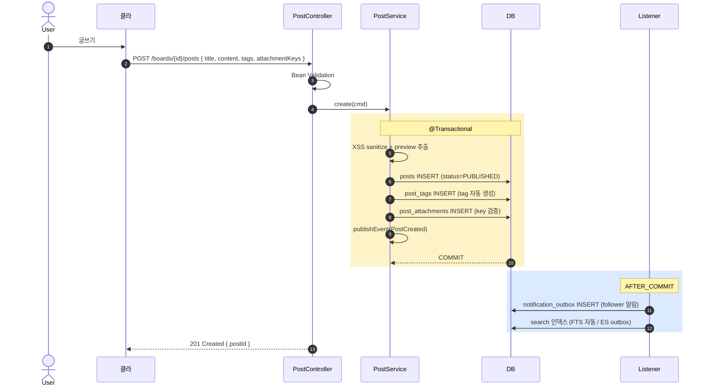

# 게시글 CRUD 구현

| 문서 버전 | 작성일 | 작성자 | 주요 변경 사항 |
| --- | --- | --- | --- |
| v1.0.0 | 2026-05-15 | engineering-agent/tech-lead | 최초 |

**[[implementation|↑ implementation hub]]**

> 게시글 생성 / 조회 / 수정 / 삭제. board 의 가장 기본 흐름.

---

## 1. 흐름 개요



---

## 2. API spec

```http
POST /api/v1/boards/{boardId}/posts
Authorization: Bearer <access>
{
  "title": "오늘 동네 카페 추천",
  "content": "## 카페 ABC\n맛있어요...",
  "categoryId": "01HZCAT01",
  "tags": ["맛집", "강남"],
  "attachmentKeys": ["user123/2026-05/01HQ.../image.jpg"],
  "visibility": "PUBLIC"
}

201 Created
{
  "code": "OK_001",
  "data": { "postId": "01HQXY...", "url": "/posts/01HQXY..." }
}
```

```http
GET    /api/v1/posts/{postId}                # 상세
GET    /api/v1/boards/{boardId}/posts        # 목록
PATCH  /api/v1/posts/{postId}                # 수정 (작성자만)
DELETE /api/v1/posts/{postId}                # soft delete
```

---

## 3. DTO

```java
public record PostCreateRequest(
    @NotBlank @Size(max = 200) String title,
    @NotBlank @Size(max = 50000) String content,
    @Size(max = 26) String categoryId,
    @Size(max = 10) List<@Size(max = 50) String> tags,
    @Size(max = 10) List<String> attachmentKeys,
    PostVisibility visibility
) {}

public record PostResponse(
    String id,
    String boardId,
    AuthorInfo author,                       // user_id 노출 X (nickname)
    String title,
    String content,                          // rendered HTML
    String contentPreview,
    PostStatus status,
    int viewCount, int likeCount, int commentCount,
    List<TagDto> tags,
    List<AttachmentDto> attachments,
    boolean isLiked,                         // viewer 가 좋아요 했는지
    boolean isBookmarked,
    boolean isOwnedByViewer,
    Instant createdAt
) {}

public record AuthorInfo(String displayName, String avatarUrl) {}
```

---

## 4. Service — Create

```java
@Service
@RequiredArgsConstructor
public class PostService {

    private final PostRepository posts;
    private final TagRepository tags;
    private final AttachmentRepository attachments;
    private final MarkdownRenderer renderer;
    private final S3Client s3;
    private final ApplicationEventPublisher events;
    private final IdGenerator ids;
    private final Clock clock;

    @Transactional
    public Post create(PostCreateCmd cmd, UserId authorId) {
        // 1. board 검증
        var board = boards.findById(cmd.boardId())
            .orElseThrow(() -> new NotFoundException("board"));
        if (!board.isActive()) throw new BusinessException(ResponseCode.NOT_FOUND);

        // 2. 도메인 검증 (length, XSS sanitize 는 렌더링 시점)
        var post = Post.create(
            new PostId(ids.next()), cmd.boardId(), authorId,
            cmd.title(), cmd.content(),
            cmd.visibility(), Instant.now(clock)
        );
        posts.save(post);

        // 3. tag 자동 생성 + 매핑
        if (cmd.tags() != null) {
            var tagIds = tags.resolveOrCreate(cmd.tags());
            postTagRepo.saveAll(post.id(), tagIds);
        }

        // 4. category 매핑
        if (cmd.categoryId() != null) {
            postCategoryRepo.save(post.id(), cmd.categoryId());
        }

        // 5. 첨부 (S3 exists 검증)
        for (var key : cmd.attachmentKeys()) {
            if (!s3.exists(key))
                throw new BusinessException(ResponseCode.NOT_FOUND,
                    "attachment not uploaded: " + key);
            attachments.save(new PostAttachment(post.id(), key));
        }

        // 6. event publish
        post.pullDomainEvents().forEach(events::publishEvent);
        return post;
    }
}
```

### 4.1 왜 단일 트랜잭션 (post + tags + attachments)

- 정합성 — post 있는데 tag / attachment 없음 = 무효.
- 트랜잭션 rollback 시 모두 사라짐.

### 4.2 왜 S3 exists 검증

- 클라가 fake key 보낼 수 있음.
- 잘못된 key 로 매핑 시 — 사용자가 글 보면 404 image.

---

## 5. Service — Update / Delete

```java
@Transactional
public Post update(PostId postId, PostUpdateCmd cmd, UserId currentUser) {
    var post = posts.findById(postId).orElseThrow();
    if (!post.isOwnedBy(currentUser)) throw new ForbiddenException();

    post.update(cmd.title(), cmd.content(), Instant.now(clock));
    posts.save(post);
    post.pullDomainEvents().forEach(events::publishEvent);
    return post;
}

@Transactional
public void delete(PostId postId, UserId currentUser, boolean isAdmin) {
    var post = posts.findById(postId).orElseThrow();
    if (!isAdmin && !post.isOwnedBy(currentUser))
        throw new ForbiddenException();

    post.delete(Instant.now(clock));
    posts.save(post);
    post.pullDomainEvents().forEach(events::publishEvent);
    // 첨부 S3 cleanup 은 AFTER_COMMIT listener
}
```

---

## 6. Service — Read (viewer-aware)

```java
@Transactional(readOnly = true)
public PostResponse view(PostId postId, AuthUser viewer) {
    var post = posts.findById(postId).orElseThrow();

    // status / visibility 검증
    if (post.status() == DELETED) throw new NotFoundException("post");
    if (post.status() == HIDDEN && !viewer.isAdmin() && !post.isOwnedBy(viewer.id()))
        throw new NotFoundException("post");
    if (!post.visibility().canView(viewer, post.authorId()))
        throw new ForbiddenException();

    // viewer 의 like / bookmark 여부
    boolean isLiked = likeRepo.exists(viewer.id(), post.id());
    boolean isBookmarked = bookmarkRepo.exists(viewer.id(), post.id());

    // view count (별도 — async)
    viewCounter.incrementIfNotBot(post.id(), viewer);

    return PostResponse.of(post, isLiked, isBookmarked, viewer);
}
```

### 6.1 왜 view count 가 별도 (Redis async)

- 매 view 마다 DB UPDATE = 부담.
- Redis INCR 만 + 1h batch sync.

자세히: [[../design-decisions/view-counter]].

### 6.2 왜 isLiked / isBookmarked 매번 조회

- viewer 의 상태 표시 (UI 의 좋아요 button 색).
- Redis cache 또는 별도 endpoint 옵션.

---

## 7. Controller

```java
@Tag(name = "게시글")
@RestController
@RequestMapping("/api/v1")
@RequiredArgsConstructor
public class PostController {

    private final PostService service;

    @PostMapping("/boards/{boardId}/posts")
    public ResponseEntity<CommonResponse<PostCreatedResponse>> create(
        @PathVariable BoardId boardId,
        @Valid @RequestBody PostCreateRequest req,
        @AuthenticationPrincipal AuthUser auth
    ) {
        var post = service.create(req.toCommand(boardId), auth.id());
        return ResponseEntity.status(201).body(
            CommonResponse.success(ResponseCode.OK,
                new PostCreatedResponse(post.id().value(), "/posts/" + post.id().value())));
    }

    @GetMapping("/posts/{postId}")
    public ResponseEntity<CommonResponse<PostResponse>> view(
        @PathVariable PostId postId,
        @AuthenticationPrincipal AuthUser auth
    ) {
        return ResponseEntity.ok(CommonResponse.success(ResponseCode.OK,
            service.view(postId, auth)));
    }

    @PatchMapping("/posts/{postId}")
    @PreAuthorize("@boardSecurity.isAuthor(#postId, authentication)")
    public ResponseEntity<CommonResponse<PostResponse>> update(...) { ... }
}
```

---

## 8. 함정

### 함정 1 — 작성자 검증 누락
다른 user 글 수정 / 삭제.
→ @PreAuthorize 또는 service.

### 함정 2 — DELETED 상세 200
soft delete 후 조회 200 → 사용자 혼동.
→ 404.

### 함정 3 — HIDDEN 작성자 못 봄
admin 모더 후 작성자 항의.
→ 작성자 / admin 은 access.

### 함정 4 — S3 key 검증 없이 매핑
fake key 로 404 image.
→ s3.exists().

### 함정 5 — content 렌더링 cache 없음
매 조회 markdown parse → CPU.
→ Redis cache 또는 rendered_html 컬럼.

### 함정 6 — viewer 의 like / bookmark 매 query
N+1 가능.
→ batch fetch 또는 cache.

### 함정 7 — incrementView 가 트랜잭션 안
DB lock + 응답 느림.
→ 별도 호출 (Redis).

### 함정 8 — Update 시 첨부 추가 / 삭제
update 시 attachment 매핑 변경 누락.
→ diff 후 cleanup.

### 함정 9 — 비공개 visibility 검증 누락
PRIVATE 글 노출.
→ canView 검증.

### 함정 10 — board 폐기 시 옛 글
board.use_yn='N' 후 옛 글 조회.
→ 조회 시 board 검증.

---

## 9. 관련

- [[implementation|↑ hub]]
- [[../database/posts-table]]
- [[../domain-model/post-aggregate]]
- [[../design-decisions/content-format]] · [[../design-decisions/view-counter]]
- [[comment-impl]] · [[like-bookmark-impl]] · [[attachment-impl]]
- [[../security/authentication-authorization]]
