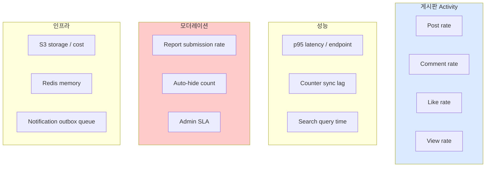

# Observability — board 메트릭

| 문서 버전 | 작성일 | 작성자 | 주요 변경 사항 |
| --- | --- | --- | --- |
| v1.0.0 | 2026-05-15 | engineering-agent/tech-lead | 최초 |

**[[operations|↑ operations hub]]**

> board 특화 메트릭. signup 의 observability 위에 추가.

---

## 1. 핵심 메트릭

| 메트릭 | 알람 | 의미 |
| --- | --- | --- |
| `post.create.rate` | baseline 대비 ↓ 50% | 작성 throughput |
| `post.view.latency.p99` | > 500ms | DB / cache 부담 |
| `post.like.toggle.rate` | spike 5x | bot / abuse |
| `comment.tree.query.p99` | > 200ms | N+1 의심 |
| `counter.sync.lag` | > 2h | batch job 지연 |
| `counter.mismatch.count` | > 100 | Redis ↔ DB 불일치 |
| `attachment.upload.failure.rate` | > 5% | S3 / presigned 문제 |
| `report.submission.rate` | spike 10x | spam 사고 |
| `auto_hide.rate` | spike | 신고 bombing |
| `notification.outbox.pending` | > 1000 | worker 이상 |
| `s3.storage.bytes` | > budget | 비용 |
| `block.cache.hit.rate` | < 80% | cache 비효율 |

---

## 2. Dashboard



---

## 3. 알람 정책

| 알람 | 채널 | 우선 |
| --- | --- | --- |
| 5xx 비율 > 5% | PagerDuty | P1 |
| Counter mismatch > 100 | Slack #alerts | P2 |
| Outbox pending > 1000 | Slack #alerts | P2 |
| Auto-hide spike (10분 5+) | Slack #security | P2 |
| S3 cost 일일 baseline 대비 ↑ 50% | Slack #cost | P3 |
| Spam report rate spike | Slack #security | P2 |

---

## 4. Logging

signup 의 structured logging 그대로. 추가:

```json
{
  "event": "post_created",
  "post_id": "01HQ...",
  "board_id": "01HZ...",
  "author_id": "01HU...",
  "tags": ["맛집", "강남"],
  "has_attachment": true
}
```

---

## 5. 관련

- [[operations|↑ hub]]
- [[../../signup/operations/observability|↗ signup observability]]
- [[../design-decisions/like-counter]] — counter sync
