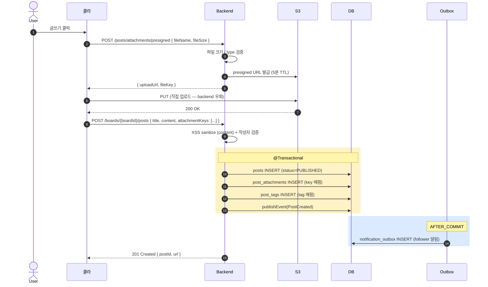
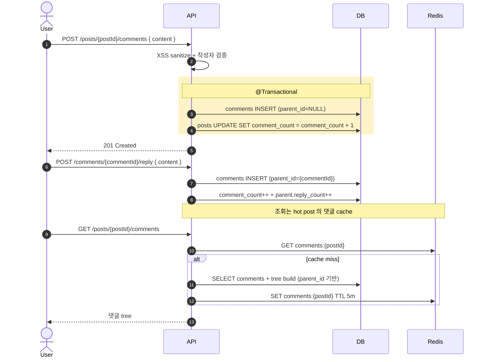
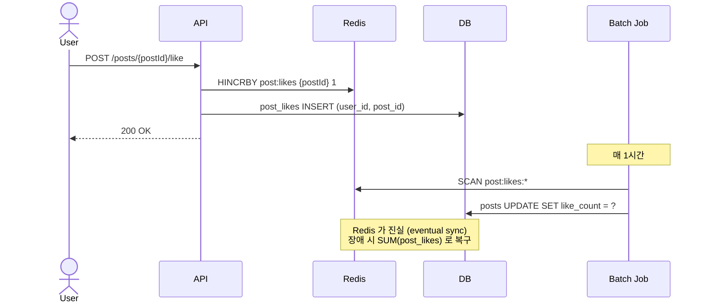
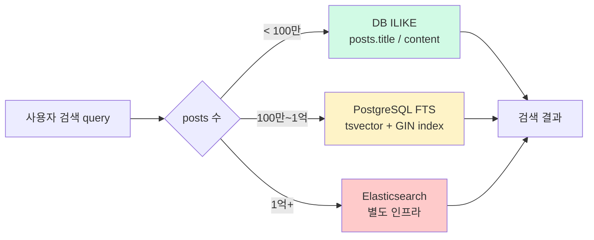
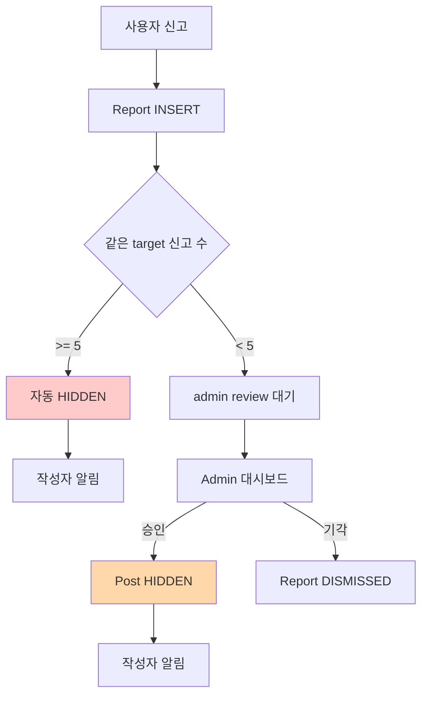

# board §1 — 전체 흐름 overview

| 문서 버전 | 작성일 | 작성자 | 주요 변경 사항 |
| --- | --- | --- | --- |
| v1.0.0 | 2026-05-15 | engineering-agent/tech-lead | 최초 — 커뮤니티 게시판 end-to-end 흐름 |

**[[board|↑ hub]]**  ·  → [[prerequisites]]

> 게시글 작성부터 조회 / 댓글 / 신고까지의 **end-to-end 흐름**.

---

## 1. 사용자 여정 (User Journey)

```mermaid
flowchart TD
    Visit[사용자가 게시판 진입] --> List[게시글 목록]
    List -->|cursor pagination| Scroll[무한 스크롤]
    List -->|클릭| Detail[게시글 상세]
    Detail --> View["view count +1<br/>(Redis counter)"]
    Detail --> Comments[댓글 목록]

    Detail -->|좋아요| Like[Like toggle]
    Detail -->|북마크| Bookmark[Bookmark toggle]
    Detail -->|신고| Report[Report submit]

    Comments -->|작성| NewComment[댓글 작성]
    NewComment -->|대댓글| Reply[대댓글]

    List -->|글쓰기 (인증 필수)| Editor[에디터]
    Editor -->|첨부| Upload[S3 presigned URL]
    Editor -->|발행| Publish[Post create + Outbox]
    Publish -->|알림| Notification[작성자 follower 알림]

    style Detail fill:#fef3c7
    style Editor fill:#dbeafe
    style Report fill:#fecaca
```

---

## 2. 게시글 작성 흐름 (첨부 포함)



---

## 3. 댓글 / 대댓글 흐름



---

## 4. 좋아요 / 북마크 — counter 처리



자세히: [[design-decisions/like-counter]] (todo).

---

## 5. 검색 흐름



자세히: [[design-decisions/search-strategy]] (todo).

---

## 6. 신고 / 모더레이션



자세히: [[implementation/moderation-impl]] (todo).

---

## 7. 어떤 endpoint 가 비인증인가

| Endpoint | 인증 | 비고 |
| --- | --- | --- |
| `GET /boards/{id}/posts` | ❌ | 공개 게시판은 비인증 |
| `GET /posts/{id}` | ❌ | 공개 글 |
| `GET /posts/{id}/comments` | ❌ | 공개 댓글 |
| `POST /boards/{id}/posts` | ✅ | 작성자 인증 |
| `POST /posts/{id}/comments` | ✅ | |
| `POST /posts/{id}/like` | ✅ | |
| `POST /posts/{id}/report` | ✅ | |
| `GET /me/posts` | ✅ | |
| `GET /admin/reports` | ✅ ADMIN | |

→ SecurityConfig 매트릭스: [[security/authentication-authorization]] (todo).

---

## 8. 각 흐름의 핵심 결정점

| 단계 | 결정 | 영향 |
| --- | --- | --- |
| 게시글 — content 형식 | markdown / HTML / JSON (Slate / TipTap) | 에디터 / 렌더링 / XSS |
| 댓글 — depth | flat / 2-level / 무한 | UX / 쿼리 복잡도 |
| 좋아요 counter | DB / Redis / hybrid | 동시성 / latency |
| 정렬 (hot) | 시간 감쇠 algorithm | 메인 화면 노출 |
| 검색 | DB FTS / Elasticsearch | 인프라 / 정확도 |
| 첨부 — 업로드 경로 | 서버 경유 / S3 presigned | 비용 / latency |
| 페이지네이션 | offset / cursor | UX / 성능 |
| 익명 옵션 | 익명 가능 / 닉네임만 / 실명 강제 | 운영 / abuse |
| 신고 자동 hide threshold | 3 / 5 / 10 | false positive vs 빠른 대응 |

각 결정의 trade-off + 권장: [[design-decisions/design-decisions]].

---

## 9. 이 폴더 코드의 재사용성

### A. 도메인 / 표준 부분 (그대로 복사)

- Aggregate (Post / Comment / Like / Report)
- Value Objects (PostId / CommentId / TargetId)
- Repository port + Adapter
- 응답 envelope ([[../../common/response-envelope]])
- Spring Security ([[../../common/security-config]])

→ 거의 모든 커뮤니티 SaaS 에서 그대로 사용 가능.

### B. 정책 / 비즈니스 부분 (조정 필요)

- 게시판 종류 / 분류 (boards 시드)
- 댓글 depth 정책
- 좋아요 / 북마크 활성 여부
- 검색 도구 (DB vs Elasticsearch)
- 첨부 max size / type
- 신고 자동 hide threshold
- 익명 / 닉네임 정책

→ 회사 / 도메인 정책에 따라 조정.

---

## 10. 관련

- [[board|↑ hub]]
- [[prerequisites]] — 다음 (§2)
- [[design-decisions/design-decisions]] — 권장 도구 가이드
- [[../signup/signup]] — 인증 의존성
