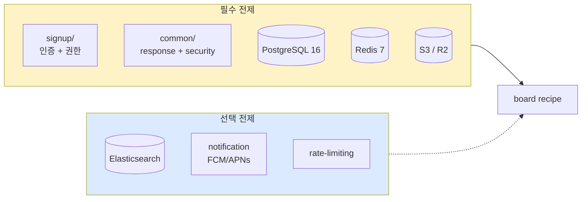

# board §2 — 전제 / 범위 / 적용 기준

| 문서 버전 | 작성일 | 작성자 | 주요 변경 사항 |
| --- | --- | --- | --- |
| v1.0.0 | 2026-05-15 | engineering-agent/tech-lead | 최초 |

**[[board|↑ hub]]**  ·  ← [[overview]]  ·  → [[requirements]]

> 이 board recipe 를 적용하기 전 갖춰져야 하는 **전제** 와 **범위**.

---

## 1. 기술 전제

### 1.1 필수

| 항목 | 버전 | 이유 |
| --- | --- | --- |
| Spring Boot | 3.3.x | Jakarta EE / Spring 6 / Hibernate 6 baseline |
| Java | 21 LTS | record / sealed / pattern matching / virtual thread |
| PostgreSQL | 16 | JSONB / FTS (tsvector) / partial index / window function |
| Redis | 7 | counter (조회수 / 좋아요) + 댓글 cache |
| S3 (or compatible) | — | 첨부 파일 storage + presigned URL |

### 1.2 선택

| 항목 | 언제 필요 |
| --- | --- |
| Elasticsearch 8 | posts 1억+ / 강한 검색 (한국어 형태소 분석) |
| CloudFront / CDN | 첨부 파일 CDN (응답 latency ↓) |
| Kafka | follow 기반 알림 fan-out (대형 — 10만+ followers) |
| pgvector | 유사 글 추천 (선택) |

---

## 2. 도메인 / 인프라 전제

| 항목 | 어디서 | 이유 |
| --- | --- | --- |
| **인증된 user** | [[../signup/signup]] | 글/댓글/좋아요 모두 user 식별 필요 |
| **응답 envelope** | [[../../common/response-envelope]] | CommonResponse / ResponseCode |
| **Spring SecurityConfig** | [[../../common/security-config]] | JWT 인증 + 권한 |
| **rate limit** | [[../rate-limiting]] | 글/댓글 abuse 방어 |
| **S3 presigned URL** | [[../file-upload-s3]] | 첨부 파일 업로드 |
| **알림 시스템** (옵션) | [[../webhook-send]] / 별도 | 좋아요 / 댓글 알림 |

---

## 3. 적용 기준 — 언제 이 recipe 가 맞는가

### 3.1 ✅ 잘 맞는 경우

- **커뮤니티 게시판** — 당근 동네 게시판 / 무신사 매거진 / 디시 갤러리 / 네이버 카페 같은 user-generated content.
- **다중 게시판** — 자유 / Q&A / 공지 / 갤러리 등 여러 board.
- **댓글 / 좋아요 / 신고** 가 핵심 사용자 행동.
- **검색 / 정렬** 이 메인 UX (홈 화면이 인기 글 / 최신 글).
- **첨부 파일** (이미지 / 동영상) 지원.
- **모더레이션** (운영자 검토) 필요.

### 3.2 ⚠️ 부분 적용 — 추가 작업 필요

- **블로그형** (관리자 글 only): post-crud 만 사용. 댓글 / 좋아요는 단순화.
- **Q&A 형**: comment 를 answer 로 의미 분리. 채택 / 투표 추가.
- **실시간 채팅**: 별도 — [[../chat-realtime]].
- **개인 follow 피드**: 별도 — [[../feed-timeline]].

### 3.3 ❌ 안 맞는 경우

- **단순 announcement** (회사 공지) — DB 만으로 충분. 별도 recipe 과잉.
- **마이크로블로그 / SNS** (twitter / threads) — feed-timeline + follow 가 핵심. 본 recipe 는 게시판 중심.
- **DM / 채팅** — chat-realtime 별도.
- **마켓플레이스** (당근 거래) — product-crud / order-stock 별도.

---

## 4. 범위 — 무엇을 만드나

### 4.1 핵심 (Phase 3 의 8 흐름)

1. 게시글 CRUD + soft delete + 작성자 검증
2. 댓글 / 대댓글 (2-level)
3. 좋아요 / 북마크 (per user)
4. 검색 / 정렬 / 페이지네이션
5. 카테고리 / 태그
6. 첨부 파일 (S3 presigned)
7. 신고 / 모더레이션 / 차단 사용자
8. 알림 (좋아요 / 댓글 — 옵션)

### 4.2 도메인 가정

- **다중 게시판** — `boards` 테이블 + `board_id` FK.
- **공개 / 비공개 board** — board 의 `visibility`.
- **익명 옵션** — 게시판 별 정책 (`allow_anonymous`).
- **카테고리** — board 안의 sub-classification.
- **태그** — 글에 자유롭게 부착 (M:N).
- **2-level 댓글** — 댓글 + 대댓글 (대대댓글 X — UX 단순).
- **좋아요 = toggle** — 한 user 가 한 target 에 한 번만.

### 4.3 안 다루는 것

- 실시간 (WebSocket) — [[../chat-realtime]] / [[../websocket-stomp]].
- 사용자 follow / 피드 — [[../feed-timeline]].
- 추천 알고리즘 (협업 필터링) — [[../recommendation]].
- 결제 / 광고 / 후원 — [[../payment-pg]].
- 게시판 자체 admin CRUD — 운영자 도구 (별도).

---

## 5. 의존성 그림



---

## 6. 환경별 추천 stack

### 6.1 시작 단계 (MVP — MAU 1만 이하)

```yaml
db: postgresql-16
cache: redis-7 (counter only)
search: db-ilike
attachment: s3 + presigned
elasticsearch: skip
notification: outbox 만 (FCM 미적용)
```

### 6.2 성장 단계 (MAU 10만 ~ 100만)

```yaml
db: postgresql-16 (read replica 1)
cache: redis-cluster
search: postgresql-fts (tsvector + GIN)
attachment: s3 + cloudfront
notification: fcm + apns
```

### 6.3 대형 (MAU 100만+)

```yaml
db: postgresql-16 (master + replica + 샤딩 검토)
cache: redis-cluster (3 shard)
search: elasticsearch (별도 cluster)
attachment: s3 + cloudfront + 다중 region
notification: kafka fan-out + fcm
```

---

## 7. 전제 위반 시 영향

| 전제 누락 | 영향 |
| --- | --- |
| 인증 (signup) | user 식별 X → 작성자 / 좋아요 / 신고 모두 깨짐 |
| Redis | counter / cache 깨짐 → 매 view 마다 DB UPDATE (성능 폭망) |
| S3 (or compatible) | 첨부 불가 |
| rate-limit | abuse 폭증 (분당 1000+ 글) |
| XSS sanitize | 사용자 글에 악의적 HTML/JS → 다른 user 영향 |
| 모더레이션 | spam / 불법 콘텐츠 무방비 |

---

## 8. 관련

- [[board|↑ hub]]
- [[overview]] — 이전 (§1)
- [[requirements]] — 다음 (§3)
- [[../signup/signup]] — 인증 의존
- [[design-decisions/design-decisions]] — 도구 결정
