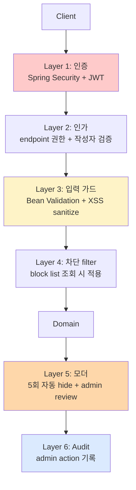

# board §9 — 보안 (Hub)

| 문서 버전 | 작성일 | 작성자 | 주요 변경 사항 |
| --- | --- | --- | --- |
| v1.0.0 | 2026-05-15 | engineering-agent/tech-lead | 최초 |

**[[../board|↑ board hub]]**  ·  ← [[../architecture]]  ·  → [[../implementation/implementation]]

> board 의 보안 정책. signup 의 보안 layer 위에 board 특화 (XSS / 차단 / 모더) 추가.

---

## 1. 이 폴더의 노트

### 1.1 board 특화

| 노트 | 무엇 |
| --- | --- |
| [[authentication-authorization]] | endpoint 권한 매트릭스 (board 특화) |
| [[xss-defense]] | UGC content 의 XSS 방어 |
| [[moderation-impl]] | 모더 권한 검증 + admin action |
| [[block-filter]] | 차단 사용자 filter 적용 |
| [[audit-logging]] | board 의 audit (글 / 댓글 / 모더) |

### 1.2 signup 패턴 재사용 (cross-link)

- [[../../signup/security/sensitive-data-handling|↗ 민감정보 처리]]
- [[../../signup/security/attack-defense|↗ brute force / enumeration]]
- [[../../signup/security/transport-security|↗ HTTPS / HSTS / CSP / CORS]]

→ board 가 signup 보안 layer 위에 동작 — 재정의 X.

---

## 2. 위협 모델

| 위협 | 어디서 막나 |
| --- | --- |
| XSS (사용자 글에 악의적 JS) | [[xss-defense]] — OWASP HTML Sanitizer |
| 무단 수정 (다른 user 글) | [[authentication-authorization]] — 작성자 검증 |
| Spam / abuse | rate limit + moderation |
| 차단된 user 글 노출 | [[block-filter]] — 조회 시 filter |
| 신고 bombing | weight + duplicate UNIQUE |
| 비공개 글 leak | visibility 검증 |
| 첨부 파일 abuse | size / type whitelist + presigned 5분 |
| Admin 의 모더 권한 남용 | [[audit-logging]] — admin action 기록 |

---

## 3. 보안 layer

---

## 4. 시작 체크리스트

- [ ] signup 의 보안 layer 적용 ([[../../signup/security/security|↗]])
- [ ] 작성자 검증 (`PATCH/DELETE`)
- [ ] XSS sanitize (content / title) — OWASP HTML Sanitizer
- [ ] 차단 사용자 filter (`block list`)
- [ ] 모더 권한 (`@PreAuthorize("hasRole('ADMIN')")`)
- [ ] 신고 자동 hide (5회)
- [ ] admin audit log (`moderation_audit_log`)
- [ ] Rate limit (글 5/min, 댓글 10/min, 좋아요 60/min)
- [ ] 비공개 board / 글의 visibility 검증

---

## 5. 관련

- [[../board|↑ hub]]
- [[../../signup/security/security|↗ signup security]] — 베이스
- [[../implementation/implementation]] — 다음
