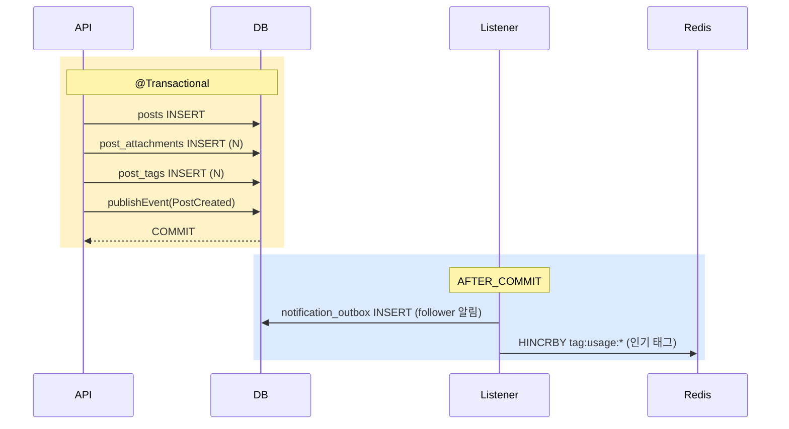
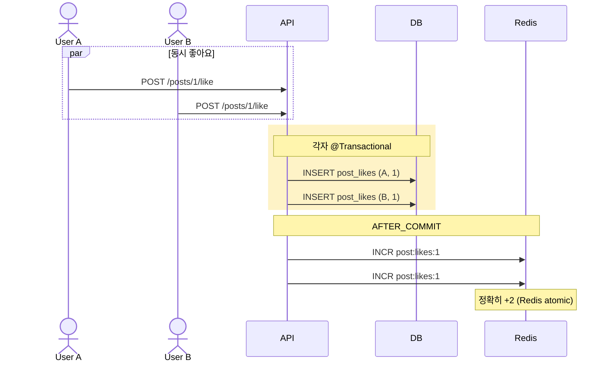

# board §8 — 트랜잭션 / 동시성 / 정합성

| 문서 버전 | 작성일 | 작성자 | 주요 변경 사항 |
| --- | --- | --- | --- |
| v1.0.0 | 2026-05-15 | engineering-agent/tech-lead | 최초 |

**[[board|↑ board hub]]**

> @Transactional 정책. signup 패턴 + board 특화 counter / 동시성.

---

## 1. 트랜잭션 경계 — 게시글 작성



→ signup 의 [[../signup/transactions]] 패턴 그대로.

---

## 2. Counter 동시성 — Like



자세히: [[design-decisions/like-counter]].

---

## 3. comment_count race

```
사용자 A 가 댓글 INSERT + post.comment_count++
사용자 B 가 댓글 INSERT + post.comment_count++
```

**문제**
- 같은 row UPDATE 의 race condition.
- @Version 낙관 락 시 한쪽 OptimisticLockException.

**해결**
- **옵션 A**: `UPDATE posts SET comment_count = comment_count + 1 WHERE id = ?` (atomic).
- **옵션 B**: counter 도 Redis + 1h batch (like 와 같은 패턴).

본 vault: **옵션 A** (단순). 인기 글의 동시 댓글 (분당 100+) 시 옵션 B.

---

## 4. 자동 hide (race)

```
5번째 신고 동시 발생 → 둘 다 "5회 이상" 발견 → 자동 hide 2번 호출?
```

**방어**
```java
@Transactional
public void report(...) {
    reports.save(...);                // PK race 시 IntegrityViolation
    long count = reports.countByTarget(...);
    if (count >= 5) {
        // PostgreSQL: SELECT FOR UPDATE 또는 status UPDATE 의 idempotency
        posts.updateStatus(postId, PostStatus.HIDDEN);
    }
}
```

- `updateStatus` 가 idempotent — HIDDEN → HIDDEN 변경 = no-op.

---

## 5. Outbox 패턴 — 알림

자세히: [[design-decisions/notification-policy]] · [[../signup/database/email-outbox-table|↗ signup email-outbox]].

```
@Transactional
- post / comment INSERT
- publishEvent(...)
COMMIT
   ↓ AFTER_COMMIT listener
- notification_outbox INSERT
   ↓ worker
- FCM / APNs 발송
```

---

## 6. 함정

자세히: [[pitfalls/transaction-pitfalls]] (todo).

### 함정 1 — 트랜잭션 안 외부 호출 (S3 / FCM)
DB 락 + 외부 cascade.
→ AFTER_COMMIT + outbox.

### 함정 2 — @Transactional self-invocation
같은 class 내부 호출 = AOP 우회.
→ 별도 빈 또는 self-injection.

### 함정 3 — Counter 가 매 INSERT 마다 UPDATE
row lock 폭증.
→ Redis + batch.

### 함정 4 — @Version 충돌 시 그냥 500
사용자에 cryptic error.
→ retry 정책 또는 명확 메시지.

### 함정 5 — Comment + Post counter 다른 트랜잭션
counter mismatch.
→ 같은 트랜잭션 (REQUIRED).

### 함정 6 — Like 의 IntegrityViolation 안 catch
중복 좋아요 시 500.
→ catch + silent.

---

## 7. 관련

- [[board|↑ hub]]
- [[../signup/transactions]] — 패턴
- [[design-decisions/like-counter]] · [[design-decisions/view-counter]]
- [[pitfalls/pitfalls]] (todo)
