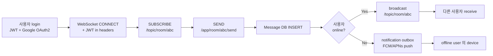

# chat 레시피 — 카카오톡 스타일 실시간 채팅 hub

| 문서 버전 | 작성일 | 작성자 | 주요 변경 사항 |
| --- | --- | --- | --- |
| v1.0.0 | 2026-05-14 | engineering-agent/tech-lead | 최초 — folder split + 카톡 (1:1 / 그룹 / 오픈채팅 / 멀티 디바이스 / 읽음 / 사진/음성) + Phase F0~F10 (Kafka 고도화) |

**[[../api-design|↑ api-design hub]]**

> Project 4 매핑: **WebSocket + STOMP + JWT 로그인 + Google OAuth2 + 채팅방**.
> 카톡 스타일: **1:1 / 그룹 / 오픈채팅 + 멀티 디바이스 동기화 + 읽음 표시 + push fallback (offline) + 사진/음성/파일/이모티콘**.

---

## 0. 왜 이 레시피인가

| 질문 | 답 |
| --- | --- |
| 왜 카톡 스타일? | 한국 사용자 가장 익숙 + 1:1 / 그룹 / 오픈채팅 / 멀티 디바이스 / 읽음 모두 포함 |
| 왜 WebSocket + STOMP? | 실시간 양방향 + Spring 통합 표준. SSE / polling 보다 latency 낮음 |
| 왜 notification 의존? | offline 사용자 push 발송 = notification 모듈 ([[../notification/notification|↗]]) 통해 |
| 왜 chat-realtime 와 별도? | 옛 1:1 (당근) 노트 → 카톡 fuller 스타일 (그룹/오픈채팅/멀티) 로 확장 |
| 왜 folder split? | 영역 10+ (room/message/presence/multi-device/...) 의 깊은 분리 |

---

## 1. 전체 흐름



자세히: [[overview]].

---

## 2. 폴더 구조

```
chat/
├── chat.md                       ← hub
├── overview.md
├── prerequisites.md              ← WebSocket + Redis Pub/Sub + notification 의존
├── requirements.md               ← 60+ AC
├── architecture.md               ← Hexagonal + WebSocket layer + Redis Pub/Sub
├── transactions.md
├── implementation-order.md       ← F0~F10
│
├── design-decisions/
│   ├── design-decisions.md
│   ├── websocket-vs-sse-vs-polling.md  ★
│   ├── stomp-vs-raw.md                  ★
│   ├── room-types.md                    ← DIRECT/GROUP/OPEN/SECRET
│   ├── message-storage.md               ← RDB vs Mongo vs Cassandra (카톡 사례)
│   ├── message-ordering.md              ★ Lamport / sequence
│   ├── read-receipt-strategy.md         ★ 카톡 "읽음 1/2/N"
│   ├── multi-device-sync.md             ★ 카톡 멀티 디바이스
│   ├── presence-strategy.md             ← online/away/offline
│   ├── push-fallback.md                 ← offline → notification
│   ├── attachment-strategy.md           ← 사진/음성/동영상/파일
│   ├── search-strategy.md
│   ├── retention-policy.md
│   ├── encryption-strategy.md           ← E2EE 옵션 vs server-side
│   ├── moderation-blocking.md
│   ├── scale-strategy.md                ★ Redis Pub/Sub for cross-node WebSocket
│   └── kafka-event-driven.md            ★ F10+
│
├── database/
│   ├── database.md
│   ├── rooms-table.md
│   ├── room-members-table.md
│   ├── messages-table.md                ★
│   ├── message-reads-table.md           ★
│   ├── attachments-table.md
│   ├── presence-cache.md                ← Redis (DB X)
│   ├── blocks-table.md
│   ├── room-events-table.md             ← 입장/퇴장/방장 변경
│   └── chat-sessions-table.md           ← WebSocket session
│
├── domain-model/
│   ├── domain-model.md
│   ├── room-aggregate.md                ★
│   ├── message-aggregate.md             ★
│   ├── chat-session-aggregate.md        ← WebSocket session
│   ├── presence-aggregate.md
│   ├── value-objects.md
│   ├── domain-events.md
│   ├── repository-ports.md
│   └── aggregate-boundaries.md
│
├── enums/
│   ├── enums.md
│   ├── room-type.md
│   ├── message-type.md                  ← TEXT/IMAGE/VIDEO/AUDIO/FILE/EMOJI/SYSTEM
│   ├── message-status.md
│   ├── member-role.md                   ← OWNER/ADMIN/MEMBER
│   ├── presence-status.md
│   └── delivery-status.md
│
├── security/
│   ├── security.md
│   ├── websocket-auth.md                ★ CONNECT frame + JWT
│   ├── csrf-websocket.md                ← Origin check
│   ├── xss-message.md
│   ├── blocked-user-filter.md
│   ├── attachment-scan.md
│   ├── rate-limit-message.md            ← 스팸 / 도배
│   ├── encryption-at-rest.md
│   └── audit-logging.md
│
├── implementation/
│   ├── implementation.md
│   ├── websocket-stomp-config.md        ★
│   ├── connect-auth-impl.md             ★ JWT 검증 (CONNECT)
│   ├── room-impl.md
│   ├── message-send-impl.md             ★
│   ├── message-fetch-impl.md
│   ├── read-receipt-impl.md             ★
│   ├── multi-device-sync-impl.md        ★ Redis Pub/Sub fan-out
│   ├── presence-impl.md
│   ├── attachment-impl.md
│   ├── search-impl.md
│   ├── moderation-impl.md
│   ├── push-fallback-impl.md            ← notification 호출
│   ├── google-login-impl.md             ★ OAuth2 (Project 4 요구)
│   └── kafka-integration.md
│
├── testing/
│   ├── testing.md
│   ├── test-scenarios.md
│   ├── unit-tests.md
│   ├── integration-tests.md             ← WebSocketStompClient
│   ├── load-tests.md                    ← k6 동시 1만 connection
│   └── e2e-tests.md
│
├── operations/
│   ├── operations.md
│   ├── observability.md                 ← active connections, msg throughput
│   ├── runbook.md
│   └── scaling.md                       ★ Redis Pub/Sub + sticky session
│
└── pitfalls/
    ├── pitfalls.md
    ├── connection-pitfalls.md
    ├── ordering-pitfalls.md
    ├── multi-device-pitfalls.md
    ├── presence-pitfalls.md
    └── scale-pitfalls.md
```

---

## 3. Phase 단계

| Phase | 내용 | 기간 |
| --- | --- | --- |
| F0 | 준비 (Spring 3.3 + Redis Pub/Sub + signup JWT + Google OAuth2) | 1주 |
| F1 | 1:1 채팅 (DIRECT room) — STOMP CONNECT + send/receive | 2주 |
| F2 | 메시지 영속 + REST 페이징 + 읽음 표시 (1/2 카톡 스타일) | 1.5주 |
| F3 | 그룹 채팅 (GROUP room) — N 명 + 방장 / member 관리 | 1.5주 |
| F4 | **멀티 디바이스 동기화** ★ — Redis Pub/Sub fan-out | 2주 |
| F5 | Presence (online/away/offline) + typing indicator | 1주 |
| F6 | 첨부 (사진/음성/동영상/파일) — S3 presigned | 1.5주 |
| F7 | offline push fallback — notification 통합 | 0.5주 |
| F8 | 오픈채팅 (OPEN room) + 검색 + 차단 | 1.5주 |
| F9 | 운영 + 모니터링 + scale (Redis Pub/Sub) | 1주 |
| **F10** | Kafka 고도화 (분산 + replay + KStreams) | 1.5주 |

총 ~15주 (팀 2명).

자세히: [[implementation-order]].

---

## 4. cheat sheet

| 의사결정 | 정답 | 어디 |
| --- | --- | --- |
| 실시간 transport | **WebSocket + STOMP** | [[design-decisions/websocket-vs-sse-vs-polling]] |
| 인증 | JWT in CONNECT frame | [[security/websocket-auth]] |
| 메시지 저장 | PostgreSQL (Mongo 대신) | [[design-decisions/message-storage]] |
| 순서 보장 | 같은 room → 같은 partition + sequence | [[design-decisions/message-ordering]] |
| 읽음 표시 | per-user per-message READ row | [[design-decisions/read-receipt-strategy]] |
| 멀티 디바이스 | Redis Pub/Sub fan-out + device session list | [[design-decisions/multi-device-sync]] |
| Offline push | notification 모듈 의존 | [[design-decisions/push-fallback]] |
| Cross-node WebSocket | Redis Pub/Sub + sticky session | [[design-decisions/scale-strategy]] |
| 첨부 | S3 presigned + virus scan | [[design-decisions/attachment-strategy]] |
| 차단 사용자 | 모든 list / receive 필터 | [[security/blocked-user-filter]] |

---

## 5. 다른 컨텍스트

| 비즈니스 | 차이 |
| --- | --- |
| **카카오톡** ★ (본 vault) | 1:1 + 그룹 + 오픈채팅 + 멀티 디바이스 + 읽음 1/2/N |
| 라인 | 카톡과 거의 동일 + 스티커 store |
| Slack / Discord | channel 단위 + thread + 검색 강 |
| WhatsApp | E2EE 강제 + 1:1 위주 |
| 당근 | 1:1 + 거래 1건 = room 1개 (단순) — chat-realtime 옛 노트 |
| 디스플레이 chat (트위치) | 1 stream 의 broadcast — 영속 X, fan-out 강 |
| 게임 인-게임 chat | 짧은 retention + 욕설 필터 강 |

---

## 6. 관련 (의존 / 흡수)

- [[../signup/signup|↗ signup recipe]] — JWT + Google OAuth2 인증
- [[../notification/notification|↗ notification recipe]] — offline push fallback (필수)
- [[../board/board|↗ board recipe]] — 댓글 / 좋아요 패턴 일부 참고
- [[../websocket-stomp|↗ websocket-stomp recipe]] — 기술 기초 (본 레시피 흡수 X, cross-link)
- [[../chat-realtime|↗ chat-realtime (당근 1:1, 흡수 예정)]]
- [[../file-upload-s3|↗ file-upload-s3]] — 첨부 base

---

## 7. 변경 이력

| Version | Date | 변경 |
| --- | --- | --- |
| v1.0.0 | 2026-05-14 | 최초 — folder hub + Phase F0~F10 + 카톡 (1:1/그룹/오픈채팅/멀티/읽음/사진/음성) + Google OAuth2 |
