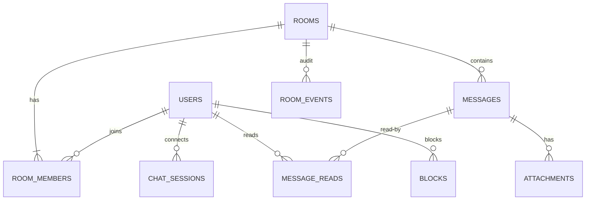

# chat database hub — ERD + 10 테이블

**[[../chat|↑ hub]]**

---

## 1. ERD



---

## 2. 테이블 목록

| # | 테이블 | 노트 |
| --- | --- | --- |
| 1 | rooms | [[rooms-table]] |
| 2 | room_members | [[room-members-table]] |
| 3 | messages ★ (partitioned) | [[messages-table]] |
| 4 | message_reads ★ | [[message-reads-table]] |
| 5 | attachments | [[attachments-table]] |
| 6 | presence (Redis) | [[presence-cache]] |
| 7 | blocks | [[blocks-table]] |
| 8 | room_events | [[room-events-table]] |
| 9 | chat_sessions (Redis 또는 DB) | [[chat-sessions-table]] |

---

## 3. Migration

```
V01__users (signup)
V60__rooms
V61__room_members
V62__messages (partitioned)
V63__message_reads
V64__attachments
V65__blocks
V66__room_events
V67__chat_sessions
```

---

## 4. 관련

- [[../chat|↑ hub]]
- [[../domain-model/domain-model]]
- [[../design-decisions/message-storage]]
