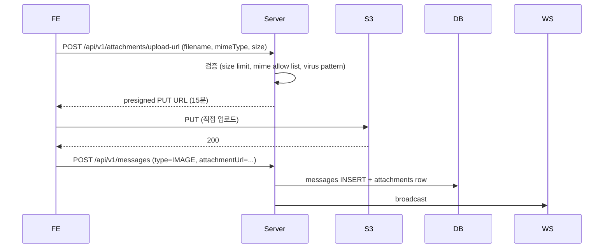

# Attachment — 사진 / 음성 / 동영상 / 파일

**[[design-decisions|↑ hub]]**

---

## 1. 본 vault

| Type | Max | Storage | Thumbnail |
| --- | --- | --- | --- |
| IMAGE | 10MB | S3 + CloudFront | Lambda 자동 |
| VIDEO | 200MB | S3 | Lambda 첫 frame |
| AUDIO | 30s / 5MB | S3 | waveform JSON |
| FILE | 100MB | S3 | mime icon |

---

## 2. 흐름 (S3 presigned upload)



자세히: [[../implementation/attachment-impl]] · [[../../file-upload-s3|↗ file-upload-s3]].

---

## 3. Thumbnail 생성 (Lambda)

```
S3 PUT 이벤트 → Lambda
  if image → resize 200x200 + S3 PUT thumb
  if video → first-frame extract + S3 PUT
  if audio → waveform JSON
```

→ Server 부하 X (S3 + Lambda).

---

## 4. 함정

1. **mime type FE 신뢰** → server 가 magic byte 검증.
2. **size 검증 X** → 1GB 업로드.
3. **presigned URL 영구** → 15분 만료.
4. **public S3 bucket** → CDN signed URL.
5. **virus scan 안 함** → 악성 file 배포.
6. **첨부 영구 보관** → cost ↑ → 30일 후 cold storage.

---

## 5. 관련

- [[design-decisions|↑ hub]]
- [[../implementation/attachment-impl]]
- [[../security/attachment-scan]]
- [[../../file-upload-s3|↗ file-upload-s3]]
