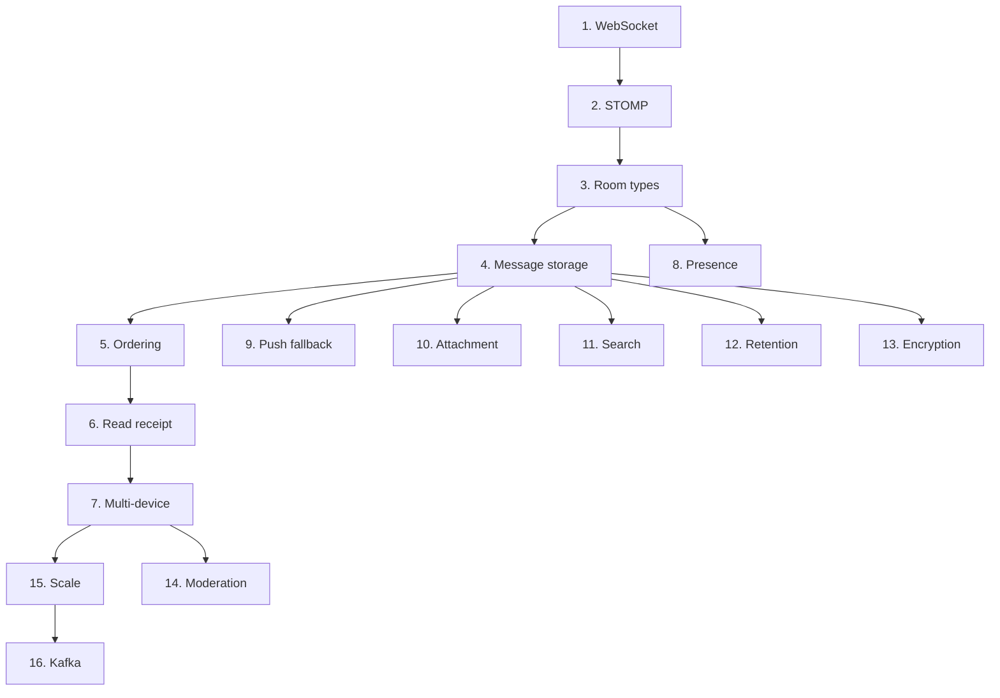

# chat design-decisions hub

**[[../chat|↑ hub]]**

---

## 1. 결정 목록

| # | 결정 | 노트 |
| --- | --- | --- |
| 1 | **WebSocket vs SSE vs Polling** ★ | [[websocket-vs-sse-vs-polling]] |
| 2 | **STOMP vs raw WebSocket** ★ | [[stomp-vs-raw]] |
| 3 | Room types (DIRECT/GROUP/OPEN/SECRET) | [[room-types]] |
| 4 | Message storage (RDB vs Mongo vs Cassandra) | [[message-storage]] |
| 5 | **Message ordering** ★ | [[message-ordering]] |
| 6 | **Read receipt** ★ | [[read-receipt-strategy]] |
| 7 | **Multi-device sync** ★ | [[multi-device-sync]] |
| 8 | Presence | [[presence-strategy]] |
| 9 | Push fallback (offline) | [[push-fallback]] |
| 10 | Attachment | [[attachment-strategy]] |
| 11 | Search | [[search-strategy]] |
| 12 | Retention | [[retention-policy]] |
| 13 | Encryption (E2EE 옵션) | [[encryption-strategy]] |
| 14 | Moderation / Blocking | [[moderation-blocking]] |
| 15 | **Scale (Redis Pub/Sub)** ★ | [[scale-strategy]] |
| 16 | Kafka (F10+) | [[kafka-event-driven]] |

---

## 2. 결정 순서 (mermaid)

---

## 3. 관련

- [[../chat|↑ hub]]
