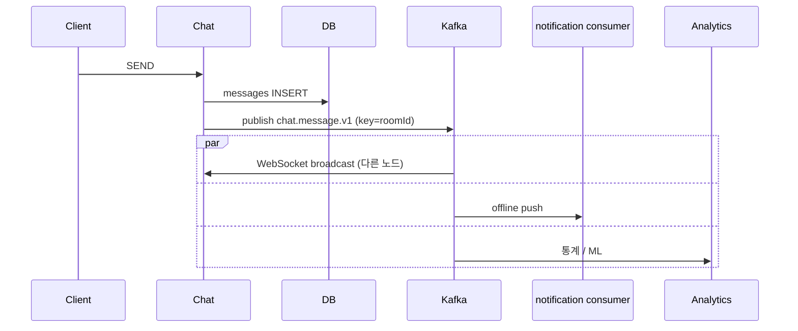

# Kafka 고도화 (F10+) — chat events

**[[design-decisions|↑ hub]]**

> F0~F9 = Redis Pub/Sub (in-cluster). F10+ = Kafka topic (분산 + replay + 분석).

---

## 1. 본 vault — F10+

| 단계 | 모델 |
| --- | --- |
| F0~F4 | Redis Pub/Sub backplane |
| F5+ | + RabbitMQ STOMP relay (broker) |
| **F10** | + Kafka topic (replay / 분석 / cross-region) |
| F11 | Consumer (notification / analytics / moderation) 분리 |

---

## 2. Topic 설계

| Topic | partition key | retention |
| --- | --- | --- |
| `chat.message.v1` | room_id | 30d |
| `chat.read.v1` | room_id | 7d |
| `chat.presence.v1` | user_id | 3d |
| `chat.room.events.v1` | room_id | 90d |
| `chat.moderation.v1` | room_id | 5y |
| `chat.audit.v1` | actor_id | 5y |

→ partition key = room_id (순서 보장).

---

## 3. 흐름 (F10+)

---

## 4. 왜 Kafka (Redis Pub/Sub 만 X)

- Redis Pub/Sub = at-most-once (subscriber 못 받으면 손실).
- Kafka = at-least-once + replay + retention.
- 분석 / 통계 / 모더 ML 같은 추가 consumer.
- 큰 platform / cross-region.

---

## 5. 함정

1. **F0 부터 Kafka** → overkill.
2. **partition key 잘못** → room 순서 X.
3. **consumer dedup 없음** → at-least-once 중복.
4. **WebSocket broadcast 와 Kafka 둘 다** → 중복 (Redis 또는 Kafka 중 하나).

---

## 6. 관련

- [[design-decisions|↑ hub]]
- [[scale-strategy]]
- [[../implementation/kafka-integration]]
- [[../../product/design-decisions/kafka-event-driven|↗ product Kafka]]
- [[../../notification/design-decisions/kafka-event-driven|↗ notification Kafka]]
