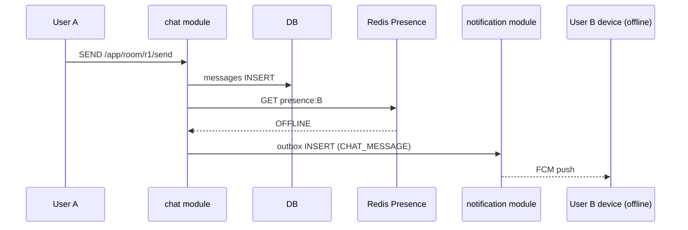

# Push fallback — offline → notification 모듈

**[[design-decisions|↑ hub]]**

---

## 1. 본 vault

```
메시지 send → room.members iterate
  for each member:
    if presence(member) == OFFLINE:
       notification.outbox INSERT (CHAT_MESSAGE → member)
    else:
       (이미 WebSocket broadcast 로 받음)
```

→ [[../notification/notification|↗ notification 모듈]] 의존.

---

## 2. 왜

- offline user 가 app 다시 열 때 까지 알림 X → UX ↓.
- WebSocket 못 받음 → push 만 가능.

---

## 3. 흐름



---

## 4. quiet hours / preference

- notification 모듈이 처리 ([[../notification/design-decisions/user-preferences]]).
- chat 모듈은 단순 호출.

---

## 5. debounce (burst 방어)

- A 가 B 에게 5초 안 10개 메시지 → 10개 push 면 spam.
- notification 모듈의 debounce ([[../notification/design-decisions/batch-aggregation#3]]) 사용.

---

## 6. 함정

1. **online user 도 push 발송** → 메시지 + push 중복.
2. **presence 못 가져옴** → 보수적 push 발송 (가능 X 보다 알림 가능).
3. **preference 무시** → chat 알림 OFF 한 user 도 push.
4. **same room burst** → spam (debounce 적용).

---

## 7. 관련

- [[design-decisions|↑ hub]]
- [[presence-strategy]]
- [[../implementation/push-fallback-impl]]
- [[../../notification/notification|↗ notification]]
