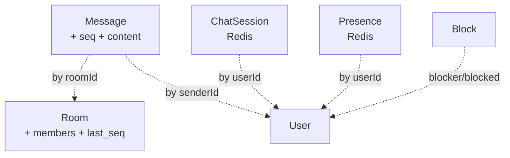

# Aggregate 경계

**[[domain-model|↑ hub]]**

---

## 1. mermaid



→ 같은 TX = Room + Message (메시지 send 시 room.last_seq 증가).
→ 다른 TX = Presence / Session (Redis).

---

## 2. 같은 TX 케이스

### 메시지 send

```java
@Transactional
1. Redis INCR room:seq:{roomId} → seq
2. message INSERT (seq)
3. UPDATE rooms SET last_message_id=?, last_message_at=?, last_seq=? WHERE id=?
4. publishEvent (AFTER_COMMIT) → Redis publish + push fallback
```

### 멤버 join (그룹)

```java
@Transactional
1. room.addMember() — version 검증
2. room_members INSERT
3. UPDATE rooms SET member_count=member_count+1, version=version+1
4. messages INSERT type=SYSTEM ("OO 님이 들어왔어요")
5. AFTER_COMMIT publish
```

---

## 3. eventual

- ChatSession / Presence — Redis 만 (DB 와 비동기).
- Block — DB + Redis cache (변경 시 invalidate).

---

## 관련

- [[domain-model|↑ hub]]
- [[../transactions]]
- [[../architecture]]
