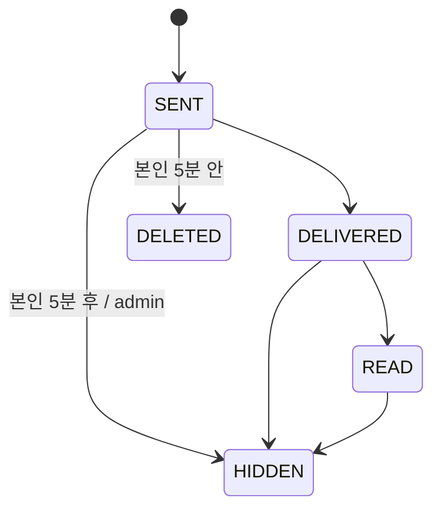

# MessageStatus enum

**[[enums|↑ hub]]**

```java
public enum MessageStatus {
    SENT,        // 서버 INSERT 완료
    DELIVERED,   // 1+ device 도착
    READ,        // 사용자가 읽음
    DELETED,     // 본인 5분 안 hard delete
    HIDDEN;      // 5분 후 soft delete / admin
}
```



---

## 관련

- [[enums|↑ hub]]
- [[../domain-model/message-aggregate]]
