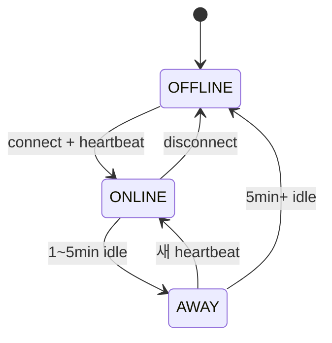

# PresenceStatus enum

**[[enums|↑ hub]]**

```java
public enum PresenceStatus {
    ONLINE,     // 활성 (heartbeat < 1분)
    AWAY,       // idle (heartbeat 1~5분)
    OFFLINE;    // 연결 없음 또는 5분 초과
}
```



---

## 관련

- [[enums|↑ hub]]
- [[../design-decisions/presence-strategy]]
