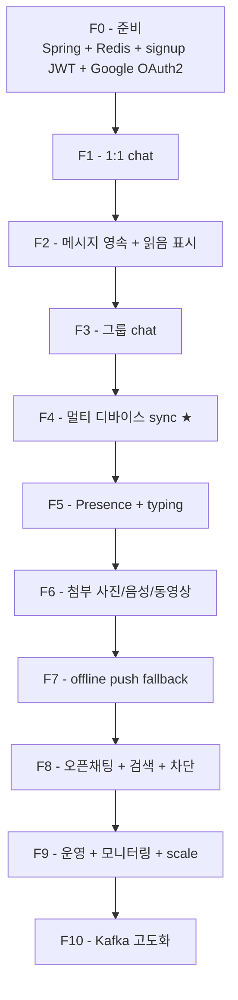

# 구현 순서 — F0~F10 PR 단위 to-do

**[[chat|↑ hub]]**

---

## 1. Phase 단계

| Phase | 내용 | 기간 |
| --- | --- | --- |
| F0 | 준비 + signup JWT + Google OAuth2 | 1주 |
| F1 | DIRECT room + STOMP send/receive | 2주 |
| F2 | DB 영속 + REST 페이징 + 읽음 1/0 | 1.5주 |
| F3 | GROUP + 방장/admin 권한 | 1.5주 |
| F4 | **멀티 디바이스 (Redis Pub/Sub)** ★ | 2주 |
| F5 | presence + typing | 1주 |
| F6 | 사진/음성/동영상/파일 (S3) | 1.5주 |
| F7 | offline push (notification 호출) | 0.5주 |
| F8 | OPEN room + 검색 + 차단 + 신고 | 1.5주 |
| F9 | 운영 + scaling + monitoring | 1주 |
| **F10** | Kafka topic + replay + KStreams | 1.5주 |

총 ~15주.

---

## 2. 의존성

| Feature | 의존 |
| --- | --- |
| F0 | signup F0~F8 + notification F0~F7 |
| F1 | F0 |
| F2~F3 | F1 |
| F4 | F1, F2, F3 |
| F5 | F1 |
| F6 | F1 |
| F7 | F1, notification F0~F7 |
| F8 | F1, F2 |
| F9 | 전체 |
| F10 | F9 |

---

## 3. 회피 체크리스트

각 PR 머지 전:
- [ ] Migration down 가능
- [ ] WebSocket auth JWT 검증
- [ ] CSRF Origin
- [ ] signup 회귀 PASS
- [ ] notification 회귀 PASS
- [ ] EXPLAIN ANALYZE (DB query)
- [ ] Load test (k6 단순 시나리오)
- [ ] pitfalls 점검

---

## 4. 관련

- [[chat|↑ hub]]
- [[overview]] · [[prerequisites]] · [[requirements]]
- [[design-decisions/scale-strategy]]
- [[design-decisions/kafka-event-driven]]
