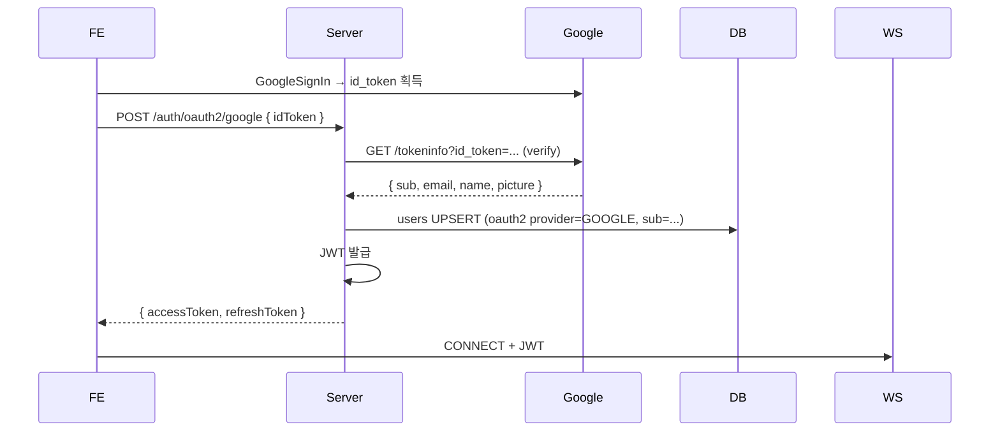

# Google OAuth2 로그인 구현 ★ (Project 4 요구)

**[[implementation|↑ hub]]**

> Project 4 핵심 기술 — JWT 로그인 + Google 소셜 로그인 연동. 본 vault 의 signup recipe 의 oauth2-social-login 패턴 확장.

---

## 1. 흐름



자세히: [[../../signup/implementation/social-login-impl|↗ signup oauth2]].

---

## 2. 설정

```yaml
google:
  client-id: ${GOOGLE_CLIENT_ID}     # FE 와 동일
  audience: ${GOOGLE_CLIENT_ID}
```

```kotlin
dependencies {
    implementation("com.google.api-client:google-api-client:2.4.0")
}
```

---

## 3. 코드

```java
@RestController
@RequiredArgsConstructor
public class GoogleLoginController {

    private final GoogleIdTokenVerifier verifier;
    private final UserService users;
    private final JwtIssuer jwt;
    private final Clock clock;

    @PostMapping("/api/v1/auth/oauth2/google")
    public LoginResponse login(@RequestBody GoogleLoginRequest req) throws Exception {
        var idToken = verifier.verify(req.idToken());
        if (idToken == null) throw new UnauthorizedException("invalid id_token");

        var payload = idToken.getPayload();
        var googleSub = payload.getSubject();
        var email = payload.getEmail();
        var name = (String) payload.get("name");
        var picture = (String) payload.get("picture");

        var user = users.upsertFromOauth2(
            OauthProvider.GOOGLE, googleSub, email, name, picture);

        var access = jwt.issueAccess(user.id(), Duration.ofHours(1), clock.now());
        var refresh = jwt.issueRefresh(user.id(), Duration.ofDays(30), clock.now());

        return new LoginResponse(access, refresh, user.toDto());
    }
}

@Configuration
public class GoogleConfig {

    @Bean
    public GoogleIdTokenVerifier googleIdTokenVerifier(GoogleProps props) {
        return new GoogleIdTokenVerifier.Builder(
                GoogleNetHttpTransport.newTrustedTransport(),
                GsonFactory.getDefaultInstance())
            .setAudience(List.of(props.audience()))
            .build();
    }
}
```

---

## 4. UPSERT (signup 통합)

```sql
INSERT INTO users (id, email, name, profile_image_url, oauth_provider, oauth_sub, ...)
VALUES (?, ?, ?, ?, 'GOOGLE', ?, ...)
ON CONFLICT (oauth_provider, oauth_sub) DO UPDATE
SET name = EXCLUDED.name,
    profile_image_url = EXCLUDED.profile_image_url,
    updated_at = now();
```

---

## 5. 함정

1. **id_token verify 안 함** → attacker 의 위조 token.
2. **audience check 누락** → 다른 app 의 token 통과.
3. **email 만으로 user lookup** → email 변경 / 도용 위험. → oauth_sub 사용.
4. **localStorage 에 id_token 저장** (FE) → XSS 위험. → 즉시 server 로 보내고 폐기.

---

## 6. 관련

- [[implementation|↑ hub]]
- [[../../signup/implementation/social-login-impl|↗ signup oauth2 source]]
- [[../security/websocket-auth]]
