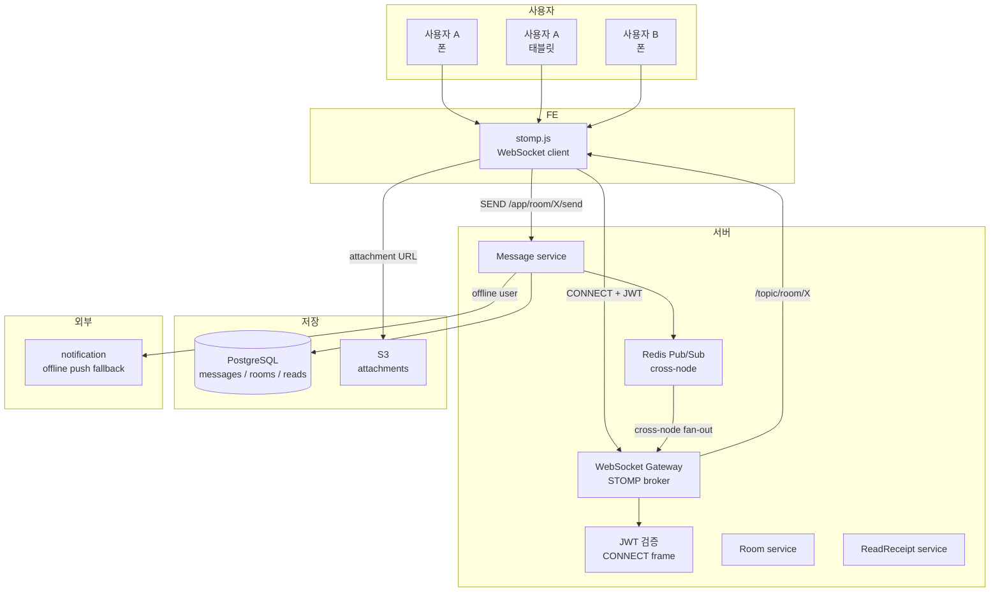
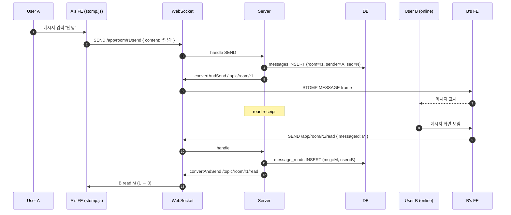
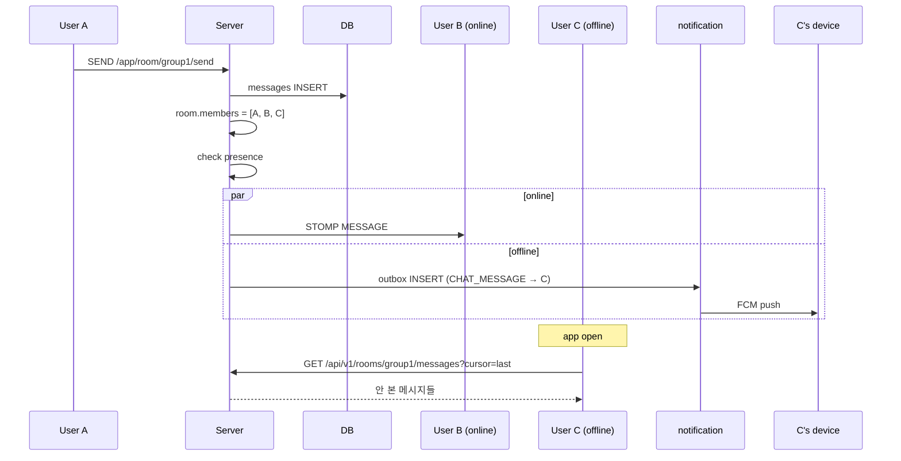
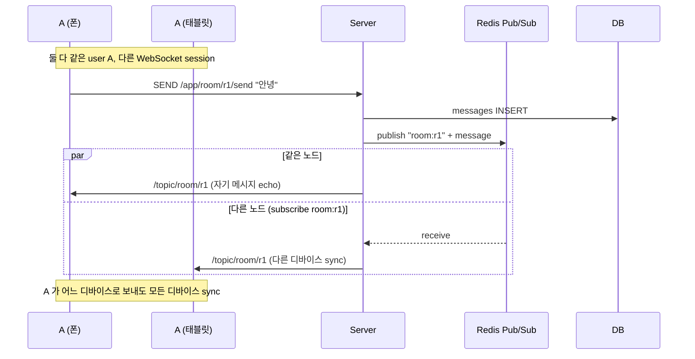
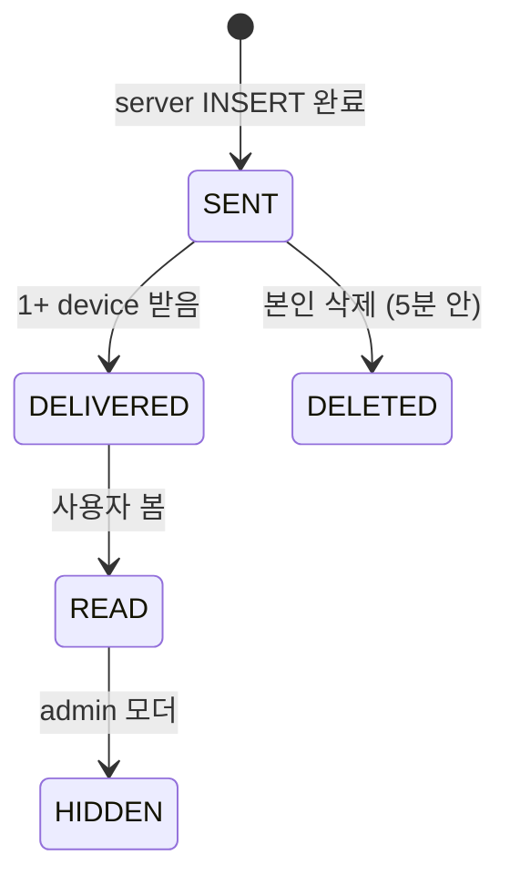
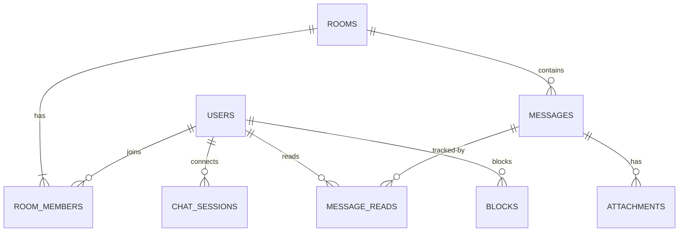

# chat overview — end-to-end

**[[chat|↑ hub]]**

---

## 1. 큰 그림

자세히: [[architecture]].

---

## 2. 시퀀스 — 1:1 메시지 발송 (single device)

---

## 3. 시퀀스 — 그룹 + offline 사용자 (push fallback)

자세히: [[design-decisions/push-fallback]].

---

## 4. 시퀀스 — 멀티 디바이스 동기화 ★

자세히: [[design-decisions/multi-device-sync]] · [[implementation/multi-device-sync-impl]].

---

## 5. 상태 머신 (메시지)

자세히: [[enums/message-status]].

---

## 6. ERD 큰 그림

자세히: [[database/database]].

---

## 7. 관련

- [[chat|↑ hub]]
- [[prerequisites]] · [[requirements]] · [[architecture]] · [[transactions]] · [[implementation-order]]
